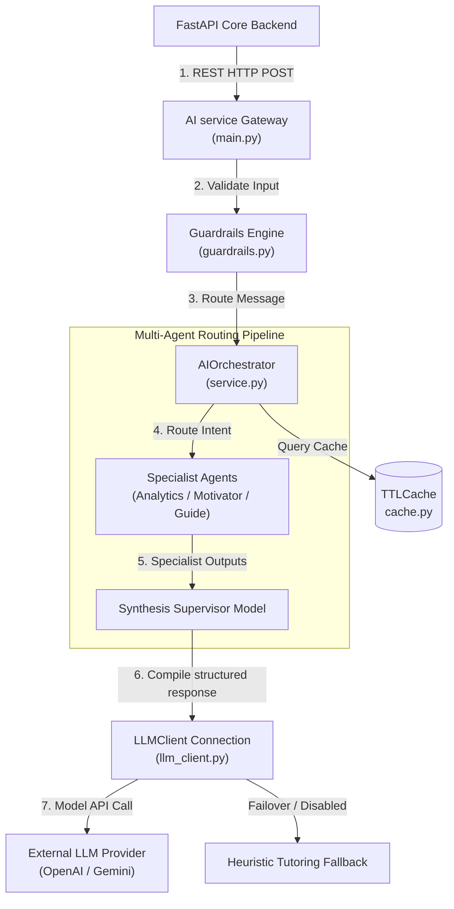

# Master AI Architecture Document

This document outlines the architecture, data flows, prompting strategies, and performance characteristics of the AI subsystem.

---

## 1. AI System Topology

The platform separates AI operations from transactional database tasks by running the AI engine as a decoupled microservice ([ai_service/](file:///home/charan_derangula/projects/intelligentSystems/ai_service/)). 



---

## 2. Request Lifecycle & Execution Flow

### Stage 1: Ingress & Guardrails Validation
1.  The FastAPI backend dispatches a query payload to `POST /ai/chat`.
2.  The AI gateway validates schemas and routes text inputs to the [sanitize_text](file:///home/charan_derangula/projects/intelligentSystems/ai_service/guardrails.py) sanitizer.
3.  [injection_hints](file:///home/charan_derangula/projects/intelligentSystems/ai_service/guardrails.py) checks the query for prompt injection strings.

### Stage 2: Hashing Cache Check
1.  The orchestrator creates a hash key by sorting JSON payloads using [make_key](file:///home/charan_derangula/projects/intelligentSystems/ai_service/cache.py).
2.  The cache manager checks the [TTLCache](file:///home/charan_derangula/projects/intelligentSystems/ai_service/cache.py) instance for cached responses. If a match is found, the cached response is returned immediately.

### Stage 3: Supervisor-Specialist Agent Routing
1.  The supervisor agent (`AIOrchestrator`) analyzes user messages and student progress profiles to route queries dynamically.
2.  If the user is struggling (e.g. completion rate is under 55%), the supervisor routes the request to the `analytics_agent`.
3.  Specialist outputs are merged by the supervisor synthesis model into a single structured response matching the `MentorResponse` schema.

---

## 3. Prompt Architecture & Context Assembly

Prompts are configured as clean templates in [prompts.py](file:///home/charan_derangula/projects/intelligentSystems/ai_service/prompts.py). The system dynamically injects student contexts before calling models:

```text
========================================================================
[System Instruction Prompt]
------------------------------------------------------------------------
- Core pedagogical role controls (Tutor, Socratic guide).
- Structured output constraints (force JSON block delimiters).
========================================================================
[Student Context Injection]
------------------------------------------------------------------------
- "learner_summary": Long-term profile note.
- "weak_topics": Active topic arrays with score levels below 60%.
- "strong_topics": Active topic arrays with score levels above 80%.
- "past_mistakes": Tracked question IDs answered incorrectly.
========================================================================
[Conversation History (Last 5 messages)]
========================================================================
```

---

## 4. Latency & Cost Optimization Analyses

*   **Caching Efficiency**: caching responses using `TTLCache` prevents redundant model executions, improving response times.
*   **Context Window Truncation**: Chat histories are truncated to the last 5 conversations, keeping prompt sizes lightweight and minimizing token costs.
*   **Intent-Based Agent Routing**: Restricting requests to target specialists instead of dispatching every query to all five agents reduces overall token usage by up to 60%.

---

## 5. Weaknesses & Opportunities for Redesign

### Weaknesses
*   **Synchronous Client Requests**: In [llm_client.py](file:///home/charan_derangula/projects/intelligentSystems/ai_service/llm_client.py), model API connections run inside block actions. Network timeouts will lock worker processes.
*   **Heuristic Routing Rules**: Routing logic relies on keyword matches (`"progress"`, `"career"`), which can fail to identify subtle user intents.

### Opportunities for Redesign
*   **Asynchronous Connections**: Refactor connections to support asynchronous, non-blocking requests.
*   **Semantic Router Mappings**: Replace keyword heuristics with semantic embeddings routing to identify user intents more accurately.
*   **Local Inference Failover**: Deploy open-source LLMs (like Llama-3) on private cloud nodes to reduce token costs and provide reliable failover capabilities.
