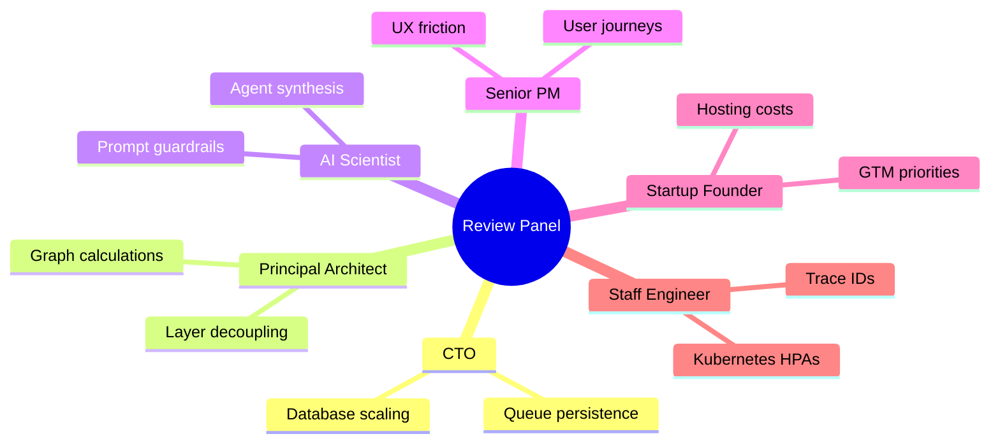

# Master Architecture Review Document

This document presents an architectural review compiled by an expert panel of startup founders, CTOs, principal architects, AI scientists, and Staff engineers.

---

## Panel Review Matrix

---

## 1. Database Architecture Review

*   **Current Design**: Single PostgreSQL database instance with shared schemas. Multi-tenant boundaries are isolated at the database layer using Row-Level Security (RLS) policies ([postgres_tenant_rls.sql](file:///home/charan_derangula/projects/intelligentSystems/backend/sql/postgres_tenant_rls.sql)).
*   **Strengths**: Cost-efficient, easy to deploy, and database-enforced multi-tenant isolation.
*   **Weaknesses**: Key tables (like `ml_feature_snapshots` and `feature_flags`) bypass RLS, relying instead on manual query filters.
*   **Risks**: Cross-tenant data leaks if developers omit query filters on tables that lack RLS policies.
*   **Technical Debt**: Mixed-mode tenant isolation makes security audits difficult.
*   **Scalability Concerns**: CPU contention on RLS context switches (`SET LOCAL app.current_tenant_id`) under high concurrent write loads.
*   **Better Alternatives**: Split the database into isolated service databases (e.g. AuthDB, ContentDB, DiagnosticDB).
*   **Industry Best Practices**: Enforce RLS on all tenant-scoped tables, and route read queries to read replicas.
*   **Estimated Engineering Cost**: 80 Engineering Hours.
*   **Estimated Business Value**: **Critical** (protects customer data and limits compliance liability).

---

## 2. Content Graph & Prerequisite Engine Review

*   **Current Design**: Prerequisite relationships are traversed and sorted topologically in-memory ([knowledge_graph.py](file:///home/charan_derangula/projects/intelligentSystems/backend/app/domain/engines/knowledge_graph.py)).
*   **Strengths**: Simple implementation that does not require additional database systems.
*   **Weaknesses**: Topological sorting is a CPU-bound operation that will block Python's single-threaded event loop under heavy traffic.
*   **Risks**: Slow query responses and API timeouts when loading large topic networks.
*   **Technical Debt**: Prerequisite loop detection logic is missing from content update routes.
*   **Scalability Concerns**: Memory consumption and CPU usage scale linearly ($O(V+E)$) with topic counts.
*   **Better Alternatives**: Use a dedicated graph database (Neo4j) to query prerequisite paths.
*   **Industry Best Practices**: Offload graph computations to the database layer using recursive CTEs or dedicated graph query languages.
*   **Estimated Engineering Cost**: 120 Engineering Hours.
*   **Estimated Business Value**: **High** (ensures fast page load speeds as courses grow).

---

## 3. AI Service & Agent Orchestration Review

*   **Current Design**: Decoupled FastAPI microservice ([ai_service/](file:///home/charan_derangula/projects/intelligentSystems/ai_service/)) that routes user prompts to specialized agents based on keyword heuristics, merging outputs into structured JSON.
*   **Strengths**: Decoupled AI boundaries protect core database transactions from slow external API requests.
*   **Weaknesses**: Synchronous API calls in [llm_client.py](file:///home/charan_derangula/projects/intelligentSystems/ai_service/llm_client.py) can lock worker threads during network timeouts.
*   **Risks**: System lockups and failed chat responses during LLM provider outages.
*   **Technical Debt**: Hardcoded keyword matching in routing rules.
*   **Scalability Concerns**: High token usage and latency when running multiple agent prompts sequentially.
*   **Better Alternatives**: Implement asynchronous, non-blocking model requests, and use semantic embeddings for agent routing.
*   **Industry Best Practices**: Implement circuit breakers, fallback configurations, and prompt caching.
*   **Estimated Engineering Cost**: 100 Engineering Hours.
*   **Estimated Business Value**: **High** (improves AI reliability and reduces API token costs).

---

## 4. The Panel's Startup Strategy

If this were our startup, we would implement these changes immediately:

### What We Would KEEP
*   PostgreSQL RLS policies as the database-enforced safety net for tenant isolation.
*   The decoupled FastAPI AI microservice boundary to protect transactional database performance.
*   The strict layered directory structure (Presentation $\rightarrow$ Application $\rightarrow$ Domain $\rightarrow$ Infrastructure) in the backend.

### What We Would REMOVE
*   In-memory topological sorting.
*   Synchronous external API requests.
*   Redis Pub/Sub WebSocket brokers.

### What We Would REDESIGN
*   Migrate from Redis Pub/Sub to Apache Kafka to ensure message persistence for real-time WebSockets.
*   Move graph calculations out of application memory and implement recursive database CTEs.
*   Enforce RLS policies on all tenant-scoped tables globally.

### What We Would BUILD FIRST
*   Enable database-level RLS policies on all missing tenant tables to ensure customer data security.
*   Implement asynchronous connection adapters in the AI microservice.
*   Set up automated load testing runs in CI/CD pipelines to establish performance benchmarks.
