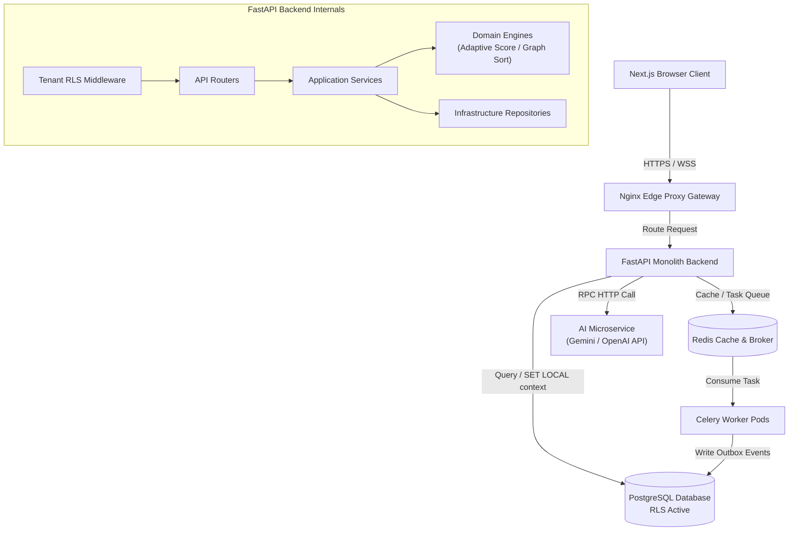

# Master Repository Intelligence Document

This document serves as the master architectural blueprint for the **Learning Intelligence Platform**. It is designed to enable a senior engineer or architect to understand, maintain, and scale the entire system without reading the source code.

---

## 1. Overall Project Purpose
The platform is a multi-tenant B2B SaaS system designed for schools, universities, and corporate training departments. Unlike traditional, linear learning management systems (LMS), it uses **adaptive diagnostic assessments** to identify student knowledge gaps, generates **personalized learning roadmaps** based on prerequisite graphs, and provides **on-demand AI mentoring** tailored to the student's progress.

---

## 2. Directory Structure & Folder Map

```text
intelligentSystems/
├── backend/                    # Core FastAPI backend modular monolith
│   ├── alembic/                # DB schema migration definitions
│   ├── app/
│   │   ├── application/        # Application services and transactional workflows
│   │   ├── core/               # App configuration, security variables, and dependencies
│   │   ├── domain/             # Core engines, calculations, and ORM database models
│   │   ├── infrastructure/     # Database repositories, celery tasks, and client adapters
│   │   └── presentation/       # API routers and security middlewares
│   └── tests/                  # Pytest backend test suite (100+ suites)
├── learning-platform-frontend/ # Next.js 15 client dashboard app
│   ├── app/                    # Next.js App Router folders and layout modules
│   ├── components/             # Reusable UI widgets and layout modules
│   └── tests/                  # Frontend unit and Playwright E2E browser tests
├── ai_service/                 # Decoupled AI routing microservice
│   ├── prompts.py              # System prompt declarations and constraints
│   └── service.py              # Multi-agent supervisor coordination logic
├── docs/                       # System architecture, deployment, and runbooks
├── k8s/                        # Production Kubernetes deployment manifests
└── nginx/                      # Edge routing gateway configurations
```

---

## 3. Technology Stack

*   **Backend Core**: Python 3.11, FastAPI (web server framework), SQLAlchemy (ORM library), Alembic (migrations).
*   **AI Engine**: Python, Google Gemini 1.5 Pro, OpenAI GPT-4o, Pydantic (data parsing).
*   **Frontend Core**: Next.js 15, React, TailwindCSS, Zustand (client state), React Query (server cache).
*   **Databases & Caches**: PostgreSQL 15+ (relational storage), Redis 7+ (shared cache and Celery task broker).
*   **Task Brokerage**: Celery (background job queue framework), Celery Beat (scheduler).
*   **Observability**: Prometheus (metrics scraping), Grafana (dashboards), Alertmanager (alerts routing).
*   **Testing Suites**: Pytest (backend verification), Playwright (E2E browser tests), Vitest (frontend components).

---

## 4. System Architecture Blueprint



---

## 5. Domain Entities & Database Design

The platform uses a shared-database, shared-schema multi-tenant model. Tenant data is isolated at the database layer using PostgreSQL Row-Level Security (RLS).

*   `tenants`: Defines organizational workspaces.
*   `users`: Stores email addresses, password hashes, and roles. Unique index constraints on `(email, tenant_id)` allow duplicate emails across different tenants.
*   `goals`: Defines learning targets (e.g. "Full Stack Developer").
*   `topics`: Subject elements containing prerequisite associations.
*   `questions`: Quantitative assessment items linked to topics.
*   `diagnostic_tests`: Testing sessions containing active score metrics.
*   `user_answers`: Submissions validating diagnostic attempts.
*   `roadmaps`: Personalized paths guiding students through topics.
*   `roadmap_steps`: Individual roadmap step states (`locked`, `active`, `completed`).
*   `outbox_events`: Event records processed by background sweep workers.

---

## 6. Service & Module Responsibilities

### Core Backend Services
*   [AuthService](file:///home/charan_derangula/projects/intelligentSystems/backend/app/application/services/auth_service.py): Manages logins, user registrations, and session cookie generation.
*   [DiagnosticService](file:///home/charan_derangula/projects/intelligentSystems/backend/app/application/services/diagnostic_service.py): Manages diagnostic quiz sessions and selects adaptive questions.
*   [RoadmapService](file:///home/charan_derangula/projects/intelligentSystems/backend/app/application/services/roadmap_service.py): Generates learning paths by traversing prerequisites.
*   [AnalyticsService](file:///home/charan_derangula/projects/intelligentSystems/backend/app/application/services/precomputed_analytics_service.py): Calculates student mastery scores and populates dashboards.
*   [OutboxService](file:///home/charan_derangula/projects/intelligentSystems/backend/app/application/services/outbox_service.py): Commits and dispatches events to background queues.

### Domain Engines
*   [AdaptiveTestingEngine](file:///home/charan_derangula/projects/intelligentSystems/backend/app/domain/engines/adaptive_testing_engine.py): Evaluates student ability scores ($\theta$) using Item Response Theory.
*   [KnowledgeGraph](file:///home/charan_derangula/projects/intelligentSystems/backend/app/domain/engines/knowledge_graph.py): Sorts topic prerequisite graphs topologically.

---

## 7. Security, Authentication & Isolation

### Multi-Tenant Isolation
Every request passing through [security_middleware.py](file:///home/charan_derangula/projects/intelligentSystems/backend/app/core/security_middleware.py) sets the dynamic session context `app.current_tenant_id` on the database connection pool. PostgreSQL automatically filters queries using RLS policies declared in [postgres_tenant_rls.sql](file:///home/charan_derangula/projects/intelligentSystems/backend/sql/postgres_tenant_rls.sql), preventing cross-tenant data leaks.

### Authentication & CSRF
*   **Stateless JWT access keys** are sent in request headers and verified on each call.
*   **HttpOnly cookie refresh tokens** are stored in secure cookies to manage session lifetimes.
*   **CSRF Middleware** checks mutated requests (`POST`, `PUT`, `PATCH`, `DELETE`) by comparing header values with CSRF cookie parameters.

---

## 8. Decoupled AI Microservice Architecture

The prompt engineering, context extraction, and safety guardrails are decoupled inside the [ai_service/](file:///home/charan_derangula/projects/intelligentSystems/ai_service/) microservice:

*   **Guardrails**: Screens inputs for prompt injection threats using keywords checks in [guardrails.py](file:///home/charan_derangula/projects/intelligentSystems/ai_service/guardrails.py).
*   **Agent Routing**: Routes prompts to specialized agents (Analytics, Motivation, Career Guide) dynamically based on intent keywords in `_route_agents`.
*   **Synthesis**: Compiles specialist agent outputs into structured JSON responses using schemas in [prompts.py](file:///home/charan_derangula/projects/intelligentSystems/ai_service/prompts.py).
*   **Fallback Operations**: Activates precomputed tutoring suggestions if external LLM APIs fail.

---

## 9. Caching & Background Queues

### Caching Strategy
*   Uses a Redis cache layer configured with read-through/cache-aside patterns.
*   Static topic graphs, user metadata, and precalculated analytics view tables are cached with TTL limits.

### Background Queue Strategy
*   Uses a **Transactional Event Outbox Pattern**. Mutating actions write event records to the database atomically in the same transaction.
*   Background Celery sweep tasks read the outbox table using `FOR UPDATE SKIP LOCKED` parameters, dispatch events, and update status logs.

---

## 10. Deployment & Infrastructure Configuration

*   **Kubernetes Manifests**: Located in [k8s/](file:///home/charan_derangula/projects/intelligentSystems/k8s/). Deployments configure replica sets, pod disruption budgets (`pdb.yaml`), ingress rules (`ingress.yaml`), and horizontal pod autoscalers (`hpa.yaml`).
*   **Network Firewalls**: Implemented in `network-policy.yaml`. Restricts access so only API and worker pods can connect to the database.
*   **Observability Exporters**: Exposes system metrics on the `/metrics` endpoint for Prometheus scraping, routing alarms through Alertmanager to operators.

---

## 11. Core Strengths, Gaps & Technical Debt

### Core Strengths
*   Strong multi-tenant isolation enforced at the database level using PostgreSQL RLS policies.
*   Decoupled AI service boundary that protects transactional databases from slow external API requests.
*   Layered codebase architecture that isolates business logic from frameworks and databases.

### Technical Debt & Gaps
*   **RLS Gaps**: Key tables (like `ml_feature_snapshots` and `feature_flags`) bypass RLS, relying instead on manual query filters.
*   **In-Memory Graph Traversal**: Traversing prerequisite trees in application memory blocks Python's single-threaded event loop, which will fail under high concurrent traffic.
*   **Missing Message Persistence**: Redis Pub/Sub does not persist messages. If a connection drops, realtime WebSocket messages are lost. Neo4j graph databases and Apache Kafka streaming integrations are recommended for the next phase.
