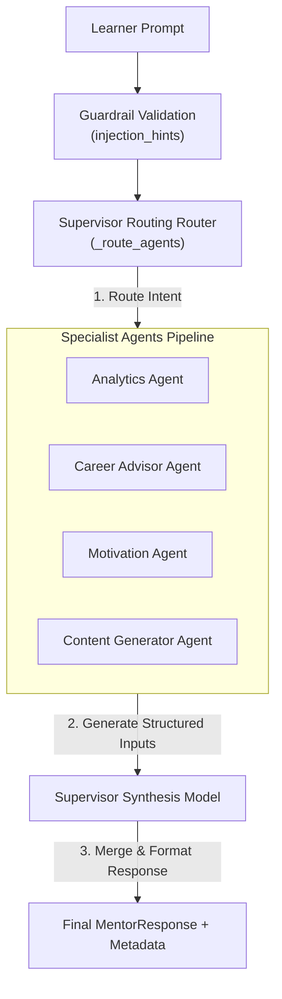
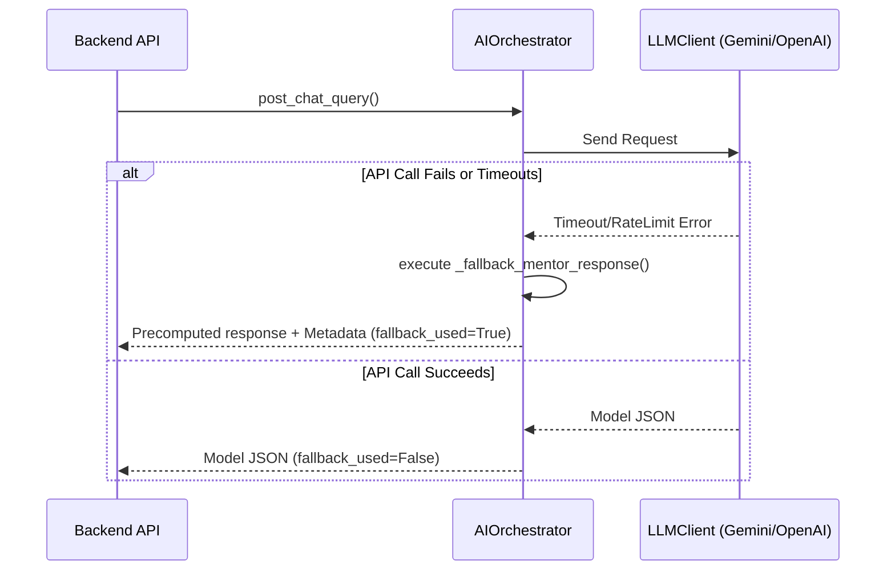

# AI System Bible

This document serves as the definitive reference manual for the artificial intelligence subsystem of the **Learning Intelligence Platform**. It details the agent routing topology, prompt structures, safety guardrails, cache operations, and fallback logic implemented inside the [ai_service/](file:///home/charan_derangula/projects/intelligentSystems/ai_service/) microservice.

---

## 1. Prompt Engineering & Templates

The system configures prompt instructions inside the [prompts.py](file:///home/charan_derangula/projects/intelligentSystems/ai_service/prompts.py) file. System messages use role-based prompts to enforce structured pedagogical tones, output schemas, and diagnostic limits.

### Core System Prompts

1.  **Specialist Agent Instruction (`specialist_agent_prompt`)**: Configures specialized roles (Motivator, Analyst, Career Guide) to evaluate raw student logs and output structured recommendations.
2.  **Supervisor Orchestrator Instruction (`multi_agent_synthesis_prompt`)**: Instructs the primary routing model to merge specialist outputs, resolving conflicts and forming a cohesive tutoring response.
3.  **Adaptive Roadmap Instruction (`roadmap_prompt`)**: Directs the roadmap model to sort goal nodes topologically based on diagnostic weakness maps.
4.  **Diagnostic Explanation Instruction (`explain_topic_prompt`)**: Guides the LLM to format lesson contents using simple analogies and step-by-step proofs.

### The "WHY" Behind Prompt Structures

*   **Markdown Schema Formatting**: Prompts force models to output structured JSON blocks using markdown delimiters (e.g. ````json ... ````). This prevents parsers from breaking on verbose text wrappers.
*   ** pedagogical tone controls**: Restricting prompts from solving questions directly prevents students from abusing chat interfaces during timed diagnostics.

---

## 2. Supervisor-Specialist Multi-Agent System

The AI service operates a **Supervisor-Specialist Multi-Agent Routing Model** to construct student mentor responses:



### Specialist Agent Catalog & Intent Rules

*   **Mentor Agent**: Anchors overall tutorial tone. Always included in chat executions.
*   **Content Generator Agent**: Triggered if inputs contain search keywords like `question`, `quiz`, `explain`, `example`, or `practice`.
*   **Analytics Agent**: Triggered if the student has logged weak topics, has a course completion rate below 55%, or uses keywords like `progress`, `improve`, or `stuck`.
*   **Career Advisor Agent**: Triggered by career-related keywords like `job`, `career`, `resume`, or `interview`.
*   **Motivation Agent**: Triggered if completion metrics drop below 40% or if text inputs express frustration (e.g. `burnout`, `overwhelmed`, `focus`).

### The "WHY" Behind Agent Routing

*   **Intent-Based Resource Management**: Dispatching every query to five specialist LLM runs is slow and expensive. Filtering agents based on student profiles and text keywords reduces API token usage by up to 60%.

---

## 3. Learner Memory Persistence Model

AI chats build context dynamically by loading historical records and session parameters:

```text
========================================================================
[Chat Memory Profile Context (appended to prompt payload)]
------------------------------------------------------------------------
- "learner_summary": Long-term profile note compiled across sessions.
- "weak_topics": Active topic arrays with score levels below 60%.
- "strong_topics": Active topic arrays with score levels above 80%.
- "past_mistakes": Tracked question IDs answered incorrectly.
- "learning_style": Preferred mode (Visual, Heuristic, Applied).
========================================================================
```

Memory profiles are updated asynchronously when chat runs complete, preventing database updates from adding latency to API response times.

---

## 4. Input Guardrails & Safety Audits

To mitigate malicious attacks, the [guardrails.py](file:///home/charan_derangula/projects/intelligentSystems/ai_service/guardrails.py) module screens all text inputs:

1.  **Character Limit Truncation**: Inputs are truncated to prevent large payloads from inflating token bills.
2.  **Null-Byte Cleansing**: Strips null bytes (`\x00`) to prevent character encoding errors.
3.  **Prompt Injection Check**: Scans user inputs for injection indicators (e.g., `ignore previous instructions`, `reveal prompt`, `system prompt`). If suspicious strings are found, queries are flagged and routed to fallback advisor blocks.

---

## 5. Fallback & Recovery Operations

If downstream model APIs fail, the orchestrator applies a strict fallback policy to maintain system availability:



The fallback response (`_fallback_mentor_response`):
*   Formats a helpful fallback message.
*   Suggests action steps based on the student's active weak topics.
*   Returns mock memory profiles to prevent state sync failures.

---

## 6. High-Performance TTL Cache Layer

The [cache.py](file:///home/charan_derangula/projects/intelligentSystems/ai_service/cache.py) module implements an in-memory `TTLCache` class to avoid repeating expensive model executions for identical queries:

```python
class TTLCache:
    def __init__(self) -> None:
        self._store: dict[str, tuple[float, Any]] = {}

    @staticmethod
    def make_key(namespace: str, payload: dict[str, Any]) -> str:
        # Serializes payloads into sorted strings to ensure consistent hash keys
        raw = json.dumps(payload, sort_keys=True, default=str, ensure_ascii=True)
        digest = hashlib.sha256(raw.encode("utf-8")).hexdigest()
        return f"{namespace}:{digest}"
```

*   **Hash Validation**: Incoming queries are hashed using SHA-256 keys to check for cached responses.
*   **Automatic Eviction**: Cache items are dropped on lookups if their monotonic lifespan exceeds configured TTL limits.

---

## 7. Operational Parameters

*   **LLM Providers**: Integrates OpenAI (GPT-4o) and Google (Gemini 1.5 Pro) client instances via [llm_client.py](file:///home/charan_derangula/projects/intelligentSystems/ai_service/llm_client.py).
*   **Automatic Retries**: Implements exponential backoff retries (3 attempts, max 5-second delay) on transient network failures.
*   **Rate Limiting**: Exposes a Redis token bucket limiter to restrict queries to 10 per minute per user on chat routes.
*   **Cost Optimization**: Truncates chat histories to the last 5 conversations to keep prompt context windows lightweight.
