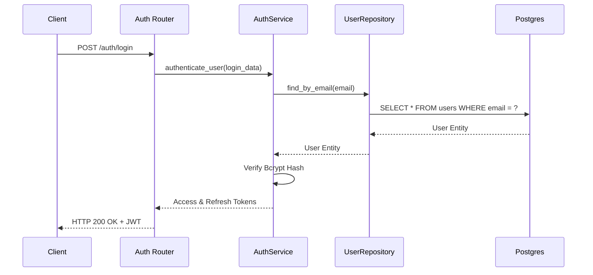
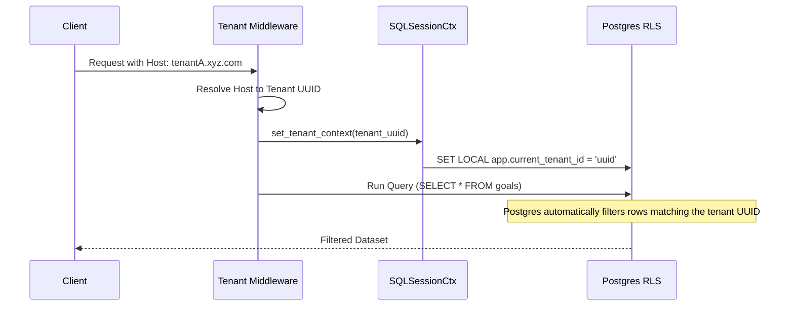
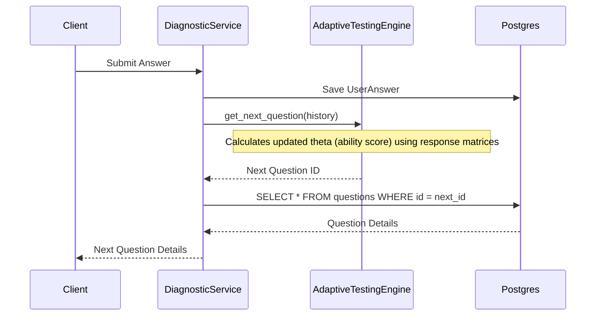
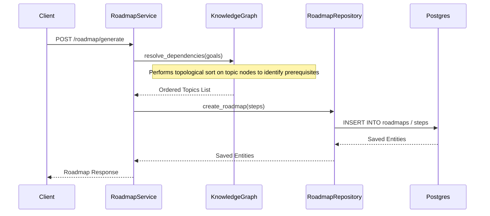
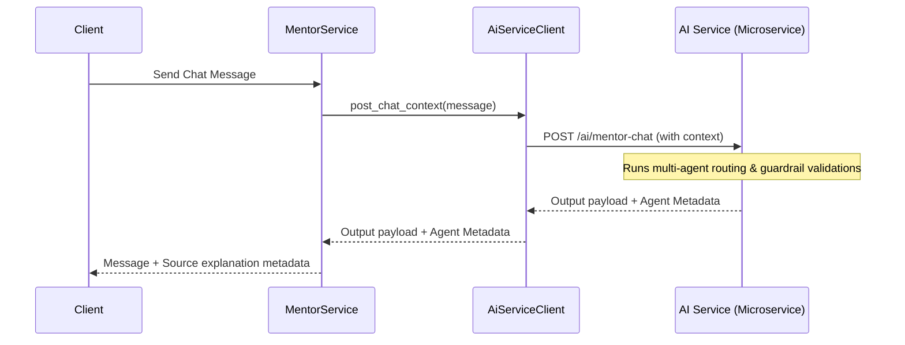
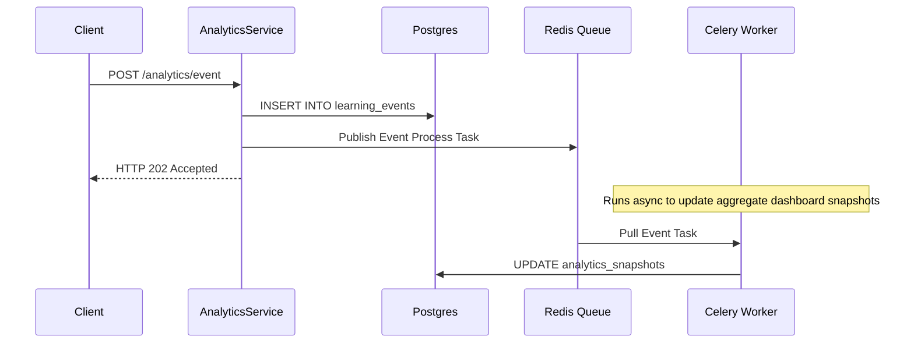
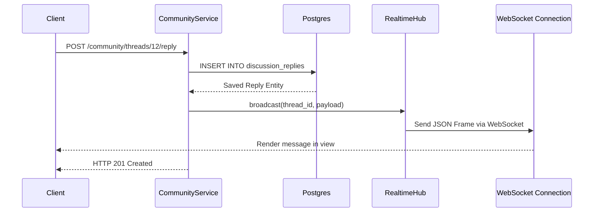
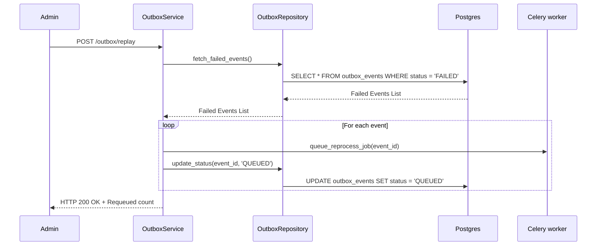
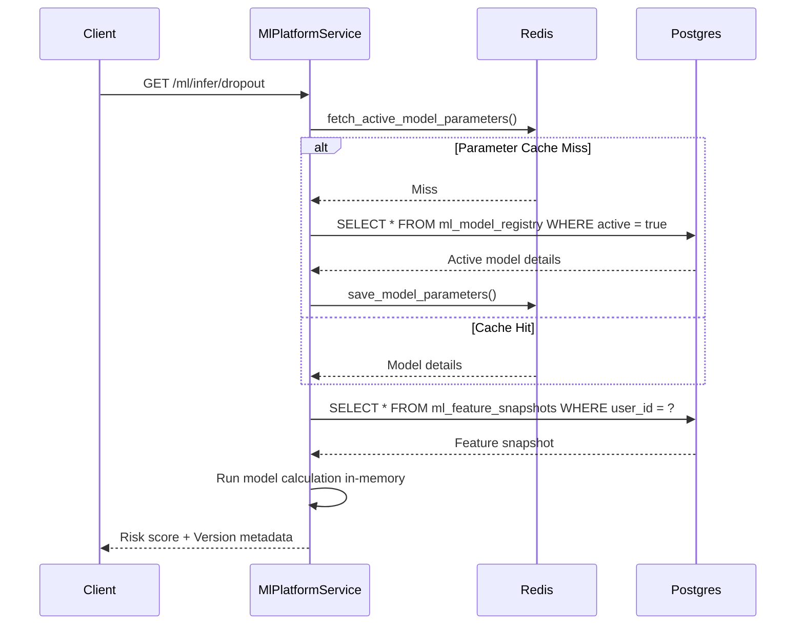

# Backend Encyclopedia

This document serves as the definitive reference manual for all backend modules in the **Learning Intelligence Platform**. It provides a deep dive into route declarations, services, database schemas, computational models, cache invalidation cycles, and execution flows.

---

## Module 1: Authentication & Identity

### 1. Purpose
Manages user credentials, generates JWT access and refresh tokens, validates Multi-Factor Authentication (MFA), and oversees profile configurations.

### 2. Routes
*   `POST /auth/register` — Creates user accounts.
*   `POST /auth/login` — Returns JWT tokens.
*   `POST /auth/mfa/enable` — Sets up MFA TOTP secrets.
*   `GET /profile` — Retrieves the authenticated profile.
*   `PUT /user/update` — Updates user metadata.

### 3. Services
*   [AuthService](file:///home/charan_derangula/projects/intelligentSystems/backend/app/application/services/auth_service.py) — Handles login, password hashing, and token issuance.
*   [UserService](file:///home/charan_derangula/projects/intelligentSystems/backend/app/application/services/user_service.py) — Oversees user CRUD queries.
*   [MfaService](file:///home/charan_derangula/projects/intelligentSystems/backend/app/application/services/mfa_service.py) — Validates Google Authenticator TOTP tokens.

### 4. Repositories
*   [UserRepository](file:///home/charan_derangula/projects/intelligentSystems/backend/app/infrastructure/repositories/user_repository.py) — Performs queries against the `users` table.

### 5. Models
*   [User](file:///home/charan_derangula/projects/intelligentSystems/backend/app/domain/models/user.py) — Stores credentials, status flags, and roles.

### 6. Schemas
*   [UserLoginRequest](file:///home/charan_derangula/projects/intelligentSystems/backend/app/schemas/auth_schema.py) — Validates login payload schemas.
*   [UserResponse](file:///home/charan_derangula/projects/intelligentSystems/backend/app/schemas/user_schema.py) — Formats user entities for responses.

### 7. Dependencies
*   [security.py](file:///home/charan_derangula/projects/intelligentSystems/backend/app/core/security.py) (cryptography)
*   Redis cache client (blacklists)

### 8. Call Flow
```
Client Request ──> HTTP Router ──> AuthService ──> UserRepository ──> PostgreSQL
```

### 9. Business Rules
*   Passwords must be hashed using bcrypt before database insertion.
*   Roles are limited to `student`, `teacher`, `admin`, and `super_admin`.

### 10. Validation
*   Emails must match standards.
*   Passwords require at least 8 characters, one number, and one special character.

### 11. Caching
*   Revoked tokens are written to a Redis blacklist with a TTL matching their remaining lifespan.

### 12. Background Jobs
*   Registration triggers an asynchronous welcome email via Celery.

### 13. Performance Considerations
*   Bcrypt hashing operations are CPU-bound; login request rates must be limited to prevent container starvation.

### 14. Security Considerations
*   JWT tokens are signed using HS256 keys. Passwords must never be logged.

### 15. Known Issues
*   Session termination requires blacklisting individual tokens; it does not revoke all active sessions for a user globally.

### 16. Sequence Diagram


### 17. Complexity
*   **Password Hashing**: $\mathcal{O}(2^k)$ where $k$ represents the bcrypt work factor cost.

### 18. Best Practices
*   Always require token scopes before routing to user-sensitive routes.

### 19. Interview Questions
*   *Question*: How does the backend mitigate replay attacks with JWT refresh tokens?
*   *Answer*: It registers token signatures in Redis and enforces a one-time-use rule for refresh operations, blacklisting old tokens on usage.

---

## Module 2: Multi-Tenancy Management

### 1. Purpose
Ensures complete isolation of transactional data across various organizational tenants.

### 2. Routes
*   `POST /tenants` — Registers new tenants.
*   `GET /tenants/{tenant_id}` — Fetches tenant configurations.
*   `POST /tenants/switch` — Switches active workspaces.

### 3. Services
*   [TenantService](file:///home/charan_derangula/projects/intelligentSystems/backend/app/application/services/auth_service.py) — Sets up databases and configures new tenants.

### 4. Repositories
*   [TenantRepository](file:///home/charan_derangula/projects/intelligentSystems/backend/app/infrastructure/repositories/tenant_repository.py) — Manages CRUD operations for the `tenants` table.

### 5. Models
*   [Tenant](file:///home/charan_derangula/projects/intelligentSystems/backend/app/domain/models/tenant.py) — Stores tenant settings and active status.

### 6. Schemas
*   [TenantCreateSchema](file:///home/charan_derangula/projects/intelligentSystems/backend/app/schemas/tenant_schema.py) — Defines schema inputs for tenant registrations.

### 7. Dependencies
*   [postgres_tenant_rls.sql](file:///home/charan_derangula/projects/intelligentSystems/backend/sql/postgres_tenant_rls.sql) (Postgres RLS engine)

### 8. Call Flow
```
Client Request ──> Ingress ──> Middleware (Extract Tenant ID) ──> Set DB Session Context ──> Query
```

### 9. Business Rules
*   Tenants can customize their schemas.
*   The `super_admin` role can override tenant isolation context using `X-Tenant-ID` headers.

### 10. Validation
*   Tenant identifiers must match domain subkeys (alphanumeric strings without symbols).

### 11. Caching
*   Tenant configurations are stored in Redis using tenant IDs as cache keys to avoid database queries on every incoming request.

### 12. Background Jobs
*   Provisioning triggers a Celery queue job to compile initial schemas.

### 13. Performance Considerations
*   Postgres RLS adds a small execution overhead to table scans; indices must cover the `tenant_id` column.

### 14. Security Considerations
*   Session variables (`app.current_tenant_id`) must be set on database connections before executing queries.

### 15. Known Issues
*   Shared tables (e.g. static topic definitions) bypass RLS, requiring manual checks.

### 16. Sequence Diagram


### 17. Complexity
*   **Context Setup**: $\mathcal{O}(1)$ query setting updates.

### 18. Best Practices
*   Always enable Postgres RLS on any table containing a `tenant_id` column.

### 19. Interview Questions
*   *Question*: Why is database-level RLS preferred over code-level filters in multi-tenant SaaS platforms?
*   *Answer*: Code-level filters rely on developer discipline to append filters. RLS enforces isolation rules at the database level, preventing leakages if filter functions are omitted.

---

## Module 3: Adaptive Diagnostics & Testing

### 1. Purpose
Evaluates learner knowledge, selects quiz questions adaptively, and tracks student weakness vectors.

### 2. Routes
*   `POST /diagnostic/start` — Initializes testing sessions.
*   `POST /diagnostic/submit` — Submits quiz answers.
*   `GET /diagnostic/next-question` — Fetches the next question.

### 3. Services
*   [DiagnosticService](file:///home/charan_derangula/projects/intelligentSystems/backend/app/application/services/diagnostic_service.py) — Coordinates diagnostic session progress.

### 4. Repositories
*   [DiagnosticRepository](file:///home/charan_derangula/projects/intelligentSystems/backend/app/infrastructure/repositories/diagnostic_repository.py) — Fetches quiz records.

### 5. Models
*   [DiagnosticTest](file:///home/charan_derangula/projects/intelligentSystems/backend/app/domain/models/diagnostic_test.py) — Stores test states.
*   [UserAnswer](file:///home/charan_derangula/projects/intelligentSystems/backend/app/domain/models/user_answer.py) — Stores student answers.

### 6. Schemas
*   [DiagnosticSubmitRequest](file:///home/charan_derangula/projects/intelligentSystems/backend/app/schemas/diagnostic_schema.py) — Validates submitted options.

### 7. Dependencies
*   [AdaptiveTestingEngine](file:///home/charan_derangula/projects/intelligentSystems/backend/app/domain/engines/adaptive_testing_engine.py) (Business rules engine)

### 8. Call Flow
```
Submit ──> DiagnosticService ──> AdaptiveTestingEngine ──> Update Weakness Model ──> Save Answers
```

### 9. Business Rules
*   Diagnostic quizzes enforce question timeouts.
*   The next question is selected based on the accuracy of the student's previous answers.

### 10. Validation
*   Option indices must be valid schema integers.

### 11. Caching
*   Quiz session metadata is cached in Redis to support fast lookups during active tests.

### 12. Background Jobs
*   When a test is submitted, a Celery job evaluates the student's performance and generates a personalized learning roadmap.

### 13. Performance Considerations
*   Dynamic question selection logic runs complex matrix mathematics; these engines should be optimized in-memory.

### 14. Security Considerations
*   Quiz questions must not be returned in bulk to prevent cheating.

### 15. Known Issues
*   If a WebSocket connection drops during a timed quiz, responses can trigger timeout errors.

### 16. Sequence Diagram


### 17. Complexity
*   **Adaptive Theta Calculation**: $\mathcal{O}(Q \cdot T)$ where $Q$ is the question count and $T$ is the topic depth.

### 18. Best Practices
*   Never return correct answer keys in API response schemas.

### 19. Interview Questions
*   *Question*: How does the platform prevent student cheating during diagnostic API checks?
*   *Answer*: It limits active testing sessions to one question at a time and hides answer properties on HTTP response structures.

---

## Module 4: Learning Paths & Goals

### 1. Purpose
Tracks educational goals, creates learning roadmaps, and prioritizes revision tasks.

### 2. Routes
*   `POST /roadmap/generate` — Creates roadmaps.
*   `PUT /roadmap/steps/{step_id}/complete` — Marks steps as finished.
*   `GET /revision/due` — Lists due revision tasks.

### 3. Services
*   [RoadmapService](file:///home/charan_derangula/projects/intelligentSystems/backend/app/application/services/roadmap_service.py) — Coordinates roadmap progression and goal management.

### 4. Repositories
*   [RoadmapRepository](file:///home/charan_derangula/projects/intelligentSystems/backend/app/infrastructure/repositories/roadmap_repository.py) — Queries the `roadmaps` table.

### 5. Models
*   [Roadmap](file:///home/charan_derangula/projects/intelligentSystems/backend/app/domain/models/roadmap.py) — Stores roadmap entities.
*   [RoadmapStep](file:///home/charan_derangula/projects/intelligentSystems/backend/app/domain/models/roadmap_step.py) — Individual task steps.

### 6. Schemas
*   [RoadmapResponse](file:///home/charan_derangula/projects/intelligentSystems/backend/app/schemas/roadmap_schema.py) — Validates output structures.

### 7. Dependencies
*   [KnowledgeGraph](file:///home/charan_derangula/projects/intelligentSystems/backend/app/domain/engines/knowledge_graph.py) (Prerequisite traversal)

### 8. Call Flow
```
Generate Request ──> RoadmapService ──> KnowledgeGraph ──> Save Roadmap ──> Return
```

### 9. Business Rules
*   Steps cannot be started until all of their prerequisites have been completed.

### 10. Validation
*   Goal links must refer to existing database IDs.

### 11. Caching
*   Roadmap graphs are cached in Redis to speed up route lookups.

### 12. Background Jobs
*   Celery jobs pre-compute revision items based on learning curves.

### 13. Performance Considerations
*   Traversing nested prerequisite networks can lead to recursion limits; depth searches must be capped.

### 14. Security Considerations
*   Users can only modify roadmaps that belong to their active tenant workspace.

### 15. Known Issues
*   Generating deep roadmaps can cause database lock contention on tenant tables under high loads.

### 16. Sequence Diagram


### 17. Complexity
*   **Prerequisite Topological Sort**: $\mathcal{O}(V + E)$ where $V$ represents topic nodes and $E$ represents dependency edges.

### 18. Best Practices
*   Batch step creations into single transactions to prevent partial writes.

### 19. Interview Questions
*   *Question*: How does the platform detect circular prerequisite loops in user content setups?
*   *Answer*: The [KnowledgeGraph](file:///home/charan_derangula/projects/intelligentSystems/backend/app/domain/engines/knowledge_graph.py) uses topological sorting algorithms (like Kahn's Algorithm or DFS) to check for cycle signatures, throwing validation errors if circular loops are found.

---

## Module 5: Guidance, Mentor & Twin

### 1. Purpose
Manages student digital twins, processes mentor chat histories, and coordinates autonomous learning loops.

### 2. Routes
*   `POST /mentor/chat` — Submits messages to the mentor agent.
*   `GET /digital-twin/simulate` — Simulates learning pathways.
*   `POST /mentor/agent/run` — Triggers autonomous recommendations.

### 3. Services
*   [MentorService](file:///home/charan_derangula/projects/intelligentSystems/backend/app/application/services/mentor_service.py) — Coordinates mentor chat configurations.
*   [DigitalTwinService](file:///home/charan_derangula/projects/intelligentSystems/backend/app/application/services/digital_twin_service.py) — Simulates learning progress.
*   [AutonomousLearningAgentService](file:///home/charan_derangula/projects/intelligentSystems/backend/app/application/services/autonomous_learning_agent_service.py) — Runs agent loops.

### 4. Repositories
*   [MentorRepository](file:///home/charan_derangula/projects/intelligentSystems/backend/app/infrastructure/repositories/user_repository.py) — Manages chat histories.

### 5. Models
*   [MentorChatMessage](file:///home/charan_derangula/projects/intelligentSystems/backend/app/domain/models/user.py) — Stores mentor messages.

### 6. Schemas
*   [DigitalTwinResponse](file:///home/charan_derangula/projects/intelligentSystems/backend/app/schemas/digital_twin_schema.py) — Formats digital twin simulation responses.

### 7. Dependencies
*   [AiServiceClient](file:///home/charan_derangula/projects/intelligentSystems/backend/app/infrastructure/clients/ai_service_client.py) (AI microservice API)

### 8. Call Flow
```
Chat Input ──> MentorService ──> AI Service Client ──> Save Chat ──> Response
```

### 9. Business Rules
*   The system filters out toxic inputs before calling the AI model.
*   Digital Twin projections require a minimum baseline activity log to generate predictions.

### 10. Validation
*   Chat inputs must be under 2000 characters.

### 11. Caching
*   Twin projections are cached for 1 hour to prevent resource depletion on frequent page refreshes.

### 12. Background Jobs
*   Autonomous agent checks run periodically via Celery Beat schedulers.

### 13. Performance Considerations
*   AI model queries are slow; requests must run asynchronously using FastAPI `async/await` syntax.

### 14. Security Considerations
*   Prevent prompt injection attacks by formatting inputs inside predefined, structured templates.

### 15. Known Issues
*   Dynamic context updates can exceed LLM context window limits during long chat threads.

### 16. Sequence Diagram


### 17. Complexity
*   **Twin Projections**: $\mathcal{O}(P \cdot S)$ where $P$ is topic counts and $S$ is simulation strategies.

### 18. Best Practices
*   Always structure LLM outputs as JSON objects to avoid parse errors.

### 19. Interview Questions
*   *Question*: Why is the digital twin compiled on-demand rather than pre-calculated in the database?
*   *Answer*: On-demand calculations ensure the twin immediately reflects real-time student activity without duplicate write cycles or syncing delays.

---

## Module 6: Analytics & Metrics

### 1. Purpose
Aggregates event telemetry, pre-calculates progress reports, and populates admin dashboards.

### 2. Routes
*   `GET /analytics/dashboard` — Retrieves system metrics.
*   `POST /analytics/event` — Logs user learning events.
*   `GET /audit/logs` — Exposes security logs.

### 3. Services
*   [AnalyticsService](file:///home/charan_derangula/projects/intelligentSystems/backend/app/application/services/analytics_service.py) — Handles dashboard telemetry.
*   [PrecomputedAnalyticsService](file:///home/charan_derangula/projects/intelligentSystems/backend/app/application/services/precomputed_analytics_service.py) — Aggregates progress reports.

### 4. Repositories
*   [AnalyticsRepository](file:///home/charan_derangula/projects/intelligentSystems/backend/app/infrastructure/repositories/user_repository.py) — Queries logs and snapshots.

### 5. Models
*   [LearningEvent](file:///home/charan_derangula/projects/intelligentSystems/backend/app/domain/models/audit_log.py) — Stores logged learning events.
*   [AuditLog](file:///home/charan_derangula/projects/intelligentSystems/backend/app/domain/models/audit_log.py) — Stores administrative logs.

### 6. Schemas
*   [DashboardResponse](file:///home/charan_derangula/projects/intelligentSystems/backend/app/schemas/dashboard_schema.py) — Formats dashboard telemetry outputs.

### 7. Dependencies
*   [prometheus_client](file:///home/charan_derangula/projects/intelligentSystems/backend/app/core/metrics.py) (Prometheus exports)

### 8. Call Flow
```
User Event ──> AnalyticsService ──> Write Event ──> Precompute (Celery) ──> Read Snapshot
```

### 9. Business Rules
*   Audit logs must be read-only; update or delete actions on audit tables are prohibited.

### 10. Validation
*   Event timestamps must not refer to future dates.

### 11. Caching
*   Pre-calculated dashboard summaries are stored in Redis with a 5-minute cache expiration window.

### 12. Background Jobs
*   Celery workers recalculate analytics snapshots every hour.

### 13. Performance Considerations
*   Aggregating event logs in real-time can freeze transactional databases; queries must read from pre-calculated views.

### 14. Security Considerations
*   Limit dashboard access to `teacher`, `admin`, or `super_admin` roles.

### 15. Known Issues
*   High traffic volumes can lead to slow event inserts on the primary database under heavy write loads.

### 16. Sequence Diagram


### 17. Complexity
*   **Snapshot Generation**: $\mathcal{O}(U \cdot T)$ where $U$ represents users and $T$ is logged events.

### 18. Best Practices
*   Run analytical queries on read replicas to protect primary database performance.

### 19. Interview Questions
*   *Question*: How does the backend prevent performance degradation when running database aggregations on large tables?
*   *Answer*: It decouples calculations from read requests, running updates asynchronously via Celery and saving results to snapshot tables.

---

## Module 7: Social & Collaboration

### 1. Purpose
Coordinates student communities, monitors thread replies, and manages notification alerts.

### 2. Routes
*   `POST /community/threads` — Opens new forum threads.
*   `POST /community/threads/{thread_id}/reply` — Replies to threads.
*   `GET /notifications` — Lists user alerts.

### 3. Services
*   [CommunityService](file:///home/charan_derangula/projects/intelligentSystems/backend/app/application/services/community_service.py) — Handles discussions.
*   [NotificationService](file:///home/charan_derangula/projects/intelligentSystems/backend/app/application/services/notification_service.py) — Dispatches alert templates.

### 4. Repositories
*   [CommunityRepository](file:///home/charan_derangula/projects/intelligentSystems/backend/app/infrastructure/repositories/user_repository.py) — Queries discussion forums.

### 5. Models
*   [DiscussionThread](file:///home/charan_derangula/projects/intelligentSystems/backend/app/domain/models/roadmap.py) — Forum thread model.
*   [Notification](file:///home/charan_derangula/projects/intelligentSystems/backend/app/domain/models/notification.py) — Individual user alert logs.

### 6. Schemas
*   [NotificationResponse](file:///home/charan_derangula/projects/intelligentSystems/backend/app/schemas/notification_schema.py) — Validates notification responses.

### 7. Dependencies
*   [realtime/hub.py](file:///home/charan_derangula/projects/intelligentSystems/backend/app/realtime/hub.py) (WebSocket messaging)

### 8. Call Flow
```
Create Thread Reply ──> CommunityService ──> Save DB ──> Broadcast Hub ──> Client WebSocket
```

### 9. Business Rules
*   Thread replies must inherit the parent thread's tenant classification.

### 10. Validation
*   Replies must not contain empty content strings.

### 11. Caching
*   Forum listings are cached in Redis and invalidated when new threads are opened.

### 12. Background Jobs
*   Sending push notifications is outsourced to Celery queues to prevent network request blocks.

### 13. Performance Considerations
*   High reply volumes can result in slow page loads; comments should be paginated.

### 14. Security Considerations
*   Ensure that users can only read messages from communities they are registered in.

### 15. Known Issues
*   WebSocket disconnections can cause users to miss real-time notifications.

### 16. Sequence Diagram


### 17. Complexity
*   **Message Dispatching**: $\mathcal{O}(M)$ where $M$ is the number of active connection sockets.

### 18. Best Practices
*   Always sanitize message fields to protect users from Cross-Site Scripting (XSS) injections.

### 19. Interview Questions
*   *Question*: How does the WebSocket system scale when running behind load balancers with multiple backend containers?
*   *Answer*: It links separate instances using a Redis Pub/Sub backplane, routing messages to the instance holding the user's active WebSocket connection.

---

## Module 8: Operational Infrastructure

### 1. Purpose
Coordinates background events, manages assets, and controls feature flag configurations.

### 2. Routes
*   `POST /outbox/replay` — Retries processing failed events.
*   `GET /feature-flags` — Lists application feature flags.
*   `POST /files/upload` — Handles media uploads.

### 3. Services
*   [OutboxService](file:///home/charan_derangula/projects/intelligentSystems/backend/app/application/services/outbox_service.py) — Retries failed outbox entries.
*   [FileStorageService](file:///home/charan_derangula/projects/intelligentSystems/backend/app/application/services/file_storage_service.py) — Manages cloud files.

### 4. Repositories
*   [OutboxRepository](file:///home/charan_derangula/projects/intelligentSystems/backend/app/infrastructure/repositories/outbox_repository.py) — Performs queries on outbox events.

### 5. Models
*   [OutboxEvent](file:///home/charan_derangula/projects/intelligentSystems/backend/app/domain/models/outbox_event.py) — Outbox message queue entries.
*   [FeatureFlag](file:///home/charan_derangula/projects/intelligentSystems/backend/app/domain/models/feature_flag.py) — Feature flag configurations.

### 6. Schemas
*   [FeatureFlagResponse](file:///home/charan_derangula/projects/intelligentSystems/backend/app/schemas/notification_schema.py) — Formats feature flag schemas.

### 7. Dependencies
*   MinIO / AWS S3 SDK (Cloud Storage libraries)

### 8. Call Flow
```
Upload File ──> FileStorageService ──> Upload S3 Bucket ──> Save DB Metadata ──> Response
```

### 9. Business Rules
*   Failed outbox events are retried up to 5 times before being moved to the dead-letter queue.

### 10. Validation
*   Feature flag labels must use uppercase snake_case formatting.

### 11. Caching
*   Feature flag variables are stored in Redis using a 10-minute cache expiration window.

### 12. Background Jobs
*   Outbox queues are processed by Celery schedulers every 10 seconds.

### 13. Performance Considerations
*   Direct API file uploads block server processes; large media files should be uploaded directly to S3 using pre-signed URLs.

### 14. Security Considerations
*   Upload sizes and file formats must be checked to prevent malicious file executions.

### 15. Known Issues
*   Database connection drops can delay outbox sweeps.

### 16. Sequence Diagram


### 17. Complexity
*   **Outbox Sweep Processing**: $\mathcal{O}(B)$ where $B$ represents the batch size.

### 18. Best Practices
*   Never process outbox tasks synchronously inside web transaction threads.

### 19. Interview Questions
*   *Question*: Why is the transactional outbox pattern preferred over publishing messages inside services?
*   *Answer*: If database transactions succeed but message broker operations fail, the systems drift out of sync. Saving events to an outbox table in the same transaction guarantees they will be processed reliably.

---

## Module 9: Machine Learning Platform

### 1. Purpose
Tracks client feature snapshots, registers ML models, and evaluates dropout risk profiles.

### 2. Routes
*   `GET /ml/overview` — Lists active models.
*   `POST /ml/train` — Registers new model runs.
*   `GET /ml/infer/dropout` — Predicts student dropout risks.

### 3. Services
*   [MlPlatformService](file:///home/charan_derangula/projects/intelligentSystems/backend/app/application/services/ml_platform_service.py) — Coordinates ML pipelines.

### 4. Repositories
*   [MlPlatformRepository](file:///home/charan_derangula/projects/intelligentSystems/backend/app/infrastructure/repositories/user_repository.py) — Queries ML metrics.

### 5. Models
*   [MlFeatureSnapshot](file:///home/charan_derangula/projects/intelligentSystems/backend/app/domain/models/learning_profile.py) — Stores feature snap tables.
*   [MlModelRegistry](file:///home/charan_derangula/projects/intelligentSystems/backend/app/domain/models/learning_profile.py) — Registers ML models.

### 6. Schemas
*   [MlInferResponse](file:///home/charan_derangula/projects/intelligentSystems/backend/app/schemas/analytics_schema.py) — Formats model outputs.

### 7. Dependencies
*   `scikit-learn` / `numpy` (ML calculation engines)

### 8. Call Flow
```
Infer Request ──> MlPlatformService ──> Load Model ──> Run Calculation ──> Return
```

### 9. Business Rules
*   Inferences must fallback to heuristic engines if active models are missing.

### 10. Validation
*   Feature values must be valid decimal numbers.

### 11. Caching
*   Active model parameters are cached in Redis to avoid loading serialization models on every request.

### 12. Background Jobs
*   A periodic Celery job updates student feature snapshot records.

### 13. Performance Considerations
*   Model loads are slow; models should be cached in server memory.

### 14. Security Considerations
*   Restrict access to training routes to admins.

### 15. Known Issues
*   Calculations can block Python threads; long runs should be executed in separate worker environments.

### 16. Sequence Diagram


### 17. Complexity
*   **Inference Runs**: $\mathcal{O}(F)$ where $F$ is the feature count.

### 18. Best Practices
*   Log model metrics to training tables to monitor performance over time.

### 19. Interview Questions
*   *Question*: How does the platform handle predictions if the inference engine fails?
*   *Answer*: It falls back to deterministic rule-based engines, returning standard default scores.
