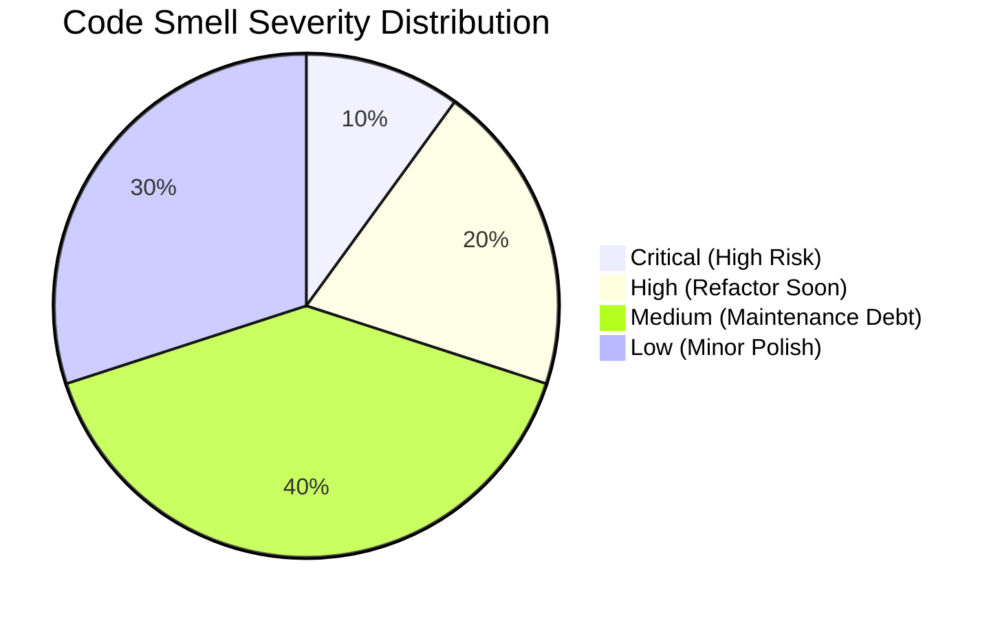

# Code Smell Audit Report

This report documents the architectural and implementation code smells identified in the platform backend. It ranks findings by severity and outlines concrete refactoring recommendations.

---

## 1. Summary of Identified Code Smells

---

## 2. Detailed Findings & Severity Rankings

### Finding 1: God Class (Severity: CRITICAL)
*   **Target Module**: [AuthService](file:///home/charan_derangula/projects/intelligentSystems/backend/app/application/services/auth_service.py)
*   **Description**: The class is over-responsible, managing user registration, credentials verification, password hashing, invite validations, MFA configurations, session logging, and welcome email queues in a single file.
*   **Consequence**: High maintenance overhead; changes to MFA logic risk introducing bugs in the core user registration or token generation paths.
*   **Refactoring Recommendation**: Decouple the class into specialized services:
    *   `RegistrationService` (manages sign-ups and invite tokens).
    *   `MfaService` (handles TOTP generation and validation).
    *   `SessionTokenManager` (handles JWT token generation and cookie setup).

---

### Finding 2: Tight Coupling to Database Session (Severity: HIGH)
*   **Target Module**: [repositories/](file:///home/charan_derangula/projects/intelligentSystems/backend/app/infrastructure/repositories/) and [services/](file:///home/charan_derangula/projects/intelligentSystems/backend/app/application/services/)
*   **Description**: Service classes import and pass SQLAlchemy database session instances (`AsyncSession`) directly.
*   **Consequence**: Hard to unit-test; mock tests require spinning up complex SQLAlchemy session objects, slowing down test runs.
*   **Refactoring Recommendation**: Implement the **Unit of Work Pattern**. Define database session boundaries inside an abstraction wrapper, keeping service classes decoupled from raw database session details.

---

### Finding 3: In-Memory Graph Processing (Severity: HIGH)
*   **Target Module**: [KnowledgeGraph](file:///home/charan_derangula/projects/intelligentSystems/backend/app/domain/engines/knowledge_graph.py)
*   **Description**: Resolves prerequisite graphs and sorts topics topologically in-memory.
*   **Consequence**: Will block Python's event loop. When a tenant loads a graph containing thousands of topics, this CPU-bound sorting operation will delay concurrent requests on the same API instance.
*   **Refactoring Recommendation**: Offload sorting calculations to PostgreSQL using recursive Common Table Expressions (CTEs) or database views.

---

### Finding 4: Cohesion Issues in Analytics (Severity: MEDIUM)
*   **Target Module**: [PrecomputedAnalyticsService](file:///home/charan_derangula/projects/intelligentSystems/backend/app/application/services/precomputed_analytics_service.py)
*   **Description**: The class mixes analytics aggregation calculations with cron job scheduling logic.
*   **Consequence**: Hard to maintain; modifying how tasks are scheduled requires updating the file that contains calculation logic.
*   **Refactoring Recommendation**: Decouple the class:
    *   `AnalyticsAggregationService` (calculates metrics).
    *   `AnalyticsScheduler` (manages Celery cron triggers).

---

### Finding 5: Duplicate Difficulty Normalization (Severity: MEDIUM)
*   **Target Module**: [diagnostic_routes.py](file:///home/charan_derangula/projects/intelligentSystems/backend/app/presentation/diagnostic_routes.py) and [diagnostic_service.py](file:///home/charan_derangula/projects/intelligentSystems/backend/app/application/services/diagnostic_service.py)
*   **Description**: Normalization rules that map decimal difficulties to difficulty levels (Easy, Medium, Hard) are implemented separately in both the presentation and application layers.
*   **Consequence**: If the difficulty scale is updated, developers must change both files, risking logic mismatches.
*   **Refactoring Recommendation**: Move all normalization logic to the domain model class as a getter property.

---

### Finding 6: Under-Engineered RLS Coverage (Severity: HIGH)
*   **Target Module**: [tenant_rls_audit_20260402.md](file:///home/charan_derangula/projects/intelligentSystems/docs/tenant_rls_audit_20260402.md)
*   **Description**: Key tenant-scoped tables (like `ml_feature_snapshots` and `feature_flags`) lack database-level RLS policies.
*   **Consequence**: High risk of data leaks if developers forget to append `tenant_id` filters to queries manually.
*   **Refactoring Recommendation**: Enable database-level RLS policies on all tenant-scoped tables immediately.
