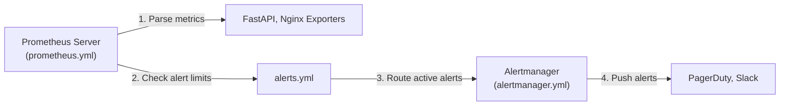
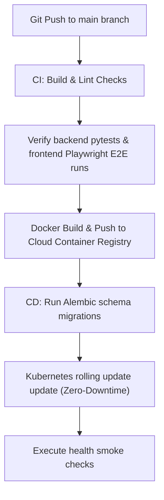

# DevOps Bible

This document serves as the definitive reference manual for infrastructure orchestration, continuous integration, continuous delivery (CI/CD), observability, and disaster recovery strategies for the **Learning Intelligence Platform**.

---

## 1. Local Container Orchestration (`Docker` & `Compose`)

The local development stack uses containerized environments managed by [docker-compose.yml](file:///home/charan_derangula/projects/intelligentSystems/docker-compose.yml) to mirror production layouts locally.

*   **API Service Container**: Runs the FastAPI application with live-reload enabled for development.
*   **Celery Workers & Beat**: Runs background tasks and schedules periodic jobs using the same codebase.
*   **AI Service Container**: Isolates prompt engineering workflows.
*   **Nginx Proxy Gateway**: Exposes port 8000 and routes requests to the backend API or frontend Next.js server.
*   **Prometheus & Grafana**: Automatically monitors container metrics on ports 9090 and 3001.

### Operational CLI Rules (`Makefile`)

Common developer tasks are automated in the root [Makefile](file:///home/charan_derangula/projects/intelligentSystems/Makefile):
*   `make up` — Builds and starts all containers in the background.
*   `make down` — Stops running containers and preserves database volumes.
*   `make test-backend` — Invokes backend pytest routines.
*   `make migrate` — Runs database schema upgrades.

---

## 2. Production Cluster Orchestration (`Kubernetes`)

Production systems are deployed to managed Kubernetes environments (AWS EKS or GCP GKE) using the manifests stored in the [k8s/](file:///home/charan_derangula/projects/intelligentSystems/k8s/) directory.

```text
k8s/
├── namespace.yaml              # Creates the isolated namespace
├── configmap.yaml              # Common non-sensitive environment variables
├── api.yaml                    # FastAPI deployment and service definitions
├── frontend.yaml               # Next.js frontend deployment
├── ai-service.yaml             # AI microservice deployment
├── workers.yaml                # Celery worker replicas
├── Ingress.yaml                # Ingress routing rules
├── hpa.yaml                    # Horizontal Pod Autoscaling (HPA) policies
├── pdb.yaml                    # Pod Disruption Budget controls
└── network-policy.yaml         # Namespace firewall isolation rules
```

*   **High Availability (HA) Settings**: Deployments configure `replicas: 3` and use Pod Disruption Budgets (`pdb.yaml`) to ensure at least 2 pods are active during cluster updates.
*   **Network Policies (`network-policy.yaml`)**: Implements strict firewall rules. Frontend pods are blocked from querying PostgreSQL directly; only API and Worker pods can access database nodes.

---

## 3. Proxy Routing & Load Balancing (`Nginx`)

Nginx acts as the primary API Gateway and edge router, configured using the files in the [nginx/](file:///home/charan_derangula/projects/intelligentSystems/nginx/) folder.

*   **Top-level Server Configurations** ([nginx.conf](file:///home/charan_derangula/projects/intelligentSystems/nginx/nginx.conf)): Sets up request buffers, gzip compression, and locks down HTTP request headers.
*   **Routing Proxies** ([frontend_gateway.conf](file:///home/charan_derangula/projects/intelligentSystems/nginx/frontend_gateway.conf)):
    *   Proxies path mutations directly to the FastAPI API container.
    *   Exposes a rate-limiting bucket using client IP addresses as keys to block spam queries.
    *   Exposes Nginx metrics via the `stub_status` endpoint to support Prometheus exporters.

---

## 4. Observability Stack

The observability system monitors platform health using **Prometheus**, **Alertmanager**, and **Grafana**, with configurations stored in the [monitoring/](file:///home/charan_derangula/projects/intelligentSystems/monitoring/) folder.



### Core Alarm Rules (`alerts.yml`)

Prometheus evaluates alert conditions defined in [alerts.yml](file:///home/charan_derangula/projects/intelligentSystems/monitoring/prometheus/alerts.yml):
*   `ApiLatencyHigh`: Triggers if P95 response times exceed 1.5 seconds for more than 5 minutes.
*   `ApiErrorRateHigh`: Triggers if HTTP 5xx error responses exceed 2% of total traffic.
*   `CeleryQueueBackedUp`: Alerts operators if pending Celery tasks exceed 100 items.
*   `OutboxLatencyHigh`: Triggers if events remain in the outbox table for longer than 60 seconds.

---

## 5. Deployment & CI/CD Strategy

Application rollouts are automated using GitHub Actions workflows, ensuring consistent verification checks before deploying to production.



*   **Zero-Downtime Rolling Updates**: Kubernetes updates containers sequentially. Readiness probes ensure new containers are fully initialized before old versions are terminated.
*   **Database Migrations**: Database changes are applied using Alembic before rolling out new API containers, ensuring all schema modifications are backward-compatible.

---

## 6. Security, Secrets & Backups

*   **Secrets Storage**: Production passwords, API keys, and private keys are injected dynamically into container runtimes using Cloud Secret Managers (AWS Secrets Manager or GCP Secret Manager). Secrets are never stored in git repositories.
*   **Database Backups**: PostgreSQL runs daily automated backups. Snapshots are encrypted and stored in private cloud storage buckets with a 30-day retention policy.
*   **Disaster Recovery (DR)**: Reliability procedures are documented in the [Reliability Runbook](file:///home/charan_derangula/projects/intelligentSystems/docs/reliability_runbook.md). DR workflows target a Recovery Point Objective (RPO) of under 24 hours and a Recovery Time Objective (RTO) of under 4 hours.

---

## 7. Production Launch Checklist

Before promoting code changes to production environments, complete all items in this launch checklist:

### 1. Database Operations
- [ ] Run Alembic migrations and verify they complete successfully.
- [ ] Verify that new queries are backed by indexes in the [Index Recommendations SQL](file:///home/charan_derangula/projects/intelligentSystems/docs/postgres_index_recommendations.sql).
- [ ] Verify that all tables containing tenant-scoped data have PostgreSQL Row-Level Security (RLS) policies enabled.

### 2. Infrastructure & Routing
- [ ] Confirm that environment variables are set in the production settings.
- [ ] Verify that Nginx rate limits are active.
- [ ] Set up public access blocks on private S3 storage buckets.
- [ ] Configure SPF/DKIM DNS settings to authenticate SendGrid email dispatchers.

### 3. Observability & Scaling
- [ ] Verify that Prometheus metrics are exposed on the `/metrics` endpoint.
- [ ] Set up Horizontal Pod Autoscaling (HPA) resource limits for Kubernetes nodes.
- [ ] Verify that Grafana dashboards are correctly loading data from Prometheus sources.
