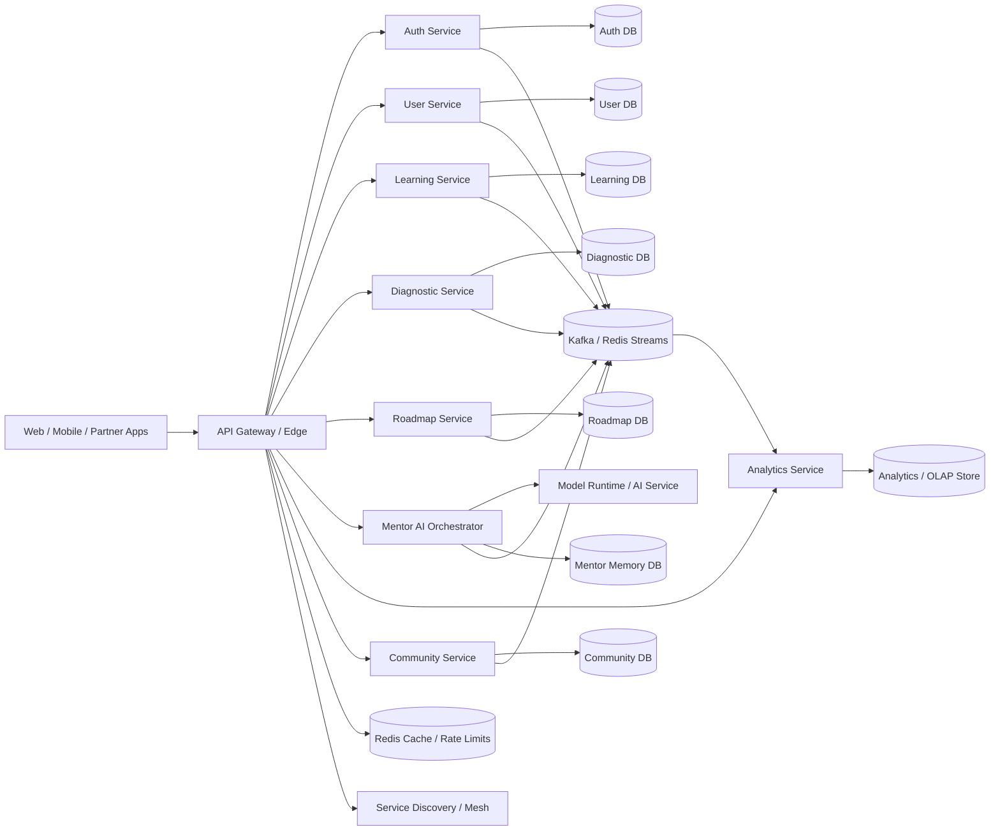

# Distributed System Architecture

## Goal
Evolve the platform from a modular monolith into a service-oriented architecture that can:

- scale to millions of users
- isolate traffic-heavy domains
- deploy services independently
- tolerate downstream failures
- support async/event-driven growth without tight coupling

## Target Topology

## Service Boundaries

### 1. Auth Service
Responsibilities:
- login, registration, refresh, password reset
- JWT issuance and validation
- API client auth for partner apps
- tenant-aware authorization claims

Owns:
- credentials
- sessions / refresh tokens
- auth audit records

External contract:
- `POST /auth/login`
- `POST /auth/register`
- `POST /auth/refresh`
- `POST /auth/api-clients/validate`

### 2. User Service
Responsibilities:
- user profile lifecycle
- tenant membership
- role assignments
- learner profile metadata

Owns:
- users
- tenant-user relationships
- user preferences

### 3. Learning Service
Responsibilities:
- topics, skills, goals, resources, content graph
- topic-to-skill mappings
- career and marketplace content metadata

Owns:
- topics
- skills
- topic prerequisites
- topic_skill mappings
- learning resources

### 4. Diagnostic Service
Responsibilities:
- diagnostic sessions
- question serving
- answer capture
- raw assessment scoring

Owns:
- diagnostic tests
- user answers
- question analytics

### 5. Roadmap Service
Responsibilities:
- roadmap generation orchestration
- step progression
- retention/review scheduling
- learning event emission

Owns:
- roadmaps
- roadmap steps
- progression state

### 6. Mentor AI Orchestrator
Responsibilities:
- learner memory
- AI context building
- mentor chat orchestration
- fallback and provider routing
- interview-prep / career coaching AI features

Owns:
- mentor memory profiles
- session summaries
- AI request metadata

Depends on:
- model runtime service
- roadmap read APIs
- learning/profile read APIs

### 7. Analytics Service
Responsibilities:
- live dashboards
- aggregated KPIs
- job readiness calculations
- experimentation metrics
- operational reporting

Owns:
- read models
- derived aggregates
- OLAP-friendly event projections

Should consume:
- learning events
- roadmap events
- community events
- mentor events

### 8. Community Service
Responsibilities:
- communities
- threads / replies
- moderation
- collaboration presence

Owns:
- communities
- memberships
- discussions
- badges

## API Gateway

The current Nginx layer should evolve into a real edge gateway.

Recommended responsibilities:
- central routing by path and version
- JWT/API key validation via auth service or local JWKS cache
- rate limiting by user, tenant, API client, IP
- WebSocket upgrade handling
- request/response observability
- circuit breaker and timeout policy enforcement
- canary and weighted traffic routing

Recommended stack options:
- Envoy + control plane
- Kong
- APISIX
- Nginx Plus if staying on Nginx

Suggested route map:

- `/auth/*` -> Auth Service
- `/users/*` -> User Service
- `/topics/*`, `/goals/*`, `/resources/*`, `/career/*` -> Learning Service
- `/diagnostic/*` -> Diagnostic Service
- `/roadmap/*` -> Roadmap Service
- `/mentor/*` -> Mentor AI Orchestrator
- `/analytics/*`, `/dashboard/*` -> Analytics Service
- `/community/*`, `/realtime/*` -> Community Service
- `/ops/*` -> platform admin plane

## Communication Model

### Synchronous
Use REST/gRPC for:
- user-facing read/write APIs needing immediate response
- low-latency point-to-point service calls
- auth validation
- profile lookups
- roadmap reads

Good examples:
- gateway -> auth service token introspection
- mentor service -> roadmap service current plan
- career service -> learning service skill graph read

### Asynchronous
Use message queue / event bus for:
- analytics ingestion
- notification fanout
- mentor memory update side effects
- derived read models
- search indexing
- billing / usage metering
- audit events

Recommended event bus:
- Kafka for large-scale durable event streaming
- Redis Streams or RabbitMQ as an intermediate step

Recommended canonical events:
- `user.created`
- `diagnostic.completed`
- `question.answered`
- `roadmap.generated`
- `roadmap.step.updated`
- `learning.event.recorded`
- `mentor.session.completed`
- `community.thread.created`
- `community.reply.created`
- `career.readiness.recomputed`

### Transitional pattern
The current outbox pattern should be retained and expanded per service.

Each service should:
- write its business transaction to its own DB
- write an outbox row in the same transaction
- publish outbox rows asynchronously

This avoids dual-write inconsistency.

## Database Strategy

### End state
Database per service boundary.

Example:
- Auth DB
- User DB
- Learning DB
- Diagnostic DB
- Roadmap DB
- Mentor DB
- Community DB
- Analytics store

Rules:
- no cross-service table joins
- no shared write access
- cross-domain reads must happen through APIs or replicated read models

### Transitional state
Start with schema-per-service or logical ownership within the current Postgres cluster:

- `auth_*`
- `user_*`
- `learning_*`
- `diagnostic_*`
- `roadmap_*`
- `mentor_*`
- `community_*`
- `analytics_*`

This gives boundary clarity before physical DB separation.

## Service Discovery

For local/dev:
- Docker DNS service names

For production:
- Kubernetes service discovery
- service mesh or xDS-backed discovery

Recommended:
- Kubernetes + Envoy/Istio or Linkerd

Discovery must support:
- dynamic scaling
- health-based routing
- mTLS between services
- retries and timeout policy

## Fault Tolerance

### Required platform behaviors
- per-hop timeouts
- bounded retries with jitter
- circuit breakers on remote calls
- bulkheads for AI/analytics heavy workloads
- idempotent consumers for async events
- DLQ for poison messages
- graceful fallback for non-critical dependencies

### Examples

If mentor model runtime fails:
- mentor orchestrator returns rule-based fallback
- memory update still persists locally

If analytics service lags:
- user workflows still proceed
- dashboards degrade to stale cached projections

If community websocket plane fails:
- REST thread/reply operations still work
- real-time presence becomes optional degradation

## Scaling Strategy

### Stateless services
Scale horizontally:
- gateway
- auth
- user
- learning
- diagnostic
- roadmap
- analytics API
- community API

### Stateful systems
Scale with specialized infra:
- Postgres read replicas and partitioning
- Kafka partitions
- Redis cluster / sentinel
- OLAP store for analytics
- vector/model stores if mentor AI expands

### Hot paths to isolate first
1. Mentor AI orchestration
2. Analytics/dashboard aggregation
3. Community realtime traffic
4. Diagnostic write-heavy workload

These are the first candidates for extraction from the monolith.

## Migration Plan

### Phase 0: Boundary hardening inside the monolith
- keep modular monolith
- define ownership by domain package
- ban cross-domain repository calls except through service interfaces
- make outbox/event contracts explicit

### Phase 1: Edge + async foundation
- replace simple gateway with API gateway
- standardize service auth headers and correlation IDs
- move from Celery-only task dispatch to event bus compatible contracts

### Phase 2: First extracted services
- extract Mentor AI Orchestrator
- extract Analytics Service
- extract Community Service realtime plane

These already have distinct workload and scaling profiles.

### Phase 3: Core domain splits
- split Auth Service
- split Diagnostic Service
- split Roadmap Service
- split Learning Service

### Phase 4: Data separation
- schema ownership
- read-model replication
- DB-per-service rollout

## Communication Flow Examples

### Roadmap update
1. Client -> Gateway -> Roadmap Service
2. Roadmap Service updates roadmap DB
3. Roadmap Service writes outbox event `roadmap.step.updated`
4. Event bus publishes event
5. Analytics Service updates readiness/dashboard projections
6. Community/Mentor notifications consume if needed

### Mentor chat
1. Client -> Gateway -> Mentor Service
2. Mentor Service calls User/Learning/Roadmap read APIs
3. Mentor Service loads local memory
4. Mentor Service calls model runtime
5. Mentor Service persists session summary
6. Mentor Service emits `mentor.session.completed`
7. Analytics/Billing consumers update derived state

### Diagnostic completion
1. Client -> Gateway -> Diagnostic Service
2. Diagnostic Service scores and stores results
3. Diagnostic Service emits `diagnostic.completed`
4. Roadmap Service generates or refreshes roadmap
5. Analytics Service updates job-readiness projection

## Operational Standards

Every service should expose:
- `/health/live`
- `/health/ready`
- `/metrics`
- structured logs with trace id / tenant id / user id

Every request should carry:
- `X-Request-ID`
- `X-Tenant-ID`
- authenticated subject

Every event should carry:
- `event_id`
- `event_type`
- `occurred_at`
- `tenant_id`
- `aggregate_id`
- `trace_id`

## Current Repo Mapping

Current modules map approximately to future services:

- `auth_routes`, `auth_service` -> Auth Service
- `user_routes`, `tenant_routes` -> User Service
- `topic_routes`, `goal_routes`, `resource_service`, skill/career models -> Learning Service
- `diagnostic_routes`, `diagnostic_service` -> Diagnostic Service
- `roadmap_routes`, `roadmap_service`, retention -> Roadmap Service
- `mentor_routes`, `mentor_service`, `ai_service` -> Mentor AI Orchestrator + Model Runtime
- `analytics_routes`, `dashboard_routes`, `learning_intelligence_service` -> Analytics Service
- `community_routes`, realtime hub -> Community Service

## Recommendation

Do not split everything at once.

The highest-value extraction order for this codebase is:

1. API Gateway upgrade
2. Event bus standardization with outbox
3. Mentor AI Orchestrator extraction
4. Analytics Service extraction
5. Community Service extraction
6. Auth/User split
7. Learning/Diagnostic/Roadmap split

That path preserves momentum while moving toward a Netflix/Uber-style backend shape without a reckless rewrite.
