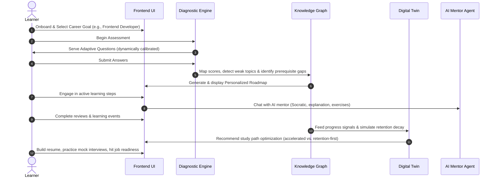
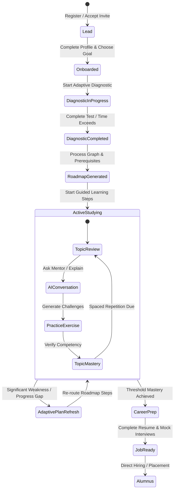

# Universal Learning Intelligence Platform: Executive Product Bible

## 1. Executive Summary
The **Universal Learning Intelligence Platform** is a multi-tenant, AI-native learning and career platform designed for academic institutions, bootcamps, corporate enterprise teams, and individual learners. 

Unlike traditional Learning Management Systems (LMS) that serve static, linear content, this platform represents a **cognitive learning operating system**. It evaluates learner competencies in real-time, models their knowledge state via dynamic graphs, simulates future outcomes using a "Digital Twin," and delivers adaptive learning roadmaps and AI-driven mentorship. 

By bridging the gap between educational progress and professional outcomes, the platform turns study milestones into measurable job-readiness scores. The code architecture is built with a FastAPI modular monolith, a React/Next.js App Router frontend, a dedicated multi-agent AI orchestration service, and a comprehensive database schema operating with PostgreSQL Row-Level Security (RLS) for enterprise tenant isolation.

---

## 2. Vision
> **To establish a universal, cognitive learning operating system that acts as a human-like private tutor, curriculum architect, and career coach for every learner on Earth.**

The platform's end-state is not simply an educational portal with AI features. It is a continuous learning intelligence network that understands the learner deeply, reasons over abstract concept hierarchies, and adaptively guides learners across any subject domain while constantly improving its teaching strategies from global telemetry.

---

## 3. Mission
To dematerialize and democratize premium, personalized education by:
* **Accelerating Mastery**: Designing dynamic learning roadmaps that target specific individual weaknesses.
* **Providing Responsive Guidance**: Delivering context-aware, socratic mentorship powered by collaborative AI agents.
* **Driving Outcomes**: Translating academic and technical progress into clear, actionable career readiness markers.
* **Scaling Institutional Operations**: Giving cohort operators and teachers robust tools to monitor student risk and intervene at critical moments.

---

## 4. Problem Statement
The education and corporate training markets face five systemic inefficiencies:
1. **Static, One-Size-Fits-All Curricula**: Traditional platforms ignore individual pacing, cognitive preferences, and retention decay (forgetting curves).
2. **Opaque Assessment Signals**: Standard tests tell a student *what* they got wrong, but fail to isolate *why* (identifying prerequisite deficiencies or deep-rooted misconceptions).
3. **The Mentorship Scalability Bottleneck**: One-on-one human coaching is economically out of reach for most, while existing AI chatbots lack persistent context, student memory, and structured pedagogical strategies.
4. **The Education-to-Employment Gap**: Learners complete courses but lack objective metrics of their real-world job-readiness, while hiring partners lack trustworthy proof of competency.
5. **Institutional Blind Spots**: Bootcamps, cohort managers, and L&D teams lack real-time visibility into student friction points, leading to high dropout rates and sub-optimal placement success.

---

## 5. Target Users
* **Students**: Learners enrolled in universities, schools, or cohort programs seeking clear direction, study plans, and interactive help to master their curriculum.
* **Independent Learners**: Ambitious self-directed professionals aiming for career pivots, certifications, or upskilling.
* **Teachers / Cohort Operators**: Instructors who manage student progress, design topics, configure custom learning goals, and review cohort analytics.
* **Mentors / Coaches**: Domain experts providing high-touch guidance, monitoring student chats, and stepping in when the AI tutor requests escalation.
* **Institution/Tenant Admins**: Educational leads who manage memberships, feature configurations, integrations, and branding.
* **Super-Admins**: Platform operators overseeing infrastructure, tenant billing, operational outboxes, and system-wide health.

---

## 6. Customer Personas

```carousel
### Alex, the Career Switcher (Independent Learner)
* **Demographics**: 28 years old, former retail manager transition-learning Software Engineering.
* **Core Need**: Needs an efficient path to landing a developer job. Wants to know exactly which concepts to study, needs instant help when stuck, and wants proof of job readiness.
* **Platform Value**: Leverages the [Adaptive Diagnostic Engine](file:///home/charan_derangula/projects/intelligentSystems/backend/app/application/services/diagnostic_service.py) to map coding weaknesses, receives a personalized [Roadmap](file:///home/charan_derangula/projects/intelligentSystems/backend/app/application/services/roadmap_service.py), studies with the AI Mentor, and uses the Resume Builder to demonstrate job readiness.
<!-- slide -->
### Professor Sarah (Teacher / Cohort Operator)
* **Demographics**: 45 years old, Director of a large-scale data science bootcamp (150+ students).
* **Core Need**: Needs to monitor student completion rates, pinpoint aggregate curriculum bottlenecks, and target human interventions.
* **Platform Value**: Accesses the Teacher Dashboard to view student weak-topic heatmaps and retention trends. Receives automated alerts from the [Autonomous Learning Agent](file:///home/charan_derangula/projects/intelligentSystems/backend/app/application/services/autonomous_learning_agent_service.py) identifying students at risk of drop-out.
<!-- slide -->
### David, L&D Director (Institution Admin)
* **Demographics**: 52 years old, L&D leader at an enterprise technology firm (5,000+ employees).
* **Core Need**: Secure, compliant upskilling portal with custom enterprise configurations, single sign-on (SSO), and granular access logs.
* **Platform Value**: Depends on PostgreSQL Row-Level Security (RLS) for complete employee data isolation, uses custom tenant goals, and monitors audit logs to ensure compliance.
```

---

## 7. Business Model
The platform operates on a **B2B2C and D2C Hybrid SaaS** model:
1. **Direct-to-Consumer (D2C)**: Direct self-serve acquisition of independent learners via a freemium-to-paid conversion funnel.
2. **Business-to-Business (B2B)**: Cohort operators, bootcamps, and universities purchase seat licenses for organizational control, dashboard analytics, and mentor workflows.
3. **Ecosystem & Marketplace**: An open network model allowing educators and creators to publish custom content, exercises, or plugins, with the platform retaining a take-rate on transactions.

---

## 8. Revenue Model
The platform leverages structured subscription tiers and metered usage:

| Plan Tier | Target Pricing | Included Value | Business Purpose |
|---|---|---|---|
| **Free (D2C)** | `$0` | Basic diagnostics, 1 roadmap generation, limited AI chat messages/month. | High acquisition, habit formation, and premium features showcase. |
| **Pro (D2C)** | `$19 - $39 / mo` | Unlimited roadmap refreshes, full AI mentor with memory, resume builder, mock interviews, autonomous agent assistance. | Maximizes conversion from high-intent self-directed learners. |
| **Team / Cohort (B2B)** | `$149 - $499 / mo` base + seat cost | Teacher & mentor dashboards, cohort analytics, custom content authoring, shared knowledge graph. | Targets bootcamps, vocational schools, and cohort training businesses. |
| **Enterprise (B2B)** | Custom Annual Contract | SSO/SAML integration, white-label UI, marketplace access, custom analytics, audit exports, dedicated SLA support. | Maximizes Annual Contract Value (ACV) and drives long-term retention. |

> [!TIP]
> **Usage-Based Add-Ons (Metered Overage)**: Heavy AI token usage, premium mock interview simulations, and marketplace purchases are monetized via micro-transactions or transaction take-rates.

---

## 9. Competitive Advantage
The platform's defensibility lies in its integrated **layered intelligence architecture**:
* **Graph-Based Reasoning**: The platform utilizes a [Knowledge Graph Engine](file:///home/charan_derangula/projects/intelligentSystems/backend/app/domain/engines/knowledge_graph.py) that tracks concepts and dynamic prerequisites rather than serving static directories.
* **Specialized Multi-Agent AI**: Uses collaborative agents (Mentor, Content Generator, Analytics, Career Advisor, Motivation Agent) coordinated via the [AI Service Orchestrator](file:///home/charan_derangula/projects/intelligentSystems/ai_service/service.py) rather than a simple ChatGPT wrapper.
* **The Learner Digital Twin**: A virtual state simulator that projects future progress curves, accelerating completion timelines and evaluating retention strategy decay.
* **High-Reliability Outbox Pattern**: Implements transactional outbox processing for microservice event synchronization, ensuring zero event loss.
* **Hybrid Mentorship Web**: Allows AI systems to smoothly hand off complex issues to human mentors, closing student feedback loops while generating premium dataset alignment logs to retrain the AI.

---

## 10. Product Positioning
* **Market Position**: "An AI-native learning and career platform for institutions, cohort programs, and ambitious learners that turns progress into job readiness."
* **Contrast vs. Traditional LMS (e.g., Canvas, Moodle)**: Traditional LMS platforms are passive document storage servers. This platform is a reasoning engine that diagnoses, customizes, and adapts.
* **Contrast vs. Standard AI Chatbots**: Generic chatbots lack curriculum awareness, prerequisite awareness, or structured student memory. This platform binds AI agents to concrete graphs, database entities, and learner states.

---

## 11. Core User Journey



---

## 12. Major Product Modules
1. **Authentication & Identity**: JWT-based session architecture, token blacklisting, invite tokens, and multi-factor authentication (MFA) helpers.
2. **Adaptive Diagnostic Engine**: Handles assessments, calculates step-by-step scoring, tracks session time limits, and selects the next question dynamically.
3. **Topic Graph & Prerequisite Tracer**: Curates curriculum concept maps, parsing dependency relationships to ensure logical learning paths.
4. **Roadmap Generator**: Orchestrates learning step generation, tracks completion state, and executes adaptive plan refreshes.
5. **Multi-Agent AI Service**: Manages LLM connections, token limits, system prompts, guardrails, and specialist response routing.
6. **Learner Digital Twin**: Gathers progress telemetry to construct a simulated student model, projecting mastery timelines.
7. **Role Dashboards & Analytics**: Aggregates raw learning logs into materialized views for student, teacher, mentor, admin, and super-admin panels.
8. **Gamification & Community**: Drives engagement via XP scoring, badges, activity milestones, discussion threads, and student follower graphs.
9. **Career Readiness Engine**: Analyzes masteries to determine role alignment, exports resumes, and structures mock interview modules.
10. **Ecosystem & Marketplace**: Handles subscriptions, registers developer plugins, and lists marketplace courses or extensions.
11. **Transactional Outbox & Ops**: Manages events, outbox state machines, feature flags, and administrative control systems.

---

## 13. Product Lifecycle



---

## 14. Product Roadmap

```carousel
### Short Term (0-3 Months)
* **Onboarding Optimization**: Connect goal selection directly to diagnostic tests and immediate roadmap generation.
* **Packaging and Entitlements**: Implement strict feature gates for Free, Pro, and B2B plans in the UI.
* **Billing System Integration**: Hook up payment gateway webhooks (e.g., Stripe) to drive the subscription models.
* **Operational Audit and Security**: Finalize row-level database compliance audits and scale indexes.
<!-- slide -->
### Mid Term (3-9 Months)
* **Creator Marketplace**: Deploy content authoring and publishing workflows to support marketplace listing creators.
* **Advanced Cohort Controls**: Expand teacher tools with interactive assignment tracking and student messaging pipelines.
* **A/B Testing Engine**: Launch in-app experiment frameworks to optimize pricing plans and onboarding pathways.
* **Developer API Portal**: Expose API portals allowing organizations to integrate their custom learning profiles.
<!-- slide -->
### Long Term (9-18 Months)
* **Multimodal Tutoring Core**: Integrate voice interactions and whiteboarding capability into AI Mentor sessions.
* **Population Intelligence Retraining**: Securely aggregate global learning logs (preserving tenant privacy boundaries) to auto-tune tutor actions.
* **Employer Placement Integrations**: Link job-readiness portfolios directly with partner hiring networks.
```

---

## 15. Success Metrics
* **North Star Metric**: **Weekly Active Learners (WAL)** completing at least one guided learning step or mentor interaction.
* **Customer Acquisition & Conversion**: Free-to-paid trial conversion rate, activation rate (completed onboarding within 24 hours), and CAC payback period.
* **Engagement & Retention**: Streak preservation rates, spaced-repetition review completion rate, and mentor feedback score.
* **Learning Outcomes**: Average career readiness score improvement, time-to-mastery reduction, and course completion rate.
* **B2B Unit Economics**: Annual Recurring Revenue (ARR), Net Revenue Retention (NRR) at the tenant level, and logo retention.

---

## 16. Product Risks & Mitigation Strategies

> [!WARNING]
> **AI Hallucinations / Pedagogical Drift**: AI agents might teach incorrect concepts or bypass socratic boundaries.
> * *Mitigation*: The system deploys structural [Guardrails](file:///home/charan_derangula/projects/intelligentSystems/ai_service/guardrails.py), uses prompt isolation, and routes complex interactions to human mentors via fallback channels.

> [!CAUTION]
> **Data Privacy and Multi-Tenant Leakage**: Enterprise client data must never leak to other tenants.
> * *Mitigation*: Implement PostgreSQL Row-Level Security (RLS) policies ([Phase 1 SQL](file:///home/charan_derangula/projects/intelligentSystems/backend/sql/postgres_tenant_rls.sql) and [Phase 2 SQL](file:///home/charan_derangula/projects/intelligentSystems/backend/sql/postgres_tenant_rls_phase2.sql)), routing tenant context via session parameters in database dependencies.

> [!IMPORTANT]
> **Curriculum Graph Complexity**: Massive prerequisite graphs cause slow execution or cyclic dependency loops.
> * *Mitigation*: The platform implements precomputed, versioned graph indexes and caches roadmap calculations in Redis.

---

## 17. Product Maturity Level
The system is currently categorized as **Late Prototype / Early Production-Ready**:
* **Backend Layer**: Highly mature modular monolith featuring extensive integration tests, Alembic migrations, event streaming scaffolding, and rate limiters.
* **Frontend Layer**: A robust React Next.js App Router codebase, containing comprehensive views for all user roles, though minor UI tests require setup context adjustments.
* **AI Engine**: The multi-agent orchestrator is fully implemented with prompts and fallback mechanisms.
* **ML Infrastructure**: Feature stores, training registries, and inference APIs are scaffolded, but lack automated offline retraining loops.

---

## 18. Current Completion Percentage
Estimated overall completion: **68%**

```mermaid
gantt
    title Development Completion by Module
    dateFormat  X
    axisFormat %
    
    section Core Infrastructure
    Auth & Tenants           :active, 0, 80
    DevOps & Observability   :active, 0, 75
    section Learning Engine
    Diagnostic Engine        :active, 0, 82
    Prerequisite Roadmaps    :active, 0, 78
    section AI & ML
    Multi-Agent Tutor        :active, 0, 65
    ML Platform & Twins      :active, 0, 52
    section Business Ops
    Marketplace & Ecosystem  :active, 0, 50
    Billing & Compliance     :active, 0, 25
```



---

## 19. Missing Business-Ready Features
To transition from a production-ready codebase to a fully commercialized business, the following layers must be implemented:
1. **SSO/SAML Identity Integration**: Necessary for enterprise sales onboarding.
2. **Stripe Payment Gateway integration**: Fully connecting the backend subscription plans to Stripe checkout interfaces.
3. **Remote SIEM Audit Aggregation**: Storing secure compliance audit trails outside local DB tables/files.
4. **Antivirus Content Scanning**: Scanning user-uploaded files for malware prior to persistence.
5. **Mobile Push Notification Gateways**: Exposing push alerts beyond simple in-app notification panels.

---

## 20. Future Product Vision
Looking beyond the current roadmap, the universal learning platform aims to build:
* **The Multimodal Socratic Tutor**: An interactive agent with real-time video, speech, and sketch recognition.
* **Cross-Subject Transfer Learning**: Analyzing a student's logical pattern strengths (e.g., in logic/math) to dynamically adapt learning strategies when they learn python programming.
* **Aggregated Population Intelligence Loops**: Cross-tenant training loops that identify when certain concept pathways have poor educational outcomes, suggesting curriculum improvements to authors.
* **Autonomous Digital Twin Placement Agents**: Allowing a learner's simulated twin to actively scan employer job boards, run pre-interview simulations, and confirm competency fits directly with hiring systems.
