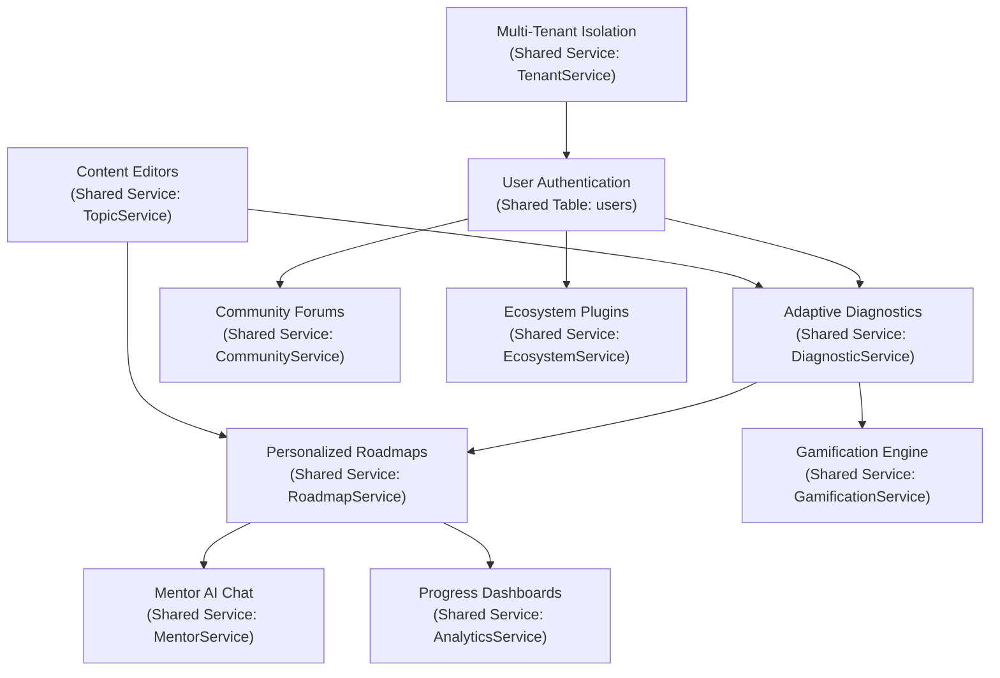

# Feature Dependency Map

This document maps the relationships, prerequisites, shared services, and database tables for the 9 core features of the platform.

---

## 1. Feature Dependency Matrix

| Feature | Prerequisites | Downstream Dependents | Shared Services | Shared Tables |
| :--- | :--- | :--- | :--- | :--- |
| **Multi-Tenancy** | None. | All features. | `TenantService` | `tenants`, `users` |
| **Diagnostic quiz** | Multi-Tenancy | Roadmaps, Progress | `DiagnosticService` | `diagnostic_tests`, `user_answers` |
| **Roadmap Generator** | Diagnostic quiz | Progress, Mentor AI | `RoadmapService` | `roadmaps`, `roadmap_steps` |
| **Mentor AI Chat** | Roadmaps | None. | `MentorService` | `mentor_chat_messages` |
| **Progress Dashboards** | Roadmaps | None. | `AnalyticsService` | `analytics_snapshots`, `topic_scores` |
| **Community Forums** | Multi-Tenancy | None. | `CommunityService` | `discussion_threads`, `discussion_replies` |
| **Gamification Engine** | Diagnostic quiz | None. | `GamificationService` | `badges`, `user_badges` |
| **Ecosystem Plugins** | Multi-Tenancy | None. | `EcosystemService` | `api_clients`, `plugin_registry` |
| **Content Editors** | Multi-Tenancy | Diagnostics, Roadmaps | `TopicService` | `topics`, `questions` |

---

## 2. Feature Dependency Graph

---

## 3. Shared APIs & Integration Scopes

*   `/auth/login` — The main gateway API; initializes tenant contexts and issues roles.
*   `/analytics/event` — Aggregates user telemetry logs across dashboards and roadmaps.
*   `/ops/outbox` — Processes and dispatches outbox table items to keep databases and caches in sync.
