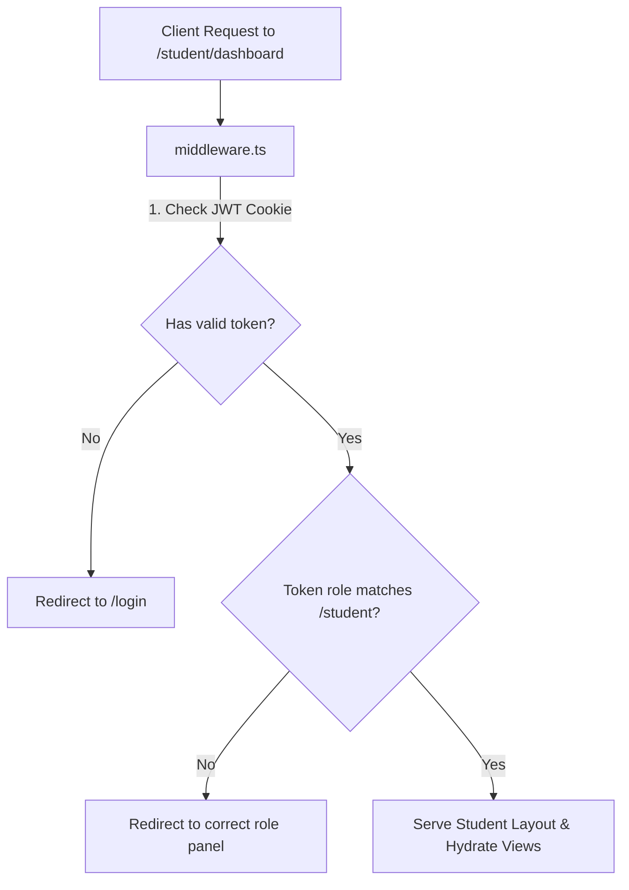
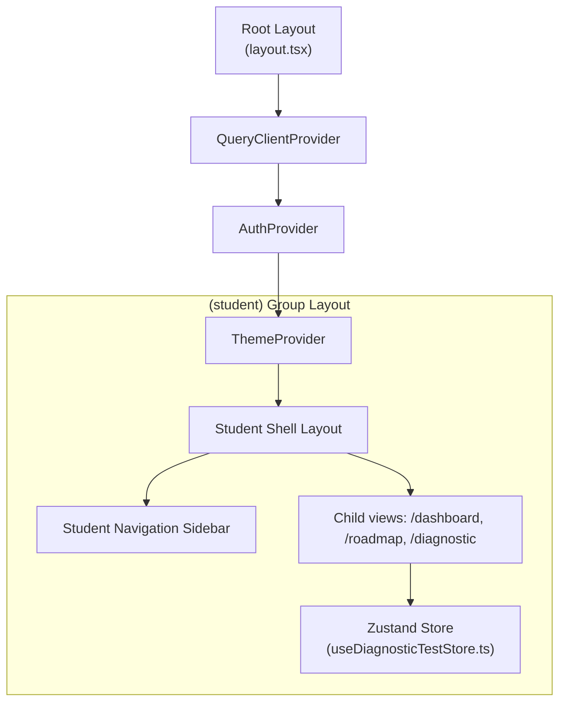

# Frontend Encyclopedia

This document serves as the definitive reference manual for the Next.js 15 frontend application (`learning-platform-frontend/`) of the **Learning Intelligence Platform**.

---

## 1. Pages & Route Groups

The application uses Next.js **Route Groups** (directories wrapped in parentheses) to organize views by user roles. This allows role-specific dashboard groups to have isolated layout templates and access permissions.

```text
learning-platform-frontend/app/
├── (admin)/                    # Admin Panel
│   └── admin/dashboard/page.tsx
├── (auth)/                     # Authentication Panel
│   ├── login/page.tsx
│   └── register/page.tsx
├── (independent-learner)/      # Independent Learner Panel
│   └── independent-learner/dashboard/page.tsx
├── (mentor)/                   # Mentor Panel
│   └── mentor/chat/page.tsx
├── (student)/                  # Student Panel
│   ├── student/dashboard/page.tsx
│   ├── student/roadmap/page.tsx
│   └── student/diagnostic/page.tsx
├── (super-admin)/              # Global Platform Operations
│   └── super-admin/ops/page.tsx
└── (teacher)/                  # Teacher Dashboard
    └── teacher/dashboard/page.tsx
```

*   **Marketing Landing Page**: [page.tsx](file:///home/charan_derangula/projects/intelligentSystems/learning-platform-frontend/app/page.tsx) — Renders the landing visual components.
*   **Auth Routes**: `/login` and `/register` manage credential collection.
*   **Dashboard Routes**: Role-specific pages load when users authenticate.

---

## 2. Layout Boundaries (`Layouts`)

Next.js layouts organize layout structures across pages, preventing parent elements from re-rendering when users navigate child views.

*   **Global Root Layout** ([layout.tsx](file:///home/charan_derangula/projects/intelligentSystems/learning-platform-frontend/app/layout.tsx)): Initializes metadata tags and wraps the view layer with providers (React Query, Auth, Theme, Toast Alerts).
*   **Dashboard Shell Layout** (e.g. `(student)/layout.tsx`): Sets up standard user sidebars, header blocks, user account menus, and tenant switching alerts.

---

## 3. UI Components (`Components`)

Visual components are split into layout shells, design tokens, and chart graphs:

*   **Design Tokens (`components/ui/`)**: Styled widgets (e.g., buttons, cards, modal dialogs, inputs) configured with Tailwind CSS classes.
*   **Analytics Charts (`components/charts/`)**: Recharts-based graphs that map student progress, topic mastery, and retention decay rates.
*   **Layout Elements (`components/layout/`)**: Persistent structural elements (e.g. header bars, navigation menus).

---

## 4. Custom React Hooks (`Hooks`)

Custom hooks encapsulate state interactions, query parameters, and event timings:

*   [useAuth.ts](file:///home/charan_derangula/projects/intelligentSystems/learning-platform-frontend/hooks/useAuth.ts) — Exposes user profile fields and coordinates post-login redirects.
*   [useTenantScope.ts](file:///home/charan_derangula/projects/intelligentSystems/learning-platform-frontend/hooks/useTenantScope.ts) — Parses subdomains or subkeys to resolve active tenant contexts.
*   `useDiagnosticCountdown.ts` — Manages quiz countdown timers and submits answers automatically on expiration.

---

## 5. Client State Management (`Stores`)

Global client-side state is managed using **Zustand** to keep states isolated and avoid unnecessary re-renders:

*   [useDiagnosticTestStore.ts](file:///home/charan_derangula/projects/intelligentSystems/learning-platform-frontend/stores/useDiagnosticTestStore.ts) — Tracks current question indexes, active quiz response inputs, remaining timer values, and submission states.

---

## 6. Contexts & Providers

Providers wrap pages to supply global runtime states:

1.  **QueryClientProvider**: Manages data caches and coordinates automatic background refreshes.
2.  **AuthProvider**: Manages access token updates and validates user session states.
3.  **ThemeProvider**: Stores active user theme settings (Dark vs. Light mode) in local storage, applying CSS variables to target layouts.

---

## 7. API Communication Layer (`API Services`)

HTTP requests use **Axios** client classes configured with request and response interceptors:

*   [apiClient.ts](file:///home/charan_derangula/projects/intelligentSystems/learning-platform-frontend/services/apiClient.ts) — Sets up the client instance, attaches active tenant header parameters (`X-Tenant-ID`), and injects Bearer JWT keys.
*   [authService.ts](file:///home/charan_derangula/projects/intelligentSystems/learning-platform-frontend/services/authService.ts) — Wraps login, logout, registration, and refresh request endpoints.

---

## 8. Protected Routes & Middleware

Request validation runs at the edge before pages hydate, using Next.js route middleware:



*   [middleware.ts](file:///home/charan_derangula/projects/intelligentSystems/learning-platform-frontend/middleware.ts) — Runs route guards, checks authorization tokens, and redirects users based on role permissions.
*   [roleRedirect.ts](file:///home/charan_derangula/projects/intelligentSystems/learning-platform-frontend/utils/roleRedirect.ts) — Resolves target dashboard URLs post-login.

---

## 9. State Synchronization Strategy

The platform splits application states into server-cached data and transient client-only data:

```text
========================================================================
[Server State (TanStack Query)]   │ [Client State (Zustand)]
--------------------------------- │ ------------------------------------
- Cached Topic Graphs             │ - Diagnostic Question Timers
- Historical Topic Mastery Scores │ - Quiz Option Selections
- User Profiles                   │ - Workspace Sidebar Toggle States
========================================================================
```

---

## 10. Rendering Flow

*   **Static Pre-rendering**: Marketing landing pages and login layouts are pre-rendered on the server to optimize loading speeds.
*   **Dynamic Client Rendering**: Interactive dashboards and quiz flows are hydrated on the client to handle real-time state updates.

---

## 11. Performance Optimization

*   **Route-Based Code Splitting**: Lazy loads route components to minimize bundle sizes.
*   **Query Caching**: Uses React Query cache parameters to avoid redundant network requests.
*   **Asset Compression**: Leverages Next.js image optimization features to serve compressed images.

---

## 12. Accessibility (a11y)

*   **Semantic Structure**: Uses standard HTML5 markup elements (e.g. `<main>`, `<nav>`, `<aside>`) to support screen readers.
*   **Keyboard Controls**: Allows users to navigate quiz questions and options using keyboard inputs.
*   **ARIA attributes**: Renders descriptive labels on charts and interactive buttons.

---

## 13. Testing Model

*   **Unit & Integration Tests (Vitest)**: Verifies utility functions and checks component rendering states.
*   **End-to-End Tests (Playwright)**: Runs full browser tests to verify user login flows, diagnostic test actions, and tenant switching behaviors.

---

## 14. Component Tree Map


