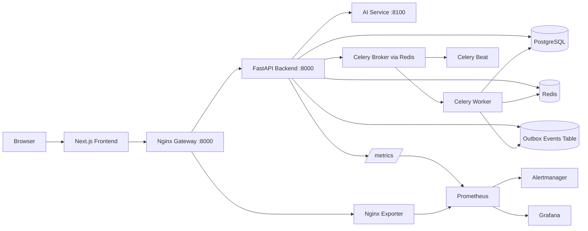
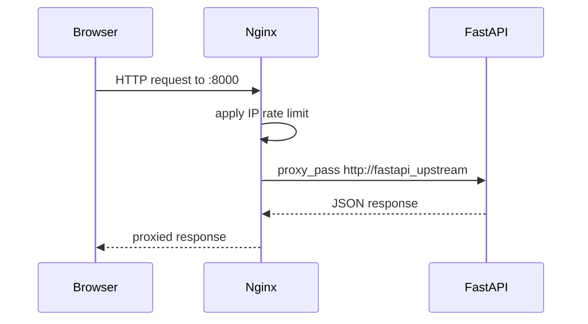
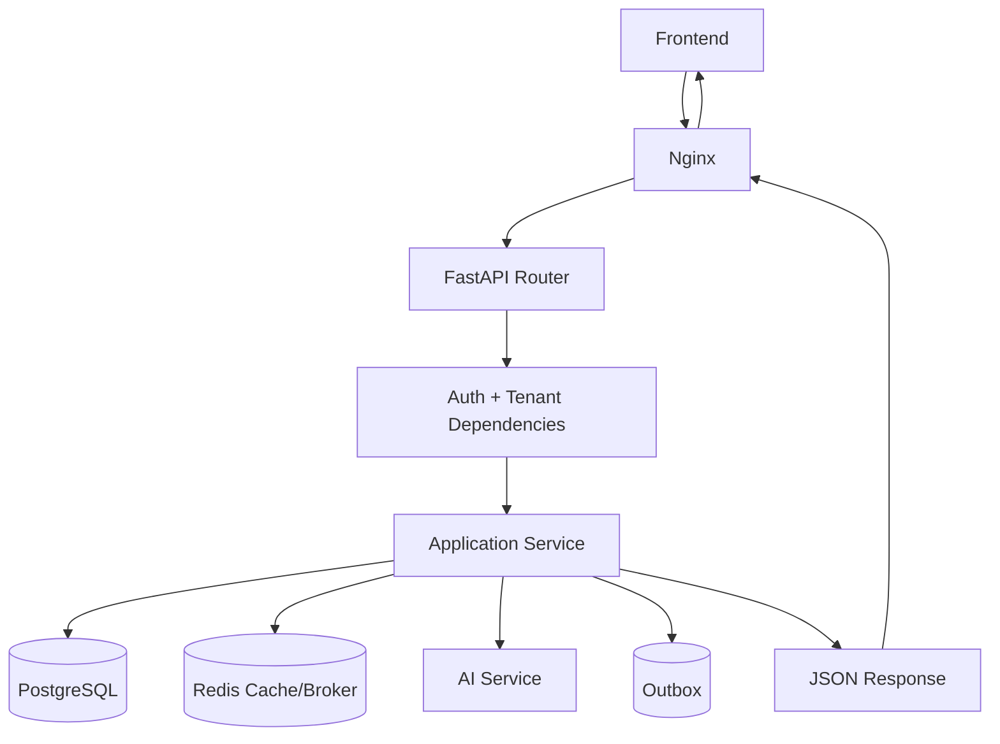
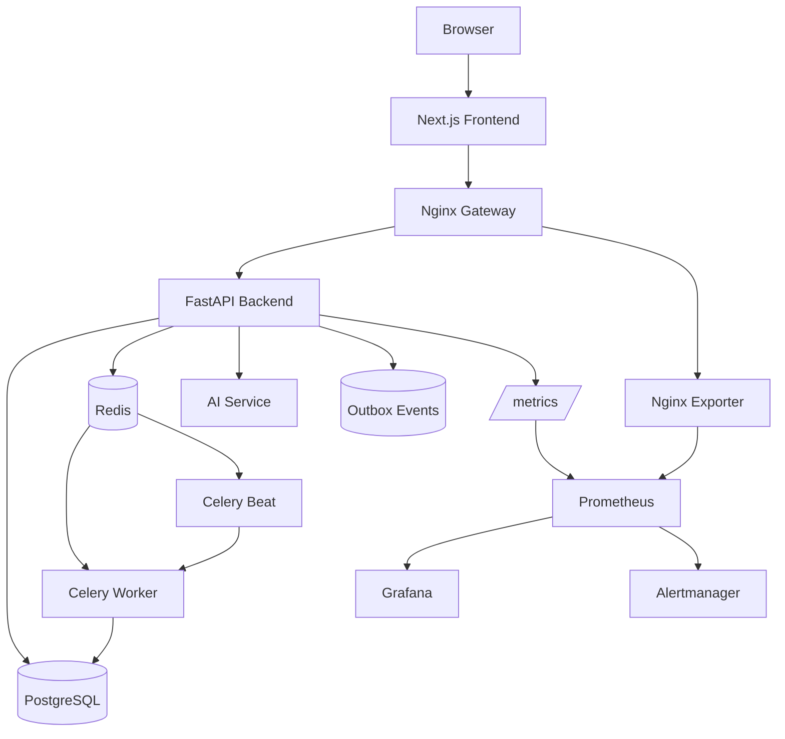
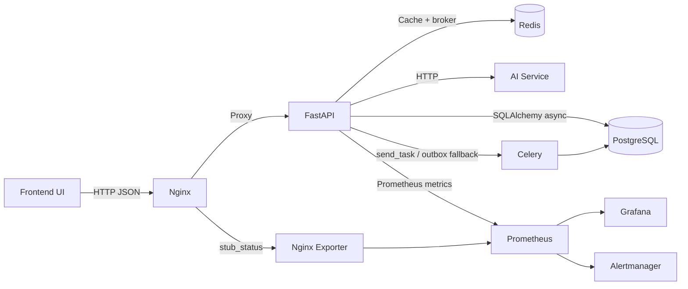
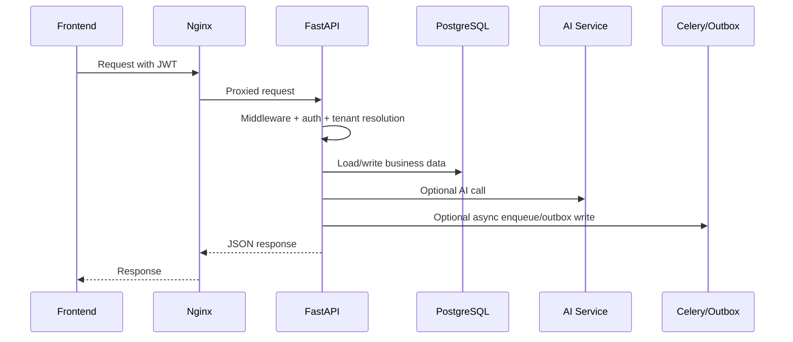
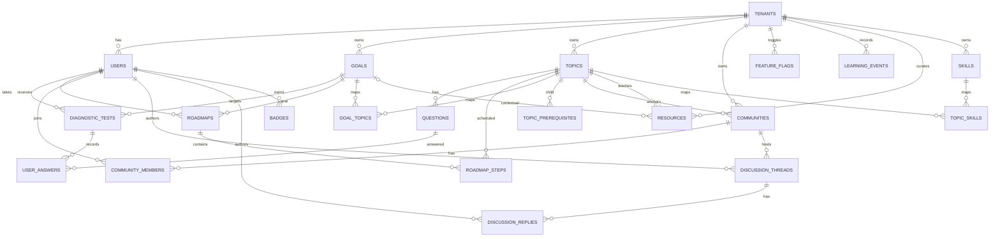

# Learning Intelligence Platform Architecture Guide

This document explains the repository as it exists in code today. It is written for developers who need to understand how the platform is structured, how requests move through it, which parts are production-facing, and which parts are still MVP placeholders or extension points.

## 1. Project Overview

### What the project does

The Learning Intelligence Platform is a multi-tenant learning SaaS built around three core learner workflows:

- authenticated access to a tenant-scoped learning workspace
- diagnostic assessment of a learner's current knowledge
- roadmap generation and mentor-style guidance based on diagnostic results and roadmap progress

The repository contains:

- a Next.js frontend in `learning-platform-frontend/`
- a FastAPI backend in `app/`
- a separate FastAPI AI service in `ai_service/`
- PostgreSQL, Redis, Celery, Nginx, Prometheus, Grafana, and Alertmanager orchestration through `docker-compose.yml`

### What problem it solves

The platform is trying to solve a common learning-operations problem: learners, teachers, and administrators need more than static course content. They need:

- tenant-specific content and user isolation
- diagnostics that estimate where a learner is weak or strong
- adaptive or semi-adaptive next-question logic
- automatically generated learning roadmaps
- mentor guidance and notifications
- progress analytics for teachers and admins
- operational tooling for feature flags, audit logs, and background job recovery

### Who the users are

The codebase supports four roles:

- `student`: takes diagnostics, views roadmaps, tracks progress, uses mentor tools, joins communities
- `teacher`: views learner progress and tenant analytics, can moderate discussion threads
- `admin`: manages tenant users, topics, questions, goals, communities, badges, feature flags, and outbox operations inside a tenant
- `super_admin`: manages tenants globally and can inspect another tenant by sending `X-Tenant-ID`

Tenant types are modeled as:

- `platform`
- `college`
- `company`
- `school`

### Conceptual system behavior

At a conceptual level, the system works like this:

1. A user authenticates and receives a JWT with `sub`, `tenant_id`, and `role`.
2. Every backend request resolves an effective tenant context.
3. Learners choose a goal and run a diagnostic.
4. Diagnostic answers are stored and aggregated into topic scores.
5. The backend generates a roadmap using prerequisite graphs, profile heuristics, and optionally the AI service.
6. Learners update roadmap progress and receive mentor-style suggestions, notifications, and analytics.
7. Teachers and admins see tenant-wide analytics and can curate tenant-owned learning content.
8. Celery and the outbox system handle background work and queue reliability.

## 2. High-Level Architecture

### Architectural style

The platform is best described as:

- a modular monolith at the application-code level
- a multi-container system at the deployment level

The backend is not split into multiple business microservices. Instead, FastAPI contains the business domains in a clean layered structure:

- presentation layer: HTTP routes
- application layer: use-case orchestration
- domain layer: engines and ORM entities
- infrastructure layer: database, repositories, cache, clients, jobs

Docker Compose then wraps that backend with separate operational services.

### Service roles

#### Next.js frontend

The frontend:

- provides the user interface
- stores the JWT in local storage and a cookie
- sends the JWT in `Authorization: Bearer ...`
- sends `X-Tenant-ID` when a super admin activates tenant inspection mode
- calls the backend through `NEXT_PUBLIC_API_URL`, which defaults to `http://localhost:8000`

The frontend is a React Query-driven client app with route protection in Next middleware.

#### FastAPI backend

The backend is the main system of record and orchestration layer. It:

- authenticates users
- enforces role-based access
- applies tenant scoping
- reads and writes PostgreSQL data
- uses Redis-backed cache helpers
- calls the AI service when enabled
- exposes metrics
- publishes background work to Celery or the outbox table

#### AI service

The AI service is a separate FastAPI app. In the current codebase it is a deterministic placeholder boundary, not a real model-serving stack. It provides:

- roadmap recommendation endpoint aliases
- mentor response endpoint aliases
- progress analysis endpoint

It exists so model-backed behavior can later be swapped in without rewriting the main backend service contract.

#### PostgreSQL

PostgreSQL is the primary system of record for:

- tenants
- users
- goals
- topics
- topic prerequisites
- questions
- diagnostic tests and answers
- roadmaps and steps
- communities and discussion data
- learning events
- resources
- feature flags
- skills and topic-skill mappings
- outbox events

#### Redis

Redis is used for two things:

- cache storage for some read paths such as topics and feature flags
- Celery broker/result backend

#### Celery workers

Celery workers execute background tasks such as:

- diagnostic analysis
- roadmap generation
- mentor notification building
- outbox replay and cleanup tasks

#### Nginx gateway

Nginx is the public edge for the backend stack on port `8000`. It:

- proxies all HTTP traffic to FastAPI
- sets forwarding headers
- enforces request rate limiting at the gateway
- exposes `stub_status` for the Nginx exporter
- provides a gateway health route

#### Prometheus

Prometheus scrapes:

- FastAPI `/metrics`
- Nginx exporter metrics

It also evaluates alert rules for API errors, latency, and outbox health.

#### Grafana

Grafana is pre-provisioned with:

- a Prometheus data source
- a `Learning Platform Overview` dashboard

#### Alertmanager

Alertmanager receives alerts from Prometheus and groups them. The current config is a logging/default receiver template rather than a real webhook/email integration.

### Service communication



### Docker deployment model

The Compose file defines these containers:

- `frontend`
- `api`
- `postgres`
- `redis`
- `celery_worker`
- `celery_beat`
- `ai_service`
- `nginx`
- `nginx_exporter`
- `prometheus`
- `alertmanager`
- `grafana`

Important deployment characteristics:

- `nginx` is the public entrypoint for the backend
- `api` is internal-only in Compose and sits behind Nginx
- `frontend` is exposed on `3000`
- `postgres` is exposed on `127.0.0.1:5433` by default
- `redis` is exposed on `127.0.0.1:6380` by default
- metrics and dashboards are exposed on `9090`, `9093`, and `3001`
- API startup runs migrations and seed logic via `scripts/start_api.sh`

## 3. Folder Structure Explanation

### Top-level repository folders

#### `app/`

Main FastAPI backend source code. This is the core backend application and contains the layered backend structure.

#### `alembic/`

Database migration environment and versioned schema history. This explains how the schema evolved from the initial MVP to tenant-owned content, feature flags, community replies, and outbox support.

#### `ai_service/`

Separate FastAPI service that acts as the AI boundary. Today it uses deterministic placeholder behavior but keeps the integration contract separate from the main backend.

#### `learning-platform-frontend/`

Next.js 15 frontend. Contains routes, React components, data-fetching services, route protection, and tenant inspection UI for super admins.

#### `monitoring/`

Operational observability configuration:

- Prometheus scrape and alert rules
- Grafana datasource/dashboard provisioning
- Alertmanager routing

#### `nginx/`

Gateway configuration:

- top-level Nginx config
- default server config
- rate limiting and proxy settings

#### `scripts/`

Operational helpers:

- API startup script
- seed bootstrap
- local preflight
- smoke tests

#### `tests/`

Backend test suite. Coverage includes:

- auth
- analytics
- diagnostics
- roadmap generation
- tenant isolation
- feature flags
- audit operations
- outbox behavior
- security hardening
- logging middleware
- service integration

#### `docs/`

Project documentation, including the launch checklist and this architecture guide.

#### `logs/`

Runtime log mount used by API and Celery containers so structured logs and audit logs survive container restarts.

### Backend subfolders inside `app/`

#### `app/application/`

Application services and cross-domain use cases. This is where most orchestration logic lives.

#### `app/core/`

Cross-cutting backend concerns:

- settings
- auth primitives
- dependencies
- security middleware
- feature flags
- metrics
- pagination
- logging

#### `app/domain/`

Domain entities and engines:

- ORM models
- learning/recommendation engines
- graph traversal logic
- mentor heuristics
- experimental or future-facing engines

#### `app/infrastructure/`

Technical adapters and persistence concerns:

- database session
- repositories
- Redis cache
- AI service client
- Celery app
- jobs and dispatching

#### `app/presentation/`

FastAPI routers, middleware, and exception mapping. This is the HTTP/API surface.

#### `app/schemas/`

Pydantic request and response models used by the routers.

### Frontend subfolders

#### `learning-platform-frontend/app/`

Next.js app router pages. Includes:

- auth
- dashboards by role
- goals flow
- diagnostic flow
- roadmap view
- mentor page
- progress page
- community page
- topic learning page

#### `learning-platform-frontend/components/`

Reusable UI and domain components:

- student dashboard widgets
- mentor widgets
- admin dashboard client
- layout primitives

#### `learning-platform-frontend/services/`

Typed API clients wrapping backend endpoints.

#### `learning-platform-frontend/hooks/`

Frontend hooks for:

- auth state
- tenant scope override
- health check

#### `learning-platform-frontend/types/`

Frontend TypeScript models corresponding to backend API contracts.

#### `learning-platform-frontend/utils/`

Helpers for token persistence, class name composition, and role redirect logic.

### Non-core/generated folders

These exist in the repository but are not part of the platform architecture:

- `.git/`
- `.next/`
- `node_modules/`
- `__pycache__/`
- `.pytest_cache/`
- `.venv`, `venv`, and similar local virtual environments
- `learning_intelligence_platform.egg-info/`

## 4. Backend Architecture

### Layering

The backend follows a clean, layered pattern:

- routes in `app/presentation/` only handle HTTP concerns
- services in `app/application/services/` implement business flows
- models in `app/domain/models/` define persisted entities
- repositories in `app/infrastructure/repositories/` isolate database access
- dependencies and middleware in `app/core/` handle auth, tenant context, settings, metrics, and security

### Routers

Routers are assembled in `app/presentation/api_router.py`. Registered modules are:

- auth
- analytics
- audit
- community
- dashboard
- tenants
- users
- goals
- topics
- mentor
- feature flags
- diagnostics
- roadmap
- outbox

### Services

Key application services:

- `AuthService`: registration and login
- `TenantService`: tenant creation and listing
- `UserService`: user creation and listing
- `GoalService`: goal CRUD and goal-topic links
- `TopicService`: topic CRUD, prerequisites, question CRUD/import/export
- `DiagnosticService`: start tests, submit answers, select next question
- `RoadmapService`: generate roadmaps and update step status
- `MentorService`: mentor guidance, suggestions, progress analysis
- `AnalyticsService`: tenant-wide aggregated analytics
- `DashboardService`: student/admin dashboard data assembly
- `CommunityService`: communities, memberships, threads, replies, badges
- `OutboxService`: durable task event storage and replay
- `LearningEventService`: event tracking
- `AuditLogService`: feature flag audit log reading/export

### Models

ORM models are SQLAlchemy declarative models in `app/domain/models/`. They are also the backbone of tenant isolation because many tables include `tenant_id`.

### Schemas

Pydantic models in `app/schemas/` define API I/O shapes for:

- auth
- users
- tenants
- goals
- topics
- diagnostics
- roadmaps
- mentor
- community
- analytics
- outbox
- audit
- feature flags

### Repositories

Repositories isolate database access. They are responsible for:

- query construction
- pagination
- tenant-constrained joins
- entity creation/update/delete

Examples:

- `UserRepository`
- `TenantRepository`
- `GoalRepository`
- `TopicRepository`
- `DiagnosticRepository`
- `RoadmapRepository`
- `CommunityRepository`
- `ResourceRepository`
- `OutboxRepository`

### Dependency injection

FastAPI dependency injection is used for:

- DB sessions via `get_db_session`
- JWT auth via `get_current_user`
- role checks via `require_roles`
- pagination via `get_pagination_params`

### Middleware

Important middleware and cross-cutting layers:

- `TenantContextMiddleware`
  - resolves `request.state.tenant_id`
  - honors JWT tenant
  - allows super admin override from `X-Tenant-ID`
- `SecurityHeadersMiddleware`
  - adds CSP, HSTS, frame, referrer, permissions, and content-type headers
- `CORSMiddleware`
  - configured from `CORS_ORIGINS`
- `RequestLoggingMiddleware`
  - emits structured logs
  - increments Prometheus counters/histograms
- SlowAPI middleware
  - powers selected endpoint rate limiting

### Authentication system

Authentication is JWT-based:

- login validates password using bcrypt
- token includes `sub`, `tenant_id`, and `role`
- protected routes use `OAuth2PasswordBearer`
- current user is reloaded from the database on every request

### Multi-tenant architecture

This is a shared-database, row-isolated multi-tenant design.

Isolation mechanisms:

- `tenant_id` columns on tenant-owned entities
- `TenantContextMiddleware` populates effective tenant context
- repositories often filter by `tenant_id`
- role checks gate sensitive endpoints
- super admins can inspect a different tenant by sending `X-Tenant-ID`

Important nuance: the design is mostly tenant-scoped, but not every code path is equally strict. For example, some question update/delete flows resolve questions by global ID before mutation. That is technical debt to tighten further.

### Request flow through the backend

A normal protected request flows like this:

1. Nginx forwards the request to FastAPI.
2. FastAPI middleware sets security headers and tenant context.
3. The auth dependency decodes the JWT and loads the user from PostgreSQL.
4. A router validates the request body/query through Pydantic schemas.
5. The router delegates to an application service.
6. The service calls repositories, domain engines, caches, or the AI client.
7. The service commits/rolls back via the shared SQLAlchemy session.
8. The router returns a schema-shaped response.
9. Middleware logs the request and updates Prometheus metrics.

## 5. Database Design

### Core tables and relationships

#### Tenancy and identity

- `tenants`
- `users`

`users.tenant_id -> tenants.id`

Notes:

- user roles are stored as an enum: `super_admin`, `admin`, `teacher`, `mentor`, `student`
- user email is globally unique, not tenant-scoped

#### Learning content

- `goals`
- `topics`
- `goal_topics`
- `topic_prerequisites`
- `questions`
- `skills`
- `topic_skills`
- `resources`

Notes:

- `goals` and `topics` became tenant-owned in migration `20260316_0016`
- names are unique per tenant for goals and topics
- `goal_topics` maps goals to topics
- `topic_prerequisites` defines prerequisite edges between topics
- `questions` belong to topics
- `skills` belong to tenants and connect through `topic_skills`
- `resources` optionally connect to both a topic and a goal

#### Diagnostic and learning activity

- `diagnostic_tests`
- `user_answers`
- `learning_events`

Relationships:

- `diagnostic_tests.user_id -> users.id`
- `diagnostic_tests.goal_id -> goals.id`
- `user_answers.test_id -> diagnostic_tests.id`
- `user_answers.question_id -> questions.id`
- `learning_events.user_id -> users.id`
- `learning_events.topic_id -> topics.id`
- `learning_events.diagnostic_test_id -> diagnostic_tests.id`

#### Roadmaps

- `roadmaps`
- `roadmap_steps`

Relationships:

- `roadmaps.user_id -> users.id`
- `roadmaps.goal_id -> goals.id`
- `roadmap_steps.roadmap_id -> roadmaps.id`
- `roadmap_steps.topic_id -> topics.id`

#### Community

- `communities`
- `community_members`
- `discussion_threads`
- `discussion_replies`
- `badges`

Relationships:

- `communities.tenant_id -> tenants.id`
- `communities.topic_id -> topics.id`
- `community_members.community_id -> communities.id`
- `community_members.user_id -> users.id`
- `discussion_threads.community_id -> communities.id`
- `discussion_threads.author_user_id -> users.id`
- `discussion_replies.thread_id -> discussion_threads.id`
- `discussion_replies.author_user_id -> users.id`
- `badges.user_id -> users.id`

#### Operations and reliability

- `feature_flags`
- `outbox_events`

Notes:

- feature flags are unique per `(tenant_id, feature_name)`
- outbox events can optionally carry `tenant_id`
- outbox status values used in code are `pending`, `processing`, `dead`, `dispatched`

### Purpose of requested key tables

#### `users`

Stores authenticated platform identities, tenant membership, role, and password hash.

#### `tenants`

Represents organizations or isolated workspaces. Most business data is ultimately scoped to one tenant.

#### `topics`

Represents learning nodes. Topics also participate in prerequisite graphs and roadmap steps.

#### `questions`

Diagnostic/practice questions attached to topics. Supports:

- `multiple_choice`
- `short_text`

Also stores accepted answer aliases and answer options.

#### `goals`

Defines target learning outcomes such as `AI/ML Engineer` or `Product Analyst`.

#### `roadmaps`

Stores generated learning plans for a user-goal pair.

#### `diagnostic_tests`

Tracks assessment sessions against a goal.

#### `discussion_threads`

Represents community discussion topics inside a tenant community.

### Tenant isolation

Tenant isolation is primarily row-based. The main pattern is:

- every tenant-owned entity stores `tenant_id`
- routers derive an effective tenant from auth or super-admin override
- repositories filter using that tenant

This is a practical SaaS pattern, but it depends on consistent repository/service usage rather than database-enforced row-level security.

## 6. API Design

The API is organized by domain modules. Routes live under `app/presentation/`.

### Auth

Purpose:

- register users
- issue JWTs

Main endpoints:

- `POST /auth/register`
- `POST /auth/login`

Database interaction:

- reads/writes `users`
- validates `tenant_id` against `tenants`

### Users

Purpose:

- create tenant users
- list users in the current tenant

Main endpoints:

- `POST /users`
- `GET /users`

Database interaction:

- writes `users`
- lists users filtered by `tenant_id`

### Tenants

Purpose:

- super-admin tenant management

Main endpoints:

- `POST /tenants`
- `GET /tenants`

Database interaction:

- writes and lists `tenants`

### Topics

Purpose:

- topic CRUD
- prerequisite graph maintenance
- question CRUD
- question import/export
- topic detail retrieval

Main endpoints:

- `GET /topics`
- `POST /topics`
- `PUT /topics/{topic_id}`
- `DELETE /topics/{topic_id}`
- `GET /topics/{topic_id}`
- `GET /topics/prerequisites`
- `POST /topics/prerequisites`
- `DELETE /topics/prerequisites/{prerequisite_id}`
- `GET /topics/questions`
- `POST /topics/questions`
- `PUT /topics/questions/{question_id}`
- `DELETE /topics/questions/{question_id}`
- `POST /topics/questions/import`
- `POST /topics/questions/import.csv`
- `GET /topics/questions/export`
- `GET /topics/questions/export.csv`

Database interaction:

- `topics`
- `topic_prerequisites`
- `questions`

### Goals

Purpose:

- goal CRUD
- goal-to-topic mapping

Main endpoints:

- `GET /goals`
- `POST /goals`
- `PUT /goals/{goal_id}`
- `DELETE /goals/{goal_id}`
- `GET /goals/topics`
- `POST /goals/topics`
- `DELETE /goals/topics/{link_id}`

Database interaction:

- `goals`
- `goal_topics`
- `topics`

### Diagnostics

Purpose:

- start a diagnostic session
- submit diagnostic answers
- fetch topic scores
- select the next diagnostic question

Main endpoints:

- `POST /diagnostic/start`
- `POST /diagnostic/submit`
- `GET /diagnostic/result`
- `POST /diagnostic/next-question`

Database interaction:

- `diagnostic_tests`
- `user_answers`
- `questions`

Async behavior:

- after submission, the backend tries to queue `jobs.analyze_diagnostic`
- if queue dispatch fails, it stores an outbox event

### Roadmaps

Purpose:

- generate learner roadmaps
- list roadmaps
- update step status

Main endpoints:

- `POST /roadmap/generate`
- `GET /roadmap/{user_id}`
- `PATCH /roadmap/steps/{step_id}`

Database interaction:

- reads diagnostic scores
- writes `roadmaps`
- writes `roadmap_steps`
- writes `learning_events` when a step is completed

Async behavior:

- tries to enqueue `jobs.generate_roadmap`
- tries to enqueue `jobs.send_notifications`
- falls back to outbox if dispatch fails

Important implementation note:

`POST /roadmap/generate` already generates the roadmap synchronously inside the request, then also attempts to queue a background `jobs.generate_roadmap`. That can create duplicate work and is a strong candidate for cleanup.

### Mentor

Purpose:

- chat response
- suggestion generation
- progress analysis
- notification generation

Main endpoints:

- `POST /mentor/chat`
- `GET /mentor/suggestions`
- `GET /mentor/progress-analysis`
- `GET /mentor/notifications`

Database interaction:

- suggestions and progress analysis can read diagnostics and roadmap data
- notification generation reads roadmap state and derived topic weakness

Important implementation note:

`/mentor/chat` now loads learner context from PostgreSQL and, when `ai_mentor_enabled` is on, calls the AI service through `AIServiceClient.mentor_response()`. If the AI path is disabled or unavailable, `MentorService.chat()` falls back to deterministic mentor guidance.

### Community

Purpose:

- community discovery and creation
- join membership
- discussion threads and replies
- badge award/revoke flows

Main endpoints:

- `GET /community/communities`
- `POST /community/communities`
- `DELETE /community/communities/{community_id}`
- `GET /community/members`
- `POST /community/members`
- `GET /community/threads`
- `POST /community/threads`
- `PATCH /community/threads/{thread_id}/resolve`
- `GET /community/replies`
- `POST /community/replies`
- `GET /community/badges`
- `POST /community/badges`
- `DELETE /community/badges/{badge_id}`

Database interaction:

- `communities`
- `community_members`
- `discussion_threads`
- `discussion_replies`
- `badges`

### Analytics

Purpose:

- tenant-wide learning metrics for teachers/admins

Main endpoints:

- `GET /analytics/overview`
- `GET /analytics/roadmap-progress`
- `GET /analytics/topic-mastery`

Database interaction:

- joins across `users`, `diagnostic_tests`, `user_answers`, `questions`, `roadmaps`, and `roadmap_steps`

### Operations

Operations concerns are implemented under `/ops`, not as a single module.

#### Feature flags

- `GET /ops/feature-flags`
- `GET /ops/feature-flags/catalog`
- `POST /ops/feature-flags/{flag_name}`

Behavior:

- tenant-aware
- super-admin can target another tenant
- ETag and cache headers are supported
- updates are audit logged through the structured logger

Supported flags:

- `adaptive_testing_enabled`
- `ai_mentor_enabled`
- `ml_recommendation_enabled`

#### Audit

- `GET /ops/audit/feature-flags`
- `GET /ops/audit/feature-flags/export`
- `GET /ops/audit/feature-flags/names`

Behavior:

- reads file-based audit logs
- supports time filtering, feature filtering, pagination-like offsets, CSV export, and ETags

#### Outbox

- `GET /ops/outbox`
- `GET /ops/outbox/stats`
- `POST /ops/outbox/flush`
- `POST /ops/outbox/requeue-dead`
- `POST /ops/outbox/requeue-dead/{event_id}`
- `POST /ops/outbox/recover-stuck`

Behavior:

- admin/super-admin operational recovery tools for background dispatch reliability

## 7. AI Service

### What it does

The AI service is a dedicated FastAPI app that exposes an AI-facing contract. In the current repository it is a placeholder service that returns deterministic responses. It is still valuable architecturally because:

- it keeps model integration decoupled from the main backend
- the backend already uses it through an HTTP client
- feature flags can switch AI-assisted flows on without changing the frontend contract

### Endpoints

Native endpoints:

- `GET /health`
- `POST /predict-learning-path`
- `POST /mentor-response`

Backend-facing aliases:

- `POST /ai/generate-roadmap`
- `POST /ai/mentor-chat`
- `POST /ai/analyze-progress`

### How the backend calls it

The backend uses `AIServiceClient`, which sends JSON over HTTP with `httpx`.

Methods:

- `predict_learning_path()`
- `mentor_response()`
- `analyze_progress()`

### Payloads sent

Roadmap generation sends:

- `user_id`
- `tenant_id`
- `goal`
- `topic_scores`
- `learning_profile`

Mentor response sends:

- `user_id`
- `tenant_id`
- `message`
- `roadmap`
- `weak_topics`
- `learning_profile`

Progress analysis sends:

- `user_id`
- `tenant_id`
- `completion_percent`
- `weak_topics`

### How responses are used

#### Roadmap generation

When `ml_recommendation_enabled` is enabled, `RecommendationService.weak_topics_with_foundations_async()` first tries the AI service. If the AI service returns `recommended_steps`, the topic IDs are used as the target topics for roadmap generation. If that fails, the code falls back to the rule engine.

#### Mentor guidance

When `ai_mentor_enabled` is enabled, `MentorService.generate_advice()` tries `AIServiceClient.mentor_response()` and appends the AI reply to the rule-based guidance text.

#### Progress analysis

When `ai_mentor_enabled` is enabled, `MentorService.progress_analysis()` tries `AIServiceClient.analyze_progress()` and prepends the AI summary/focus topics to the recommended focus list.

### Current limitations

- the AI service is deterministic placeholder logic, not an LLM/model host
- there is no vector store, prompt layer, or conversation persistence

## 8. Celery and Background Jobs

### Celery architecture

Celery is configured in `app/infrastructure/jobs/celery_app.py` using:

- broker: Redis
- result backend: Redis
- JSON serialization
- UTC timezone

### Workers

The `celery_worker` container runs:

- `celery -A app.infrastructure.jobs.celery_app:celery_app worker --loglevel=info`

### Beat scheduler

The `celery_beat` container runs periodic jobs:

- `jobs.process_outbox_events` every 60 seconds
- `jobs.cleanup_outbox_events` every 24 hours
- `jobs.refresh_outbox_metrics` every 60 seconds
- `jobs.recover_stuck_outbox_events` every 5 minutes

### Async task types

Defined task functions include:

- `jobs.generate_roadmap`
- `jobs.analyze_diagnostic`
- `jobs.send_notifications`
- `jobs.process_outbox_events`
- `jobs.cleanup_outbox_events`
- `jobs.refresh_outbox_metrics`
- `jobs.recover_stuck_outbox_events`

### Redis as message broker

Redis is used by Celery to:

- accept task publication from the backend
- hand work to workers
- persist task results/status metadata

### Outbox reliability pattern

The outbox exists because queue publication should not break the request lifecycle.

Pattern:

1. The route tries `enqueue_job(...)`.
2. If broker publication fails, the task payload is written into `outbox_events`.
3. Beat periodically runs `jobs.process_outbox_events`.
4. Pending outbox rows are retried.
5. Failures increment attempts and can move to `dead`.
6. Admin ops endpoints allow requeueing and recovery.

This is one of the stronger architectural choices in the repository.

## 9. Nginx Gateway

### Request routing

Nginx listens on port `80` inside the container and is published as host `8000`.

Primary routing behavior:

- `/gateway-health` returns `200 ok`
- `/nginx_status` exposes stub status to the exporter
- all other paths proxy to `api:8000`

### Rate limiting

Nginx defines:

- `limit_req_zone $binary_remote_addr zone=api_by_ip:10m rate=10r/s;`

The default server applies:

- `limit_req zone=api_by_ip burst=40 nodelay;`

This is gateway-level protection, separate from the application-level SlowAPI limits on selected endpoints.

### Proxy configuration

Nginx forwards these key headers:

- `Host`
- `X-Real-IP`
- `X-Forwarded-For`
- `X-Forwarded-Proto`
- `X-Request-ID`

It also disables request and response buffering for proxied traffic.

### Security headers

Nginx adds a CSP header, while FastAPI middleware adds a broader set of headers:

- `X-Content-Type-Options`
- `X-Frame-Options`
- `Referrer-Policy`
- `Permissions-Policy`
- `X-XSS-Protection`
- `Strict-Transport-Security`
- `Content-Security-Policy`

Important nuance:

- the CSP is currently permissive: `default-src * data: blob: 'unsafe-inline' 'unsafe-eval';`
- `Strict-Transport-Security` is added even in local HTTP scenarios

### How Nginx forwards requests to FastAPI



## 10. Monitoring Stack

### Prometheus

Prometheus scrapes:

- `api:8000/metrics`
- `nginx_exporter:9113/metrics`

FastAPI metrics include:

- `total_requests`
- `request_duration`
- `error_count`
- `outbox_dispatched_total`
- `outbox_failed_total`
- `outbox_dead_total`
- `outbox_cleanup_removed_total`
- `outbox_recovered_total`
- `outbox_queue_depth`

### Grafana

Grafana is provisioned with:

- a Prometheus datasource
- a dashboard titled `Learning Platform Overview`

Dashboard panels include:

- API requests/sec
- API error rate/sec
- p95 request duration
- active Nginx connections
- outbox dispatch/failure rate
- outbox success ratio
- outbox dead-letter total
- outbox recovered total
- outbox cleanup rate
- outbox queue depth

### Alertmanager

Alertmanager is configured to group alerts by:

- `alertname`
- `service`
- `severity`

The current receiver is a default log/template receiver.

### Nginx exporter

The Nginx Prometheus exporter scrapes:

- `http://nginx/nginx_status`

This gives Prometheus gateway metrics such as active connections.

### Alert rules

Defined alerts include:

- `HighApiErrorRate`
- `HighApiLatencyP95`
- `OutboxDispatchSuccessRatioLow`
- `OutboxDispatchFailuresHigh`
- `OutboxDeadLetterGrowing`
- `OutboxPendingBacklogHigh`
- `OutboxDeadBacklogHigh`
- `OutboxProcessingStuck`
- `OutboxRecoveriesSpike`

## 11. Request Lifecycle

### 1. User logs in

Actual flow:

1. Frontend login page or dashboard shell posts to `/auth/login`.
2. Request goes to Nginx on `:8000`.
3. Nginx proxies to FastAPI.
4. `AuthService.login()` loads the user by email from PostgreSQL.
5. Password is checked with bcrypt.
6. FastAPI returns a JWT.
7. Frontend stores the token in local storage and in a cookie.
8. Future frontend requests attach:
   - `Authorization: Bearer <token>`
   - `X-Tenant-ID` if super-admin inspection mode is active

### 2. User generates a roadmap

Actual flow:

1. Frontend calls `POST /roadmap/generate` with `goal_id` and `test_id`.
2. Nginx proxies to FastAPI.
3. Auth dependency resolves the current user and effective tenant.
4. `RoadmapService.generate()`:
   - loads diagnostic topic scores
   - loads prerequisite edges
   - derives a learning profile from answer analytics
   - checks `ml_recommendation_enabled`
   - optionally calls the AI service for topic ordering hints
   - otherwise uses the rule engine
   - expands prerequisites with `KnowledgeGraphEngine`
   - evaluates per-step difficulty
   - writes `roadmaps` and `roadmap_steps`
5. Backend commits and returns the new roadmap.
6. The route then tries to enqueue:
   - `jobs.generate_roadmap`
   - `jobs.send_notifications`
7. If queue dispatch fails, the route stores outbox rows instead.

Important note:

The synchronous roadmap is already complete before the background task is queued. The queued generation appears redundant in the current implementation.

### 3. User asks mentor chat

Conceptual target flow:

Frontend -> Nginx -> Backend -> learner context -> AI service -> response

Actual current flow in code:

1. Frontend calls `POST /mentor/chat`.
2. Nginx proxies to FastAPI.
3. FastAPI verifies `payload.user_id` and `payload.tenant_id` match the authenticated user.
4. `MentorService.chat()` loads learner roadmap and diagnostic context from PostgreSQL.
5. If `ai_mentor_enabled` is on, the backend calls the AI service with message, roadmap context, weak topics, and learning profile.
6. If the AI call fails or the feature is off, the backend falls back to rule-based mentor guidance.
7. Response goes back to the frontend.

Important note:

The AI service is still a placeholder FastAPI boundary, but `/mentor/chat` now follows the intended architecture shape instead of bypassing it.

### Request flow diagram



## 12. Security Model

### JWT authentication

- tokens are signed using `SECRET_KEY` and `ALGORITHM`
- expiration is enforced by `decode_access_token`
- token payload includes tenant and role claims

### Password hashing

- passwords are hashed with bcrypt
- password strength validation requires:
  - minimum length 8
  - at least one letter
  - at least one number

### Tenant isolation

Tenant isolation is enforced through:

- JWT tenant claim
- request-state tenant context
- repository filters and tenant joins
- super-admin header override only when role is `super_admin`

### API authorization

Role enforcement uses `require_roles(...)`.

Examples:

- only `super_admin` can manage tenants
- only `admin` and `super_admin` can manage many content/ops actions
- only `student` can update roadmap step progress

### Rate limiting

Two layers exist:

- Nginx rate limiting by IP
- application-level SlowAPI decorators on selected routes

Examples of app-level rate limits:

- auth login
- diagnostic start/submit
- roadmap generate
- feature flag operations
- audit operations

### Security gaps and hardening opportunities

- CSP is too permissive for production
- HSTS is always set, even without verified TLS termination in local/dev mode
- some tenant enforcement paths are tighter than others; question mutation scoping should be strengthened
- audit storage is file-based rather than centralized

## 13. System Diagrams

### System architecture diagram



### Service communication diagram



### Request flow diagram



### Database relationship diagram



## 14. Development Workflow

### Run locally with Docker Compose

```bash
docker compose up --build
```

Primary endpoints:

- frontend: `http://localhost:3000`
- backend via Nginx: `http://localhost:8000`
- Prometheus: `http://localhost:9090`
- Grafana: `http://localhost:3001`
- Alertmanager: `http://localhost:9093`

Default developer data-service host bindings:

- PostgreSQL: `127.0.0.1:5433`
- Redis: `127.0.0.1:6380`

### Local backend-only workflow

```bash
python -m venv venv
source venv/bin/activate
pip install -e .[test]
alembic upgrade head
python seed.py
uvicorn app.main:app --reload
```

### Local frontend workflow

```bash
cd learning-platform-frontend
npm install
npm run dev
```

Expected frontend env:

```bash
NEXT_PUBLIC_API_URL=http://localhost:8000
```

### Seed data

There are two seed paths:

- `seed.py`
  - richer demo tenants used by README/demo flow
- `scripts/bootstrap_seed.py`
  - platform baseline bootstrap with platform super admin and a smaller seed set

Seeded panel credentials from `seed.py`:

- platform super admin: `superadmin@platform.learnova.ai` / `SuperAdmin123!`
- Demo University
  - student: `maya.chen@demo.learnova.ai` / `Student123!`
  - teacher: `teacher@demo.learnova.ai` / `Teacher123!`
  - mentor: `mentor@demo.learnova.ai` / `Mentor123!`
  - admin: `admin@demo.learnova.ai` / `admin123`
- Northwind Academy
  - student: `ethan.cole@northwind.learnova.ai` / `Student123!`
  - teacher: `teacher@northwind.learnova.ai` / `Teacher123!`
  - mentor: `mentor@northwind.learnova.ai` / `Mentor123!`
  - admin: `admin@northwind.learnova.ai` / `admin123`
- Acme Learning Co
  - student: `noah.brooks@acme.learnova.ai` / `Student123!`
  - teacher: `teacher@acme.learnova.ai` / `Teacher123!`
  - mentor: `mentor@acme.learnova.ai` / `Mentor123!`
  - admin: `admin@acme.learnova.ai` / `admin123`
- Independent learner workspaces
  - `ava.martinez@workspace.learnova.ai` / `Student123!`
  - `leo.kim@workspace.learnova.ai` / `Student123!`

### Verification commands

```bash
make preflight
make verify-backend
make verify-frontend
make verify
make smoke
make smoke-multitenant
```

Frontend-specific:

```bash
cd learning-platform-frontend
npm run test:run
npm run build
npm run test:e2e
```

## 15. Project Summary

### Technologies used

Backend:

- Python 3.11
- FastAPI
- SQLAlchemy async ORM
- Alembic
- Pydantic v2
- bcrypt
- jose JWT
- Redis
- Celery
- httpx
- SlowAPI
- Prometheus client

Frontend:

- Next.js 15
- React 19
- TypeScript
- React Query
- Axios
- Recharts
- React Flow
- Tailwind CSS

Operations:

- Docker Compose
- Nginx
- PostgreSQL
- Redis
- Prometheus
- Grafana
- Alertmanager
- Nginx exporter

### How the system works end-to-end

The frontend authenticates against FastAPI, stores a JWT, and sends authenticated tenant-aware requests through Nginx. The backend applies auth, tenant context, and role authorization, then orchestrates diagnostics, roadmap generation, mentor guidance, analytics, and community features against PostgreSQL. Redis supports both caching and background task brokering. Celery and the outbox pattern keep async work resilient. Prometheus/Grafana/Alertmanager monitor API and queue health.

### What makes the architecture strong

- clear layered backend structure
- explicit tenant-aware data model
- repository-based DB access
- feature flags per tenant
- outbox reliability pattern for background work
- operational visibility through metrics, alerts, and dashboards
- frontend and AI service already separated behind stable HTTP contracts

### What can be improved

- replace the placeholder AI service with a real model-serving stack, prompt management, and conversation persistence
- remove or redesign duplicate roadmap generation work in `/roadmap/generate`
- tighten tenant scoping on all mutation paths, especially question update/delete
- move audit storage from file logs to durable queryable storage
- harden CSP and overall gateway security defaults
- align health endpoints and smoke checks, since some frontend/scripts currently hit `/` while the backend officially exposes `/health`
- decide whether global user email uniqueness is the intended SaaS behavior
- expose currently unused but promising engines, such as skill graph and resource recommendation, through API modules when product-ready

## Appendix: Active vs. extension-point engines

### Actively used in request flows

- `AdaptiveTestingEngine`
- `KnowledgeGraphEngine`
- `LearningProfileEngine`
- `TopicDifficultyEngine`
- `RuleEngine`
- `MLRecommendationEngine` via `RecommendationService`

### Present but not currently central to API flows

- `ContentRecommendationEngine`
- `SkillGraphEngine`
- `CareerPathPlanner`
- `JobReadinessEngine`
- `LearningSimulationEngine`
- `ExperimentEngine`
- `MentorLLMEngine`

These engines show the intended direction of the platform and are covered by tests, but they are not yet first-class API modules in the current application surface.
