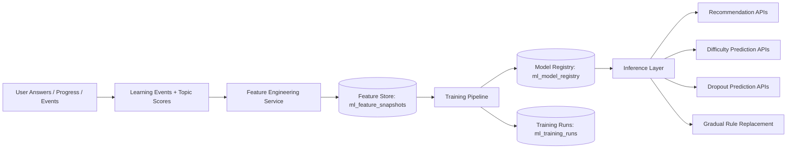

# ML Platform Architecture

## Goal
Move from static heuristics toward a continuously improving ML system that:

- collects learning behavior as training data
- computes reusable learner and topic features
- versions models explicitly
- supports periodic retraining
- integrates inference into product APIs with graceful fallback

## Pipeline

## Data Collection

Current sources already in the repo:
- `learning_events`
- `user_answers`
- `topic_scores`
- roadmap completion state
- question difficulty

Signals collected:
- user answers
- learning progress
- time spent
- topic difficulty exposure
- retention signals
- engagement events

## Feature Engineering

Current implemented feature snapshot:
- `learning_speed`
- `retention_rate`
- `topic_difficulty_score`
- `user_engagement_score`
- `total_learning_events`
- `average_answer_accuracy`
- `average_time_spent_minutes`

Feature store table:
- `ml_feature_snapshots`

This is a lightweight online/offline hybrid feature store for the current stage.

## Models

### Recommendation Model
Purpose:
- rank topics for roadmap prioritization

Current integration:
- `MLRecommendationEngine`
- `/ml/infer/recommendations`

### Difficulty Prediction Model
Purpose:
- estimate true topic difficulty from observed outcomes

Current integration:
- `/ml/infer/difficulty/{topic_id}`

### Dropout Prediction Model
Purpose:
- estimate learner failure / churn risk

Current integration:
- `/ml/infer/dropout`

### Model Registry
Table:
- `ml_model_registry`

Fields tracked:
- model name
- version
- model type
- metrics
- artifact URI
- activation state

## Training Pipeline

Training metadata table:
- `ml_training_runs`

Current API:
- `POST /ml/train`

Recommended future job flow:
1. batch job loads latest feature snapshots
2. train model per task
3. compute evaluation metrics
4. write registry entry
5. switch active version via controlled rollout

Recommended periodic cadence:
- recommendation model: daily
- difficulty model: daily or every 12h
- dropout model: every 6h

## Inference Layer

Routes:
- `GET /ml/overview`
- `POST /ml/features/snapshot`
- `POST /ml/train`
- `GET /ml/infer/recommendations`
- `GET /ml/infer/difficulty/{topic_id}`
- `GET /ml/infer/dropout`

Inference principles:
- prefer active model version if available
- return model version with prediction
- keep graceful fallback to deterministic logic
- expose outputs in a form other services can consume

## Gradual Replacement Strategy

Do not replace all rules at once.

Recommended rollout:
1. shadow predictions
2. compare ML vs rule outputs
3. enable per-tenant/per-feature flag
4. measure business outcomes
5. promote ML path to primary

## Current Repo Mapping

- data collection: `learning_event_service.py`, `diagnostic_service.py`, `roadmap_service.py`
- feature engineering: `ml_platform_service.py`
- feature store: `ml_feature_snapshots`
- model registry: `ml_model_registry`
- training metadata: `ml_training_runs`
- inference API: `ml_routes.py`

## Next Logical Steps

1. add offline training scripts under `scripts/ml/`
2. export parquet/csv training datasets
3. persist actual serialized model artifacts
4. add tenant-scoped model activation controls
5. introduce experiment framework for ML-vs-rule evaluation
