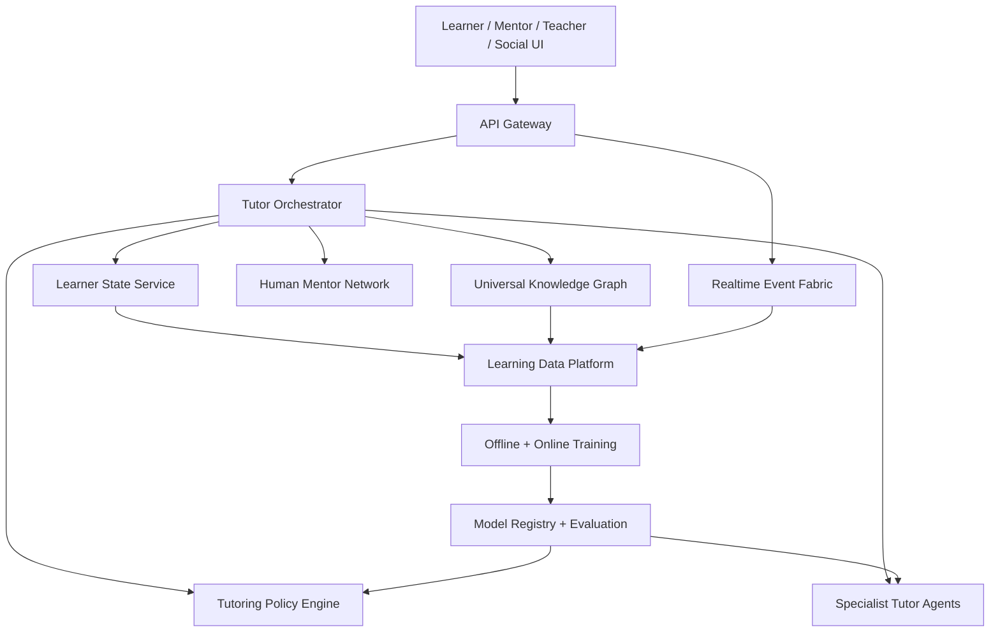

# Next-Generation Intelligent Learning Platform

## Purpose
This document defines the future-state architecture for evolving the current learning platform into a next-generation intelligent learning system:

- a fully intelligent tutor that teaches with human-like adaptability
- a universal learning system that can support any subject domain
- a continuous-learning intelligence layer that improves from global learner signals

This is a target-state blueprint, not a claim that the current repository already implements all of it.

## Product Vision
The end-state product is not a dashboard with AI features attached. It is a cognitive learning operating system with five properties:

1. It understands the learner deeply.
2. It reasons over knowledge, goals, and skill transfer.
3. It teaches adaptively with multimodal, human-like tutoring strategies.
4. It learns from the entire network of learners without collapsing personalization.
5. It continuously improves the quality of teaching, sequencing, and intervention.

In practical terms, the platform should feel like:

- a private tutor
- a curriculum architect
- a coach
- a peer-learning network
- a global intelligence system for learning outcomes

## Architectural Thesis
The platform should be designed as a layered intelligence stack rather than a single “AI tutor” service.

### Layer 1: Learner State
The system maintains a high-resolution learner state composed of:

- progress state
- mastery state
- retention state
- cognitive state
- motivational state
- career state
- collaboration state

This repo already has strong building blocks for that:

- roadmap and mastery tracking
- mentor memory
- digital twin modeling
- autonomous guidance
- knowledge graph reasoning
- realtime activity
- social learning network

The future state is to unify those signals into a single learner state contract that every intelligent subsystem can consume.

### Layer 2: Domain Knowledge
The system maintains a subject-agnostic knowledge layer:

- topics
- skills
- prerequisites
- misconceptions
- competency evidence
- assessment patterns
- content atoms
- modality metadata

The existing topic graph and skill mapping work should evolve into a universal curriculum graph that can represent:

- math
- programming
- science
- language learning
- exam preparation
- professional training
- enterprise onboarding

This graph should not be hard-coded to a single educational domain. Every subject becomes a graph of concepts, skills, evidence, and transfer edges.

### Layer 3: Tutor Cognition
The tutor should operate as a reasoning system, not only a response generator.

Core tutor cognition loop:

1. Observe learner state
2. Infer what the learner knows, misunderstands, and is likely to forget
3. Select a teaching strategy
4. Deliver an explanation, question, exercise, revision, or intervention
5. Measure learner response quality
6. Update the learner model

The current mentor, cognitive model, autonomous agent, and multi-agent orchestration are the foundations of this layer.

### Layer 4: Population Intelligence
The system should improve from global signals across all tenants and learners while preserving tenant boundaries and privacy controls.

This layer powers:

- recommendation improvement
- misconception discovery
- topic difficulty estimation
- intervention effectiveness analysis
- teaching-style effectiveness by learner archetype
- transfer learning across subject domains

This is the long-term engine that makes the platform continuously smarter.

## Core Future Components

## 1. Fully Intelligent Tutor
The tutor should teach like a high-performing human tutor, but with machine-scale memory and consistency.

### Capabilities
- detect confusion and misunderstanding in real time
- decide when to explain, test, revise, or motivate
- change tone and granularity based on the learner
- remember prior mistakes and breakthroughs
- ask diagnostic questions before giving answers
- choose between analogy, worked example, Socratic questioning, visual explanation, or drill mode

### Internal Subsystems
- learner state interpreter
- misconception detector
- teaching-strategy selector
- tutoring policy engine
- explanation planner
- assessment generator
- intervention scheduler
- reflection and summary engine

### Operating Modes
- explain mode
- guided problem-solving mode
- Socratic mode
- revision mode
- mock interview mode
- motivational coaching mode
- high-risk recovery mode

### Human-Like Behavior
Human-like tutoring does not mean anthropomorphic chat alone. It means the system:

- notices when the learner is confused before the learner says so
- adapts pacing instead of repeating the same explanation
- references prior failures and improvements naturally
- decides not just what to say, but what pedagogical move to make next

## 2. Universal Learning System
The system should support all subjects through a shared intelligence architecture.

### Universal Model
Every subject can be represented using:

- concept nodes
- skill nodes
- prerequisite edges
- misconception patterns
- evidence of mastery
- learning resources
- assessments
- simulations

### Subject Adapters
Different subject families need different execution layers:

- symbolic reasoning for math and logic
- code execution and trace analysis for programming
- semantic explanation and retrieval for humanities
- pronunciation and listening loops for languages
- scenario simulation for business, medicine, and operations

The platform should expose subject adapters behind a common tutoring interface.

### Content Representation
Content should evolve from course pages and topic records into reusable learning atoms:

- explanation atom
- example atom
- challenge atom
- diagnostic atom
- revision atom
- simulation atom
- reflection atom

This makes the system curriculum-flexible and agent-friendly.

## 3. Continuous Learning AI
The platform should learn from every interaction.

### Global Intelligence Loop
1. Collect interaction telemetry
2. Convert telemetry into learner, tutor, and content signals
3. Train policy, recommendation, and prediction models
4. Evaluate outcomes
5. Deploy better models
6. Continue online and offline learning

### Key Model Families
- recommendation models
- dropout and risk models
- mastery progression models
- misconception clustering models
- explanation effectiveness models
- teaching-policy models
- content difficulty models
- mentor escalation models

### Feedback Signals
- answer correctness
- answer latency
- revision success
- retention outcomes
- session completion
- streak recovery
- intervention acceptance
- tutor-to-human handoff success
- peer learning outcomes
- career readiness movement

### Privacy and Governance
Population learning must not mean unrestricted data pooling.

Future architecture should separate:

- tenant-private intelligence
- cross-tenant aggregated intelligence
- privacy-safe foundation learning
- model governance and auditability

## System Architecture

## Major Services in the Future State

### Learner State Service
Maintains the canonical learner model:

- mastery
- retention
- behavior
- cognitive model
- motivation
- memory
- social context
- career context

### Universal Knowledge Graph Service
Owns:

- concepts
- skills
- cross-subject relationships
- prerequisite logic
- misconception maps
- content and assessment metadata

### Tutor Orchestrator
Coordinates:

- tutoring mode selection
- agent routing
- context assembly
- human escalation
- explanation synthesis

### Tutoring Policy Engine
Chooses:

- next best pedagogical action
- explanation style
- session pacing
- difficulty calibration
- revision cadence

### Global Learning Intelligence Platform
Owns:

- feature store
- event pipelines
- model training
- model evaluation
- experimentation
- safe rollout

### Human Mentor Network
Provides:

- escalation paths
- hybrid tutoring sessions
- quality review loops
- mentor feedback signals that improve the AI

## Intelligence Contracts
The future platform should standardize these system-level contracts.

### Learner State Contract
- who the learner is
- what they know
- what they are struggling with
- how they learn best
- what intervention is appropriate now

### Teaching Plan Contract
- current objective
- teaching style
- misconceptions to address
- explanation plan
- practice plan
- success criteria

### Learning Outcome Contract
- what changed after the session
- what remains misunderstood
- what should happen next
- how confident the system is

## Roadmap From Current Platform
The current repo already contains meaningful foundations:

- mentor memory
- adaptive roadmaping
- multi-agent orchestration
- digital twin
- autonomous learning agent
- knowledge graph reasoning
- ML platform skeleton
- hybrid human + AI mentorship
- social learning network

The realistic path forward is:

### Phase 1: Unified Learner Intelligence
- unify dashboard, mentor memory, cognitive model, digital twin, and autonomous state into one learner-state service
- formalize a common context object for all AI calls

### Phase 2: Universal Knowledge Layer
- expand topic graph into a richer concept-skill-misconception graph
- add subject adapters and content-atom representation

### Phase 3: Tutor Policy System
- separate pedagogical decisioning from response generation
- move from “respond well” to “teach well”

### Phase 4: Population Learning Loop
- productionize feature store, experimentation, evaluation, and retraining
- learn globally from intervention outcomes

### Phase 5: Multimodal Universal Tutor
- voice
- whiteboard / diagram reasoning
- simulation environments
- domain-specific execution tools

## Product Experience Principles

### 1. The learner should feel understood
The system should surface:

- why it chose a teaching style
- what it thinks the learner is struggling with
- how it adapted in response

### 2. The system should act, not only answer
The future platform should proactively:

- revise plans
- insert recovery loops
- create simulations
- schedule reviews
- escalate to humans

### 3. Intelligence should be measurable
Every major tutor decision should be evaluated on:

- learner comprehension
- retention lift
- completion lift
- confidence calibration
- time-to-mastery

## What “Next-Gen” Actually Means
A next-generation intelligent learning platform is not:

- a static LMS with a chatbot
- a recommendation engine only
- a content library with analytics

It is:

- a dynamic learner model
- a reasoning tutor
- a universal knowledge engine
- a human + AI teaching network
- a global intelligence system that improves with use

## Final Position
The current platform can credibly evolve into this future state because it already has the correct primitives:

- personalization and memory
- realtime interactions
- multi-agent AI
- autonomous guidance
- digital twins
- knowledge graph reasoning
- ML infrastructure
- social and human mentorship layers

The next architectural move is not “add more UI.” It is to unify these primitives into a single tutor intelligence core that can generalize across subjects and improve from global learning outcomes.
