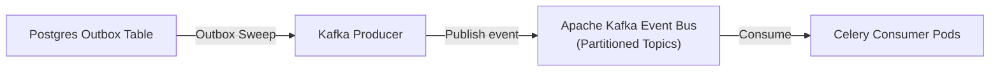
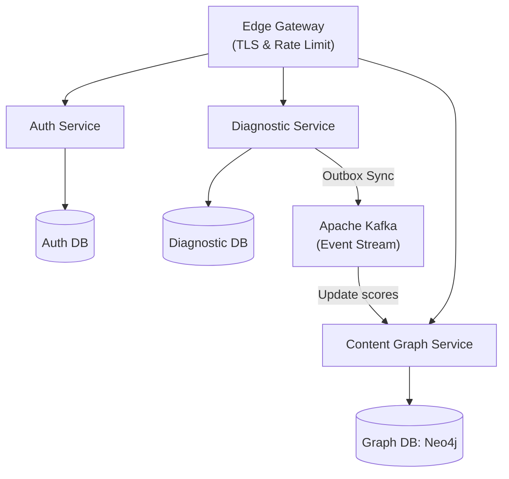

# Scalability Review (100 to 10M Users)

This document analyzes platform scaling limitations and maps out the target changes required to support growth from 100 to 10 million active users.

---

## 1. What Scales Well vs. What Breaks First

```text
========================================================================
[SCALES WELL (Stateless Compute)]   │ [BREAKS FIRST (Stateful Bottlenecks)]
----------------------------------- │ ----------------------------------
- Next.js Web Frontend Pods         │ - Single Primary Postgres DB Node
- FastAPI stateless API Pods        │ - In-Memory Prerequisite Graph Traversal
- Celery Task Workers               │ - Redis Celery Broker Queue Memory Limits
- S3 Object Media Storage           │ - LLM API Token Cost & Limit Caps
========================================================================
```

### What Scales Well
*   **Stateless Containers**: Frontend and API containers do not store state, allowing them to scale horizontally using Kubernetes HPA controllers based on CPU metrics.
*   **Asset Storage**: S3 handles high media traffic and downloads using pre-signed URL configurations.

### What Breaks First
*   **Primary PostgreSQL Node**: Read/write limits on a single database node will result in CPU starvation and slow queries under high traffic.
*   **In-Memory Graph Traversal**: Traversing prerequisite trees in application memory will block Python threads, causing request timeouts.
*   **In-Memory Redis Broker**: Relying on Redis for queue storage will exhaust memory resources if Celery task counts spike.

---

## 2. Database Bottlenecks

1.  **RLS Context Switch Contention**: Switch context queries (`SET LOCAL app.current_tenant_id`) run on every request. High concurrent traffic will saturate database CPU limits.
2.  **Connection Pool Exhaustion**: High client traffic will deplete available Postgres connection pools, leading to request queue delays.
3.  **Analytics Aggregate Write Locks**: Writing real-time activity events directly to database tables will block transactional query execution.

### DB Mitigation Strategy
*   **Read Replicas**: Route all dashboard reads and analytics reports to database read replicas, protecting the primary writer node.
*   **Table Partitioning**: Partition the `learning_events` and `user_answers` tables by date keys to keep active index footprints small.

---

## 3. API Bottlenecks

1.  **CPU-bound Bcrypt hashing**: Hashing password checks uses significant CPU resources. High traffic will starve API process runtimes.
2.  **Synchronous AI Client Timeouts**: AI requests to external models can lock container threads if API responses timeout or fail.

### API Mitigation Strategy
*   **Decouple Hashing**: Delegate password hashing operations to separate, dedicated authentication services.
*   **Asynchronous AI Chat**: Run all LLM queries through asynchronous WebSocket connections or background Celery tasks.

---

## 4. Caching & Queue Strategy

### Redis Caching
*   **Read-Through Cache Pattern**: Store student roadmaps and topic graphs in Redis with short-lived TTL configurations.
*   **Serialization Optimization**: Compress cached payloads to reduce Redis memory footprint.

### Queue Strategy (Migrate to Apache Kafka)
*   **Why**: Redis is not designed for persistent queue storage. We will replace Redis Celery brokers with **Apache Kafka** to handle event streaming.



*   **Partitioning**: Partition Kafka topics by `tenant_id` keys to ensure events are processed sequentially within tenants.

---

## 5. Horizontal vs. Vertical Scaling Policies

*   **Compute Nodes (FastAPI / Next.js)**: Scale horizontally using Kubernetes HPA rules targeting CPU utilization threshold (75%).
*   **Database Nodes (PostgreSQL)**: Scale vertically by provisioning high-memory SSD cloud instances, then scale horizontally using read replicas.

---

## 6. Suggested Redesign: Service-Oriented Architecture (SOA)

To support 10 million users, the modular monolith should be refactored into independent network services with separate database nodes:



1.  **Deconstruct Database Nodes**: Split the database into isolated service databases (e.g. AuthDB, ContentDB, DiagnosticDB), eliminating transaction blocks across domains.
2.  **Deploy a Graph Database (Neo4j)**: Replace in-memory topological sorting with a dedicated graph database (Neo4j) to query prerequisite paths.
3.  **Event-Driven Communication (Kafka)**: Coordinate database updates asynchronously using event streams, protecting services from cascading timeouts.
