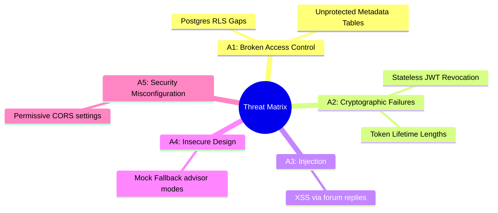

# Security Audit Report

This report presents a comprehensive security audit of the **Learning Intelligence Platform**. It details the verification of authentication protocols, data isolation boundaries, and security middleware configurations.

---

## 1. Security Architecture Analysis

### Authentication & Sessions
The authentication module ([auth_service.py](file:///home/charan_derangula/projects/intelligentSystems/backend/app/application/services/auth_service.py)) enforces credential hashing using **bcrypt** and issues stateless JSON Web Tokens (JWT) for session management.
*   **Access Tokens**: Signed using `HS256` keys with a default 30-minute lifespan.
*   **Refresh Tokens**: Stored in secure, HttpOnly, SameSite cookies with a 30-day lifespan.
*   **Session Revocation**: Revoked token signatures are logged in a Redis cache block, matching remaining lifetimes.

### Authorization & RBAC
Access permissions are managed using role checks ([authorization.py](file:///home/charan_derangula/projects/intelligentSystems/backend/app/core/authorization.py)).
*   **Enforcer Model**: Checks user role claims (`student`, `teacher`, `admin`, `super_admin`) against path requirements.
*   **Community Guardrail Middleware**: A custom guard [CommunityAuthMiddleware](file:///home/charan_derangula/projects/intelligentSystems/backend/app/core/security_middleware.py) intercepts all requests targeting `/community` routes, blocking calls if route definitions omit authentication dependencies.

### Database Row-Level Security (RLS) & Multi-Tenancy
The database implements tenant isolation at the schema layer using PostgreSQL RLS policies [postgres_tenant_rls.sql](file:///home/charan_derangula/projects/intelligentSystems/backend/sql/postgres_tenant_rls.sql).
*   **Dynamic Context**: Middleware sets session variables (`SET LOCAL app.current_tenant_id = :uuid`) on connections.
*   **RLS Policies**: Filter queries automatically:
    ```sql
    CREATE POLICY tenant_isolation_policy ON users
        FOR ALL USING (tenant_id = NULLIF(current_setting('app.current_tenant_id', true), '')::UUID);
    ```
*   **Identified Risk**: As logged in the [Tenant RLS Audit](file:///home/charan_derangula/projects/intelligentSystems/docs/tenant_rls_audit_20260402.md), several metadata and operational tables (e.g. `feature_flags`, `ml_feature_snapshots`) currently lack RLS rules, relying instead on manual query filters.

### CSRF & XSS Protections
*   **Double-Submit CSRF Token Check**: [CSRFMiddleware](file:///home/charan_derangula/projects/intelligentSystems/backend/app/core/security_middleware.py) checks mutated requests (`POST`, `PUT`, `PATCH`, `DELETE`) by comparing header values with CSRF cookie values.
*   **Content Security Policy (CSP)**: Exposes strict directives to block inline script executions (`default-src 'self'`) in production.
*   **Secure Headers**: Configures security headers to prevent clickjacking and mime sniffing:
    ```text
    X-Frame-Options: DENY
    X-Content-Type-Options: nosniff
    X-XSS-Protection: 1; mode=block
    Strict-Transport-Security: max-age=31536000; includeSubDomains
    ```

### SQL Injection Protection
*   **SQLAlchemy Parameter Bindings**: The application uses SQLAlchemy's ORM and prepared statements, ensuring inputs are parameter-bound and preventing SQL injection attacks.

### Secrets Management
*   **Runtime Environment Isolation**: Database credentials, API tokens, and private keys are loaded dynamically from environment files. Production environments pull secrets from cloud secret manager vaults (EKS Secrets / GCP Secret Manager).

### API Rate Limiting
*   **Redis-Backed Token Bucket Limiter** ([rate_limiter.py](file:///home/charan_derangula/projects/intelligentSystems/backend/app/presentation/middleware/rate_limiter.py)): Enforces query rate limits per client IP address or user ID (e.g., 5 attempts/minute on `/auth/login`, 50 attempts/minute on `/diagnostic/start`).

### File Upload Security
*   **Pre-Signed Direct S3 Uploads**: File uploads bypass backend containers. Clients query the API for a short-lived pre-signed URL, upload files directly to S3, and trigger backend verification scripts to record metadata. Storage buckets block all public read/write permissions.

### Audit Logs
*   **Immutable Security Logs**: Administrative actions and login events are saved to the `audit_logs` table. Update or delete operations on audit tables are prohibited.

---

## 2. Threat Modeling & OWASP Top 10 Mapping



| OWASP Category | Target Vector | Risk Level | Mitigation Plan |
| :--- | :--- | :--- | :--- |
| **A01:2021-Broken Access Control** | RLS gaps in operational/ML snapshots. | **High** | Implement RLS on all missing tenant-scoped tables. |
| **A02:2021-Cryptographic Failures** | Stateless JWT exposure on compromised nodes. | **Medium** | Enforce short access token lifespans (15 mins). |
| **A03:2021-Injection** | XSS risks via user forum replies. | **Medium** | Sanitize thread replies using DOMPurify libraries. |
| **A05:2021-Security Misconfiguration** | Permissive dev CORS configurations. | **Low** | Restrict production origins to validated subdomains. |

---

## 3. Risk Ranking

1.  **CRITICAL**: Mixed-Mode tenant isolation gaps. Missing database RLS rules on operational tables (e.g. `ml_feature_snapshots`, `feature_flags`) can lead to cross-tenant data exposures if query filters are omitted.
2.  **HIGH**: Stateless JWT revocation latency. Revoked tokens remain valid until cache listings expire.
3.  **MEDIUM**: Reflected Cross-Site Scripting (XSS) risks via unsanitized markdown rendering in community forum threads.
4.  **LOW**: Potential request limit bypasses using rotating proxy IPs.

---

## 4. Remediation & Mitigation Plan

### Phase 1: Close RLS Gaps (Immediate)
*   **Action**: Deploy SQL scripts to enable RLS on all tenant-scoped tables (including `ml_feature_snapshots`, `feature_flags`, and `audit_logs`).
*   **Verification**: Run RLS verification scripts to confirm queries without session variables return empty datasets.

### Phase 2: Secure Session Lifetimes (Short-Term)
*   **Action**: Reduce access token lifespan thresholds from 30 minutes to 15 minutes, forcing clients to run refresh queries more frequently.
*   **Verification**: Assert token expiration timeouts in integration tests.

### Phase 3: Sanitize Forum Content (Short-Term)
*   **Action**: Integrate DOMPurify libraries into Next.js markdown rendering components to sanitize user-submitted thread contents.
*   **Verification**: Run Playwright test scripts to confirm HTML/JS injection payloads are stripped from rendered outputs.
