# Software Architecture Bible

This document acts as the definitive architectural guide for the **Learning Intelligence Platform**. It outlines the patterns, technologies, data flows, and design paradigms that govern the codebase, and provides the architectural "WHY" behind every major technical choice.

---

## 1. High-Level System Architecture

The platform uses a **modular monolith application style** paired with a **multi-container deployment topology**. 

```mermaid
flowchart TB
    %% Clients
    Browser["Next.js Frontend\n(Port 3000)"]

    %% Gateway
    subgraph Edge ["Edge/Ingress Layer"]
        Nginx["Nginx Gateway\n(Port 8000)"]
    end

    %% Application Layer
    subgraph Compute ["Compute Services"]
        FastAPI["FastAPI Backend\n(Port 8000)"]
        AIService["AI Microservice\n(Port 8100)"]
        CeleryWorker["Celery Worker\n(Background Jobs)"]
        CeleryBeat["Celery Beat\n(Cron Scheduler)"]
    end

    %% State & Data
    subgraph State ["Data & Persistence Layer"]
        Postgres[("PostgreSQL\n(Transactional, RLS)")]
        Redis[("Redis\n(Cache & Celery Broker)")]
    end

    %% Observability
    subgraph Monitor ["Observability Stack"]
        Prometheus["Prometheus\n(Port 9090)"]
        Grafana["Grafana\n(Port 3001)"]
        Alertmanager["Alertmanager\n(Port 9093)"]
    end

    %% Connections
    Browser -->|HTTP / WS| Nginx
    Nginx -->|Route Proxy / Rate Limit| FastAPI
    FastAPI -->|DB Queries| Postgres
    FastAPI -->|Cache / Task Publish| Redis
    FastAPI -->|REST API| AIService
    CeleryWorker -->|Read/Write| Postgres
    CeleryWorker -->|Broker Pull| Redis
    CeleryBeat -->|Schedule Push| Redis
    
    %% Scrape Paths
    Prometheus -->|Scrape Metrics| FastAPI
    Prometheus -->|Scrape Metrics| Nginx
    Prometheus -->|Alerts| Alertmanager
    Grafana -->|Query| Prometheus
```

### The "WHY" Behind System Topology

*   **Modular Monolith Application Design**: The backend codebase is grouped into separate, well-defined domains (analytics, community, learning, ML, etc.) inside a single FastAPI runtime. This keeps cognitive load low, simplifies deployment, and eliminates distributed transaction overhead during early growth. It avoids "microservice premium" costs (latency, network hops, deployment management) while maintaining code isolation that permits a future microservice split if necessary.
*   **Decoupled AI Boundary Service**: The AI capabilities live in a separate FastAPI application (`ai_service/`). Because LLM orchestrations, prompt templates, and guardrails change frequently, isolation prevents prompt tuning or model-interaction latency spikes from starving resources on the core transactional FastAPI backend.
*   **Dual-Use Redis Layer**: Redis handles both transient cache operations and Celery task brokerage. Combining these roles minimizes operational costs and deployment complexity in small-to-medium environments.
*   **Nginx API Gateway proxy**: Rather than exposing FastAPI directly to the internet, Nginx is placed at the edge to manage TLS termination, request buffering, rate limiting, and static assets caching. This offloads network concerns from the python runtime.

---

## 2. Frontend Architecture

The frontend is built using **Next.js 15** with the **App Router**, styled with **Vanilla CSS & Tailwind**, and coordinated using **React Query** for async state sync.

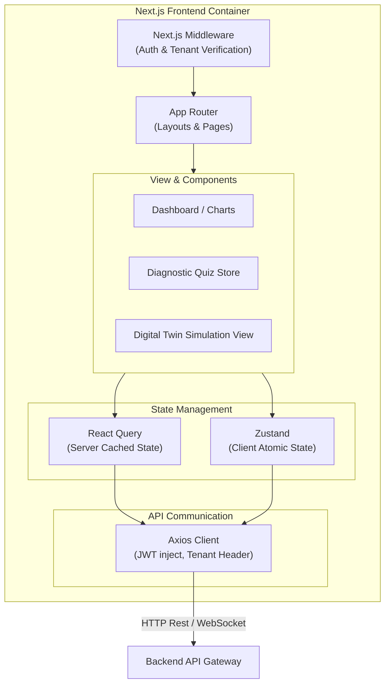

### Key Components of Frontend Design

1.  **Next.js Middleware (`middleware.ts`)**: Inspects cookies for active JWTs, validates tenant subdomains or hostnames, and redirects unauthenticated users or users with invalid roles.
2.  **Server State Caching (React Query / TanStack Query)**: Handles all network fetches, automatic caching, cache invalidation, and background synchronization of data such as roadmap progress and topic scores.
3.  **Atomic Client State (Zustand)**: Used where high-frequency, client-only reactive updates are required (e.g., diagnostic countdown timers, multi-step assessment state), avoiding heavy React contexts or global re-renders.
4.  **Tenant Override Engine**: Accessible to `super_admin` users via custom HTTP headers (`X-Tenant-ID`) to inspect tenant-scoped dashboards without logging out and back in.

### The "WHY" Behind Frontend Decisions

*   **Next.js 15 App Router**: Simplifies role-based folder structures through route groups `(student)`, `(teacher)`, `(admin)`, and `(super-admin)`. Leveraging Server Component caching speeds up initial landing pages, while Client Components handle interactive dashboards.
*   **Cookies for Auth Persistence**: Storing JWT tokens in `HttpOnly` cookies shields them from Cross-Site Scripting (XSS) attacks, while keeping standard Bearer headers for AJAX request routing.
*   **Zustand for Diagnostic States**: Diagnostic quizzes require absolute UI responsiveness. Keeping the state local but external to React renders prevents frame drops during timed questions.

---

## 3. Backend Architecture & Layered Design

The backend uses a strict **Clean Architecture Layering Pattern** to decouple business logic from external frameworks, databases, and message queues.

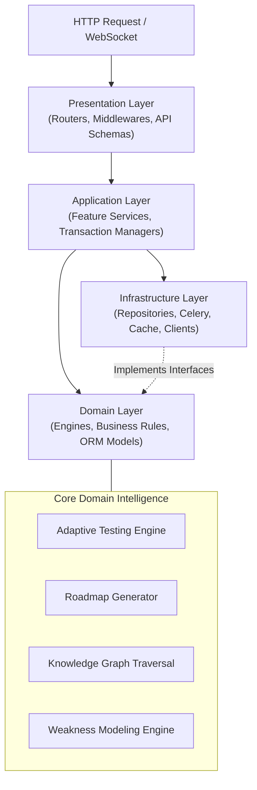

### The 4 Backend Layers

1.  **Presentation Layer (`app/presentation/`)**:
    *   *Responsibility*: Exposes HTTP routes, validates input using Pydantic schemas, handles route authorization dependencies, and formats errors.
2.  **Application Layer (`app/application/`)**:
    *   *Responsibility*: Coordinates use-case workflows (e.g. "submit quiz and regenerate roadmap"). Orchestrates transaction boundaries, handles multi-domain services, and publishes background tasks.
3.  **Domain Layer (`app/domain/`)**:
    *   *Responsibility*: Houses purely algorithmic calculations, business rules, and state equations. Includes core engines like knowledge graphs, prerequisite tracers, and DB ORM models.
4.  **Infrastructure Layer (`app/infrastructure/`)**:
    *   *Responsibility*: Communicates with state containers, queues, and external APIs. Implements the *Repository Pattern* to insulate the rest of the application from SQLAlchemy details.

### The "WHY" Behind Clean Layering

*   **Framework Agnosticism**: If the team switches from FastAPI to another framework, only the *Presentation Layer* needs rewrite. The *Domain Layer* and *Application Layer* remain untouched.
*   **Testability**: Because the domain engines are free of SQL queries or Redis clients, they can be tested in milliseconds using basic mock objects and deterministic unit test frameworks.
*   **Repository Abstraction**: Restricting SQLAlchemy session calls to repositories (`app/infrastructure/repositories/`) prevents database leaks. Presentation code never queries database objects directly, preventing N+1 query execution bugs.

---

## 4. Database Architecture & Multi-Tenancy

The platform stores persistent data in **PostgreSQL** and uses **PostgreSQL Row-Level Security (RLS)** as its security boundary to prevent cross-tenant data leaks.

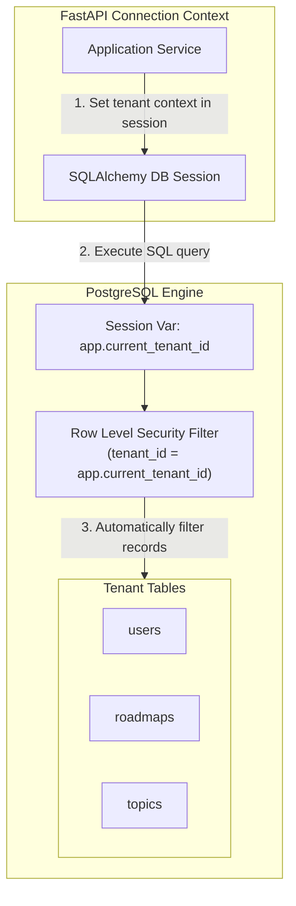

### multi-Tenant Isolation Policy

The platform implements a **Shared Database, Shared Schema** multi-tenancy model. Every tenant-scoped table contains a `tenant_id` column. Security is enforced at the database layer using Postgres RLS:

```sql
-- Dynamic Session Variable Context Setup
CREATE OR REPLACE FUNCTION get_current_tenant_id() RETURNS UUID AS $$
    SELECT NULLIF(current_setting('app.current_tenant_id', true), '')::UUID;
$$ LANGUAGE sql STABLE;

-- Example Row-Level Security Policy on the Users table
ALTER TABLE users ENABLE ROW LEVEL SECURITY;

CREATE POLICY tenant_isolation_policy ON users
    FOR ALL
    USING (tenant_id = get_current_tenant_id() OR get_current_tenant_id() IS NULL);
```

### Eventual Consistency via the Event Outbox Pattern

To update caches, notify students, and send data to ML pipelines reliably, the system uses the **Transactional Outbox Pattern**.

```mermaid
sequenceDiagram
    participant App as Application Service
    participant DB as PostgreSQL Database
    participant Celery as Celery Worker / Broker
    
    rect rgb(30, 40, 50)
        Note over App, DB: Atomic Write Transaction
        App->>DB: Write business changes (e.g. Save Roadmap)
        App->>DB: Write Outbox Event (e.g. OutboxEvent: ROADMAP_CREATED)
        DB-->>App: Commit Transaction
    end
    
    App->>Celery: Trigger Immediate Outbox Dispatcher Task
    
    rect rgb(40, 30, 40)
        Note over Celery, DB: Async Processing
        Celery->>DB: Lock and fetch pending outbox events
        Celery->>Celery: Publish to Redis Cache / ML feature store / Notification gateway
        Celery->>DB: Mark Outbox events as PROCESSED
    end
```

### The "WHY" Behind Database Decisions

*   **Shared Schema Multi-Tenancy**: Spinning up separate schemas or database containers for each tenant adds significant administrative overhead and hardware costs. A single schema with `tenant_id` scales more efficiently.
*   **Row-Level Security (RLS)**: Enforcing tenant isolation in repository code is error-prone. One developer forgetting a `.filter(tenant_id=...)` call could expose private customer data. RLS acts as a global, database-enforced safety net.
*   **Transactional Outbox Pattern**: In typical systems, if a database write succeeds but publishing a message to a queue fails, the cache and background systems drift out of sync. Writing both the state change and the event message to the *same* database atomically prevents this inconsistency.

---

## 5. AI & Multi-Agent Architecture

The artificial intelligence subsystem is organized as a **Supervisor-Specialist Multi-Agent System** that simulates, tutors, and analyzes student progress.

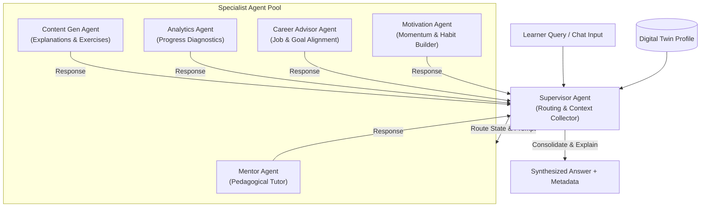

### The Autonomous Guidance Loop & Learner Digital Twin

The system runs an ongoing loop to model student behavior and offer personalized learning strategies:

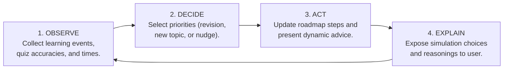

The **Learner Digital Twin** (`DigitalTwinService`) represents this behavioral projection:
1.  **Observed Layer**: Aggregates real-time student telemetry (scores, speeds, review cadences).
2.  **Simulation Layer**: Predicts paths forward based on three strategies (Fast-track, Comprehensive, Retention-heavy).
3.  **Decision Support**: Computes simulated completion dates and outputs a human-readable recommendation logic.

### The "WHY" Behind AI Choices

*   **Multi-Agent Specialization**: Generalist LLM prompts struggle to balance tutor, motivator, and analyst roles simultaneously. Splitting them into distinct agents with specialized system instructions reduces output hallucinations and improves response accuracy.
*   **Explainable Automation**: If the AI autonomously alters a student's learning pathway without stating why, user trust drops. Surfacing the agent's internal "decision metadata" ensures transparency.
*   **Twin Simulation Strategy**: Simulating pathways in the application layer (rather than storing dynamic models) keeps the database simple. The twin is compiled on demand, keeping data clean.

---

## 6. Machine Learning Architecture

The ML subsystem tracks learning features, manages model versions, and serves inferences to recommend topics and predict student dropout risks.

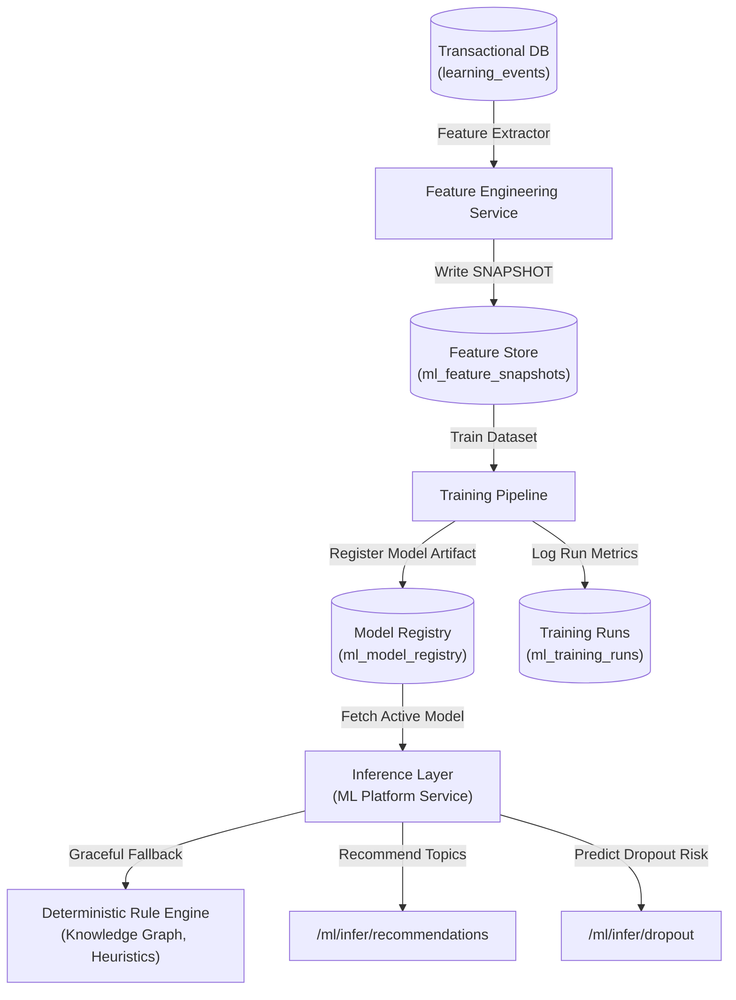

### Gradual Rule Replacement Strategy

To safeguard user experience, the system applies a strict rollout progression when replacing deterministic rule engines with ML models:

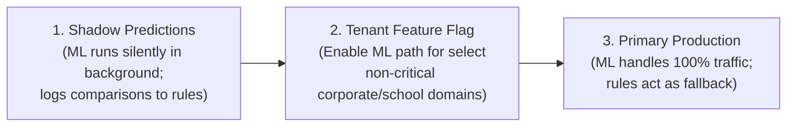

### The "WHY" Behind ML Infrastructure

*   **Lightweight Feature Snapshots**: Building a separate enterprise feature store (like Feast) is excessive for initial deployments. Saving snapshots directly in Postgres tables (`ml_feature_snapshots`) keeps feature data consistent with transactional schemas.
*   **Deterministic Fallback Design**: If the Python inference service crashes, the recommendation pipeline falls back to the deterministic Knowledge Graph prerequisite engine, ensuring no API downtime.

---

## 7. Deployment & Scaling Architecture

The deployment architecture is Kubernetes-native, and maps consistently to AWS or GCP cloud structures.

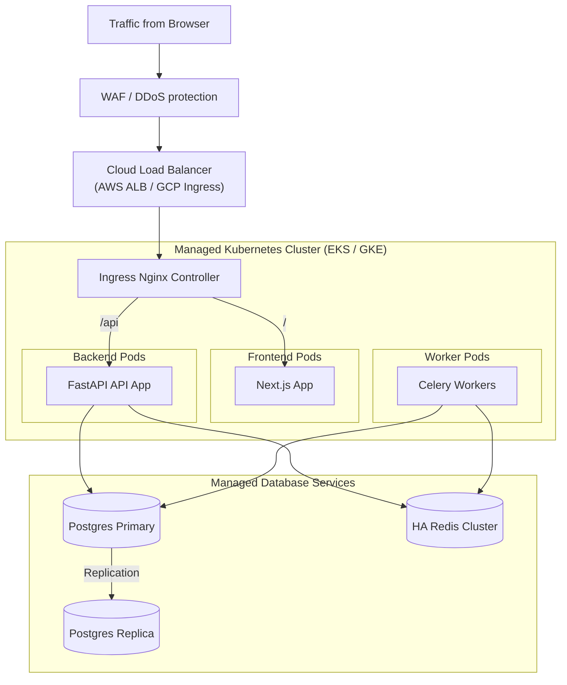

### Horizontal Auto-Scaling Policies

*   **API Pods**: Auto-scale using Horizontal Pod Autoscalers (HPA) targeting CPU utilization threshold (75%) and HTTP request rates.
*   **Celery Workers**: Auto-scale dynamically based on RabbitMQ/Redis queue depth metrics, spinning up extra resources to handle spike diagnostic completions.

### The "WHY" Behind Deployment Setup

*   **Stateless Compute Layers**: The API containers and Next.js frontend do not write state local to the file system. This allows instant node scaling without disk provisioning overhead.
*   **Managed Databases Only**: Operating PostgreSQL replication and automated failovers manually introduces high operational risk. Outsourcing this to cloud providers ensures automated backups and recovery.

---

## 8. Monitoring & Observability Architecture

Observability relies on **Prometheus** for metrics collection, **Grafana** for metrics visualization, and **Alertmanager** for routing alerts.

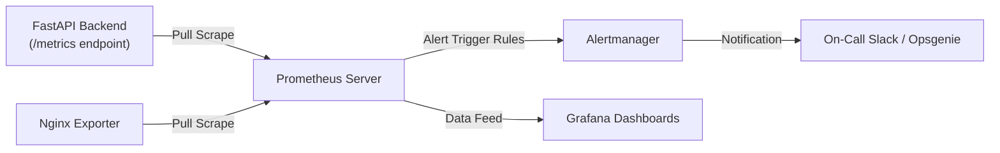

### Tracked Core Observability Metrics

| Metric | Exporter | Target SLA | Ops Mitigation |
| :--- | :--- | :--- | :--- |
| `http_request_duration_seconds` | FastAPI (Prometheus Middleware) | P95 < 200ms | HPA API container scaling |
| `celery_queue_depth` | Redis Prometheus Exporter | < 50 items | Spin up additional Celery workers |
| `outbox_events_latency_seconds` | Custom Prometheus Instrument | < 5s processing | Restart outbox dispatcher task |
| `nginx_connections_active` | Nginx stub status | Variable | WAF / Rate limit adjustments |

### The "WHY" Behind Monitoring Choices

*   **Prometheus Metric Pulling Model**: Standard push-based monitoring models degrade application performance when monitoring agents experience load. The pull model allows Prometheus to bear metrics transmission costs.
*   **Pre-Built Dashboard Provisioning**: Rather than building dashboards by hand after deployment, dashboard configurations are declared in JSON inside Git (`monitoring/grafana/provisioning/`). This ensures dashboard setups are reproducible across local, staging, and production clusters.

---

## 9. Security Architecture

The platform uses a strict security boundary to protect multi-tenant borders and verify API request access.

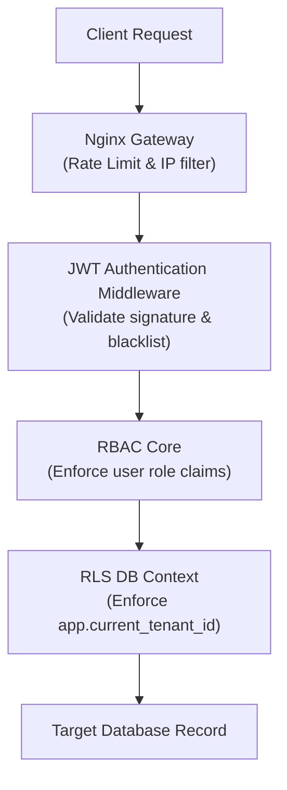

### Access Control Levels

1.  **Transport Level**: Enforcement of TLS 1.3, HTTPS redirects, and strict CORS configuration.
2.  **API Gateway Level**: Nginx limits client requests using IP subkeys to block DDoS attacks.
3.  **Authentication Level**: FastAPI checks user JWTs against a Redis token blacklist to support instant sign-out.
4.  **Authorization Level**: Role-Based Access Control (RBAC) verifies user roles (`student`, `teacher`, `admin`, `super_admin`) against path dependency requirements.
5.  **Data Isolation Level**: PostgreSQL dynamic tenant contexts guarantee that a database connection cannot read data from other tenant entities.

### The "WHY" Behind Security Architecture

*   **JWT Revocation List in Redis**: By default, stateless JWT tokens cannot be revoked until they expire. Storing invalid token signatures in a fast Redis cache ensures instant user session termination without adding database query load.
*   **Granular RBAC Enforcer**: Decoupling RBAC rules from API routes allows security policies to scale without bloating endpoint business code.

---

## 10. Dependency Flow & Microservice Communication

The system controls software dependency structures to prevent circular imports and keep business domains isolated.

### Correct Dependency Direction Rule

```text
========================================================================
[Presentation: HTTP Routers / API Schemas]
       │
       ▼
[Application: Feature Services / Workflows]
       │
       ▼
[Domain: Algorithmic Engines / Core Logic / ORM Entities]
       ▲
       │  (Inverted Dependency Flow via Interfaces)
[Infrastructure: DB Repositories / Cache Adapters / Clients]
========================================================================
```

*Domain entities and rules do not import services from application layers, nor do they depend on concrete database engines.* Database adapters implement repository interfaces declared by the domain layer. This decouples database choices from business logic code.

### Monolith to Microservice Target Communication Plan

If the modular monolith is refactored into microservices, communication will move from internal memory calls to a distributed, event-driven pattern:

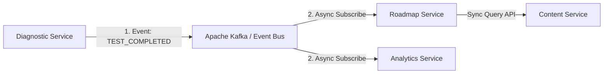

*   **Synchronous Queries (REST / gRPC)**: Used strictly when a service requires real-time, read-only data from another service to complete its operation (e.g., the Roadmap service fetching topic metadata from the Content service).
*   **Asynchronous Mutations (Kafka / Event Streaming)**: All write state changes propagate through event brokers. This prevents outages in downstream services from blocking upstream actions.

### The "WHY" Behind Dependency Flow

*   **Dependency Inversion**: Directly importing SQLAlchemy code into domain engines creates code dependencies. If the database schema changes, the domain logic would break. Reversing the dependency using interfaces keeps business calculations stable.
*   **Event-Driven Target Architecture**: Direct HTTP links between microservices generate complex coupling. If Service A calls Service B, which calls Service C, any down service triggers system-wide errors. Eventual consistency via message brokers prevents these cascading failures.
