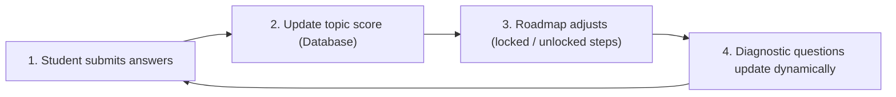
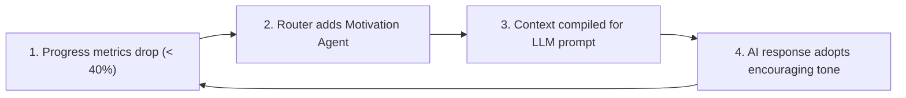

# System Thinking Report

This document treats the **Learning Intelligence Platform** as a complete dynamic system. It maps out how inputs, outputs, states, and feedback loops interact to govern platform behavior under load.

---

## 1. System Inputs & Outputs

```text
  [Inputs]                                                       [Outputs]
  - Registration/Login Inputs ──┐                         ┌──> REST JSON Responses
  - Timed Quiz Answers          ├─> [ Platform System ] ──┼──> WebSocket JSON Alerts
  - Prompt Queries              │                         ├──> Outbox Broker Messages
  - User Click Telemetry        ──┘                         └──> Pre-signed URL Assets
```

### Inputs
*   **User Actions**: Logins, registrations, role selections, and profile updates.
*   **Assessment Inputs**: Timed option selections submitted during diagnostic quiz runs.
*   **Chat Queries**: Text prompts submitted to the mentor AI chat interface.
*   **Telemetry Logs**: Activity triggers (pages visited, time spent, cards completed).

### Outputs
*   **REST JSON Payload Data**: Dynamic JSON responses (e.g. roadmaps, profile settings, user lists).
*   **WebSocket JSON Frames**: Real-time notifications and chat thread updates.
*   **Outbox Broker Messages**: Event payloads dispatched to message streams.
*   **Storage Access Signatures**: Pre-signed URLs for file uploads and asset downloads.

---

## 2. Internal State Variables

*   **Database Settings Context (`app.current_tenant_id`)**: Session-local tenant UUIDs that restrict database access boundaries.
*   **Learner Capability Vector ($\theta$)**: Floating-point scores estimating student ability levels.
*   **Roadmap Step Metrics**: States (`active`, `completed`, `locked`) of nodes in the roadmap graph.
*   **Queue Backlogs**: Counts of pending outbox and Celery tasks in memory.
*   **JWT Blacklist Registers**: Signatures of invalidated tokens in Redis.

---

## 3. Dynamic Feedback Loops

The platform relies on two main feedback loops to personalize the student experience:

### A. The Prerequisite Adaptation Loop (Data-Driven)

*   *Behavior*: If a student struggles with a topic, the system unlocks prerequisite review steps, dynamically altering their learning path.

### B. The AI Agent Tone Adaptation Loop (Behavioral)

*   *Behavior*: If a student's completion rate falls, the system updates the chat prompt context, directing the AI to adopt a supportive, motivation-focused tone.

---

## 4. System Dependencies & Failure Points

```text
========================================================================
[CRITICAL SYSTEM DEPENDENCY] ──> [FAILURE CONSEQUENCE & RESOLUTION]
------------------------------------------------------------------------
- Primary Postgres Database  ──> Global read/write crash.
                                 Mitigation: Automated Multi-AZ failover.
- Redis Cache & Task Broker  ──> Celery queue stalls, JWT checks fail.
                                 Mitigation: In-memory fallback modes.
- External LLM APIs          ──> Chat timeouts and advisor failures.
                                 Mitigation: Local heuristic fallback advisor.
- Transactional Outbox Sweeps──> Caches and message queues drift.
                                 Mitigation: Automatic alert-triggered retries.
========================================================================
```

---

## 5. Performance Bottlenecks & Scaling Limits

1.  **In-Memory Graph Traversal**: The [KnowledgeGraph](file:///home/charan_derangula/projects/intelligentSystems/backend/app/domain/engines/knowledge_graph.py) engine computes topological sorting in-memory. As the topic database grows, this CPU-bound operation will block Python's event loop, slowing down other requests.
2.  **Bcrypt Password Verification**: Hashing operations are CPU-heavy; rapid login attempts can exhaust container CPU limits.
3.  **Real-Time Analytics Counts**: Querying raw logs dynamically to populate dashboards will lead to database performance degradation under heavy traffic.
