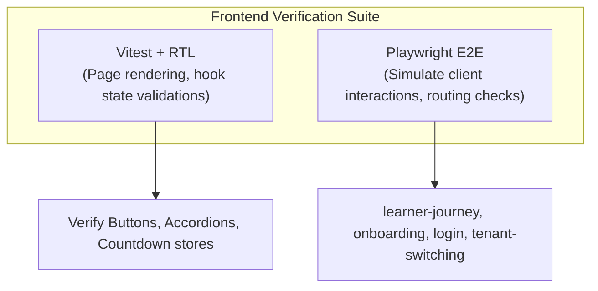
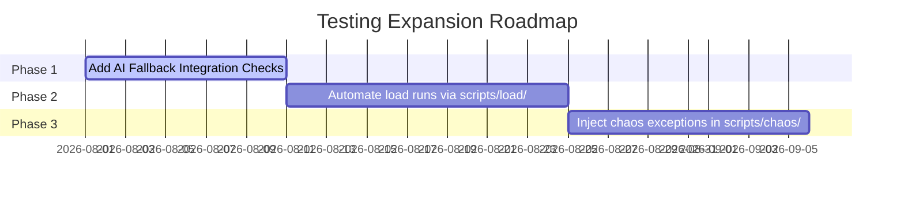

# Testing Encyclopedia

This document outlines the testing strategy, frameworks, test suites, and regression parameters for the **Learning Intelligence Platform**. It maps the 100+ tests implemented across both frontend and backend layers.

---

## 1. Backend Testing Framework (`pytest`)

The backend uses **pytest** and **pytest-asyncio** to verify server code. Mocks, databases, and session scopes are set up globally inside the [conftest.py](file:///home/charan_derangula/projects/intelligentSystems/backend/tests/conftest.py) configuration script.

### Key Backend Test Groups

1.  **Unit Tests (Domain Engines)**: Evaluates core algorithms in-memory, confirming prerequisite routes, learning curves, and adaptive testing decisions.
    *   *Critical Suite*: [test_knowledge_graph_engine.py](file:///home/charan_derangula/projects/intelligentSystems/backend/tests/test_knowledge_graph_engine.py) (verifies sorting and loops).
2.  **Integration Tests (Services)**: Verifies that application services (e.g. Auth, Diagnostics, Roadmaps) execute queries and commit database transactions correctly.
    *   *Critical Suite*: [test_service_integration_flow.py](file:///home/charan_derangula/projects/intelligentSystems/backend/tests/test_service_integration_flow.py) (verifies end-to-end user workflows).
3.  **Security Tests (RLS Isolation)**: Verifies that database connections do not leak tenant-scoped records.
    *   *Critical Suite*: [test_auth_tenant_isolation.py](file:///home/charan_derangula/projects/intelligentSystems/backend/tests/test_auth_tenant_isolation.py) (attempts to read records from other tenants).
    *   *Critical Suite*: [test_tenant_rls_coverage.py](file:///home/charan_derangula/projects/intelligentSystems/backend/tests/test_tenant_rls_coverage.py) (checks tables against target policy maps).

---

## 2. Frontend Testing Framework (`Vitest` & `Playwright`)

The frontend uses a dual-testing model split into unit component checks and E2E browser flows:



### Playwright E2E Test Suite

E2E tests run in headless browser containers to verify interactive client journeys:
*   [learner-journey.spec.ts](file:///home/charan_derangula/projects/intelligentSystems/learning-platform-frontend/tests/e2e/learner-journey.spec.ts) — Asserts starting diagnostics, selecting options, submitting quizzes, and loading roadmaps.
*   [tenant-switching.spec.ts](file:///home/charan_derangula/projects/intelligentSystems/learning-platform-frontend/tests/e2e/tenant-switching.spec.ts) — Verifies subdomain detection and switches workspace environments using administrator credentials.

---

## 3. Security, Performance & Timing Tests

1.  **Diagnostic Timer Enforcement** ([test_diagnostic_timer_enforcement.py](file:///home/charan_derangula/projects/intelligentSystems/backend/tests/test_diagnostic_timer_enforcement.py)): Confirms that answers submitted after the countdown expires are rejected.
2.  **Redis Cache Operations** (`test_cache_service.py`): Verifies that caches are written on requests and invalidated on updates.
3.  **Outbox Retry Backoffs** (`test_outbox_retry_backoff.py`): Checks that sweeps calculate exponential delay periods on event delivery failures.
4.  **XSS Sterilization** ([test_question_serialization_security.py](file:///home/charan_derangula/projects/intelligentSystems/backend/tests/test_question_serialization_security.py)): Verifies that output schemas sanitize text properties before sending API responses.

---

## 4. Critical Paths & Regression Risks

A **regression risk** is an unexpected bug introduced when unrelated code areas are updated. We identify three high-risk paths:

```text
========================================================================
[CRITICAL PATH] ──────────> [REGRESSION RISK AREA]
------------------------------------------------------------------------
- Submit Timed Quiz   ──> Question Lock conflicts & Double submits.
- Sort Prerequisites  ──> Prerequisite circular loops in content graphs.
- outbox sweep events ──> Duplicate event deliveries on worker retries.
========================================================================
```

To mitigate these risks, changes to these paths must run automated regression suites.

---

## 5. Identified Gaps (Missing Tests)

*   **WebSocket Scalability Tests**: The real-time messaging hub (`distributed_bus.py`) lacks performance tests under concurrent connections.
*   **Database Pool Load Tests**: The connection manager lacks stress tests to verify connection pooling limits when running multi-tenant Postgres RLS context switches under high concurrent loads.
*   **AI API Failures**: Lack of automated tests to verify the robustness of fallback systems when LLM API requests timeout or fail.

---

## 6. QA & Testing Roadmap



1.  **Phase 1: AI Fallback Integration Checks**: Write tests that block external LLM API endpoints and verify that the fallback advisor responds correctly.
2.  **Phase 2: Automated Load Tests**: Automate load test runs (`scripts/load/`) inside the CI/CD pipeline to establish performance benchmarks.
3.  **Phase 3: Chaos Exception Injections**: Run scripts (`scripts/chaos/`) during integration tests to confirm the system recovers from database, cache, or worker disconnects.
