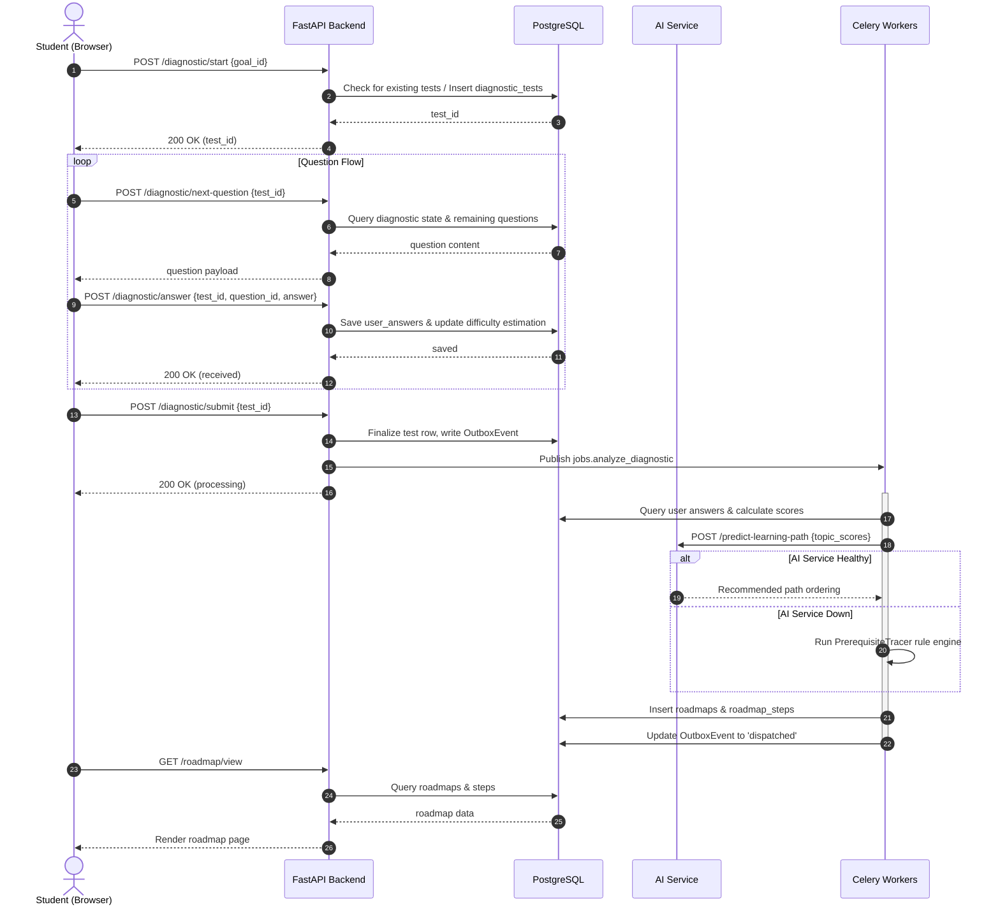
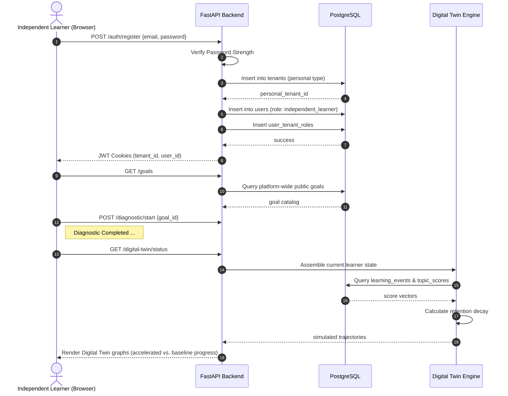
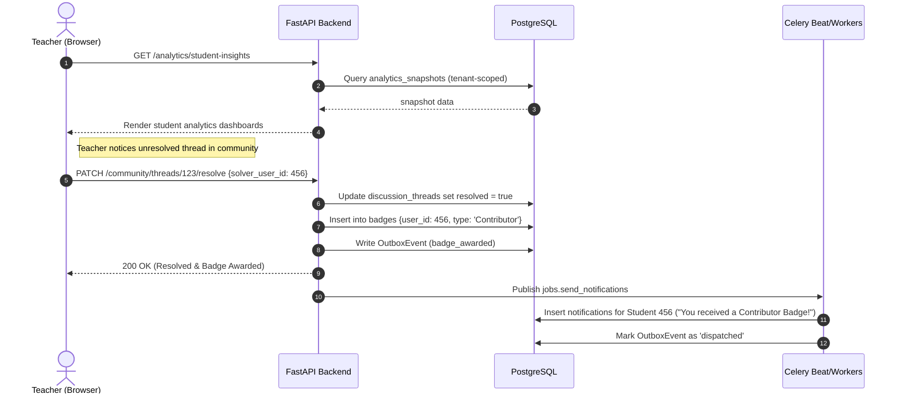
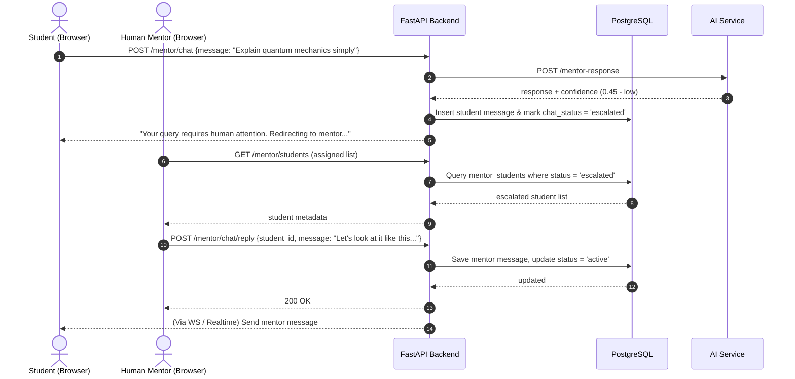
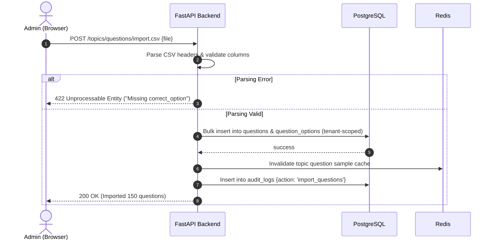
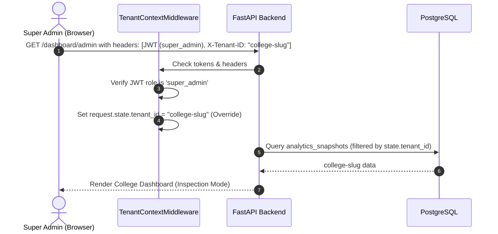

# Universal Learning Intelligence Platform: Complete User Journeys

This document details the functional and technical user journeys for all six roles supported by the platform. It maps frontend screens, REST/WS APIs, Python background services, database tables, background Celery tasks, notification triggers, AI service agents, and outcome states.

---

# 1. Student User Journey

## 1.1 Journey Overview
The **Student** is an institution-linked learner (e.g., college, school, or corporate cohort). Their learning objective (Goals), curriculum (Topics & Questions), and coaching structure (Mentors) are managed by their institution (Tenant).

---

## 1.2 Step-by-Step Lifecycle Flows

### A. Registration
* **Action**: Registering via an invite link sent by a Teacher or Admin.
* **Frontend Path**: `/auth/register` (e.g., [register page](file:///home/charan_derangula/projects/intelligentSystems/learning-platform-frontend/app/register/page.tsx))
* **APIs Called**: `POST /auth/invite-accept` or `POST /auth/register`
* **Backend Services**: `AuthService.register()` or `AuthService.accept_invite()`
* **Database Tables**: `users`, `tenants`, `user_tenant_roles`, `auth_tokens`
* **Happy Path**: 
  1. Student fills in password and accepts terms.
  2. System resolves tenant from invite token.
  3. User is created and marked as active under the tenant role `student`.
* **Failure Path**: 
  * *Expired/Invalid Token*: System returns `400 Bad Request` ("Invite token expired").
  * *Weak Password*: Returns `422 Unprocessable Entity` (Password must be $\ge$ 8 characters, containing numbers/letters).
  * *Duplicate Email*: Returns `409 Conflict` ("Email already registered").

### B. Login & Authentication
* **Action**: Standard login using email and password.
* **Frontend Path**: `/login` (e.g., [login page](file:///home/charan_derangula/projects/intelligentSystems/learning-platform-frontend/app/login/page.tsx))
* **APIs Called**: `POST /auth/login`
* **Backend Services**: `AuthService.login()`
* **Database Tables**: `users`, `sessions`, `refresh_sessions`, `auth_logs`
* **Happy Path**: Password matches, server sets JWT access and refresh tokens as cookies, redirects to `/student/dashboard`.
* **Failure Path**: 
  * *Incorrect Password*: Increments login attempt; returns `401 Unauthorized` ("Invalid credentials").
  * *Missing Tenant Scope*: If logging in through institutional portal, missing tenant header returns `400 Bad Request`.

### C. Dashboard & Metrics
* **Action**: Landing page displaying progress metrics.
* **Frontend Path**: `/student/dashboard` (e.g., [student dashboard page](file:///home/charan_derangula/projects/intelligentSystems/learning-platform-frontend/app/(student)/student/dashboard/page.tsx))
* **APIs Called**: `GET /dashboard/student`, `GET /roadmap/view`
* **Backend Services**: `DashboardService.student_dashboard()`
* **Database Tables**: `users`, `roadmaps`, `roadmap_steps`, `analytics_snapshots`, `badges`
* **Metrics Rendered**: Completion percentage ($completed\_steps / total\_steps$), weak-topic heatmaps, motivational streaks, notifications list.

### D. Adaptive Diagnostic Test
* **Action**: Taking a dynamic test to assess topic mastery.
* **Frontend Path**: `/student/diagnostic` (e.g., [diagnostic page](file:///home/charan_derangula/projects/intelligentSystems/learning-platform-frontend/app/(student)/student/diagnostic/page.tsx))
* **APIs Called**: `POST /diagnostic/start`, `POST /diagnostic/next-question`, `POST /diagnostic/answer`, `POST /diagnostic/submit`
* **Backend Services**: `DiagnosticService` (calls `AdaptiveTestingEngine` for dynamic calibration)
* **Database Tables**: `diagnostic_tests`, `questions`, `question_options`, `user_answers`, `diagnostic_test_states`
* **Happy Path**: 
  1. Diagnostic starts.
  2. Question served. Answer submitted.
  3. `AdaptiveTestingEngine` picks the next question based on current answer correctness.
  4. Finalizes after question limit or confidence threshold is met.
  5. Enqueues `jobs.analyze_diagnostic` to compile topic scores.
* **Failure Path**:
  * *Session Time Expiry*: Celery task `jobs.expire_test` auto-finalizes the test.
  * *Network Disconnect*: State is loaded from `diagnostic_test_states` upon reconnection.

### E. Personalized Roadmap & Progress Tracking
* **Action**: Navigating the generated learning plan.
* **Frontend Path**: `/student/roadmap` (e.g., [roadmap view](file:///home/charan_derangula/projects/intelligentSystems/learning-platform-frontend/app/(student)/student/roadmap/page.tsx))
* **APIs Called**: `GET /roadmap/view`, `PATCH /roadmap/steps/{step_id}`
* **Backend Services**: `RoadmapService.update_step_status()`, `LearningEventService.track_completion()`
* **Database Tables**: `roadmaps`, `roadmap_steps`, `learning_events`
* **Happy Path**: Marking a step "completed" fires a `learning_events` entry, updates progress percentage, and checks for upcoming reviews.
* **Failure Path**: 
  * *Prerequisite Violation*: Trying to complete a topic whose prerequisites are not finished returns `400 Bad Request` ("Prerequisite topics required").

### F. AI Mentor Interaction
* **Action**: Chatting with the AI Mentor regarding difficult topics.
* **Frontend Path**: `/student/mentor` (e.g., [mentor chat page](file:///home/charan_derangula/projects/intelligentSystems/learning-platform-frontend/app/(student)/student/mentor/page.tsx))
* **APIs Called**: `POST /mentor/chat`, `GET /mentor/suggestions`
* **Backend Services**: `MentorService` (delegates to `AIServiceClient`)
* **Database Tables**: `mentor_chat_messages`, `mentor_memory_profiles`, `mentor_suggestions`
* **Happy Path**: System formats student profile details, calls `/ai/mentor-chat` in `ai_service`, returns socratic explanation.
* **Failure Path**: 
  * *AI Service Down*: Falls back to rule-based guidelines in `MentorService.chat()`, responding with a generic textbook explanation.

### G. Outcomes
* **Action**: Reviewing career readiness and exporting resumes.
* **Frontend Path**: `/student/career`
* **APIs Called**: `GET /career/readiness`, `POST /career/resume/generate`
* **Backend Services**: `CareerReadinessEngine`
* **Database Tables**: `user_skill_vectors`, `job_roles`, `job_role_skills`
* **Outputs**: PDF Resume, Job Readiness Percentage (e.g., "82% ready for Junior React Developer").

---

## 1.3 Student Sequence Diagram (Diagnostic & Roadmap Flow)

---
---

# 2. Independent Learner User Journey

## 2.1 Journey Overview
The **Independent Learner** is a self-directed consumer. Unlike Students, they do not belong to a pre-existing educational tenant. Upon registration, they are automatically provisioned with a **Personal Tenant** to guarantee database isolation.

---

## 2.2 Step-by-Step Lifecycle Flows

### A. Registration & Workspace Provisioning
* **Action**: Registering directly from the landing page.
* **Frontend Path**: `/auth` (Mode: Register) (e.g., [auth page client](file:///home/charan_derangula/projects/intelligentSystems/learning-platform-frontend/components/auth/AuthPageClient.tsx))
* **APIs Called**: `POST /auth/register`
* **Backend Services**: `AuthService.register()` (initiates tenant auto-creation)
* **Database Tables**: `users`, `tenants`, `user_tenant_roles`, `gamification_profiles`
* **Happy Path**: 
  1. User enters email and password.
  2. `AuthService` auto-creates a tenant record with `tenant_type = 'personal'`.
  3. Inserts user, assigns `independent_learner` role scoped to this personal tenant.
  4. Generates default gamification profiles.
* **Failure Path**:
  * *Database Collision*: If personal tenant slug matches an existing tenant, the system retries with a randomized suffix.

### B. Login & Authentication
* **Action**: Login via the main portal without entering a tenant slug.
* **Frontend Path**: `/login`
* **APIs Called**: `POST /auth/login`
* **Backend Services**: `AuthService.login()`
* **Database Tables**: `users`, `tenants`, `refresh_sessions`
* **Happy Path**: The backend resolves the tenant ID automatically because the email belongs to a single personal tenant. Issues JWT cookies, redirects to `/independent-learner/dashboard`.

### C. Dashboard & Goal Selection
* **Action**: Selecting a preloaded learning goal.
* **Frontend Path**: `/independent-learner/goals`
* **APIs Called**: `GET /goals`, `POST /user-goals`
* **Backend Services**: `GoalService.list_goals_page()`
* **Database Tables**: `goals`, `user_goals`
* **Happy Path**: Displays default system-wide goals. Learner selects one (e.g., "Full Stack Web Developer"), mapping it to their personal tenant scope.
* **Failure Path**:
  * *No Goals Found*: If the system-wide platform catalog is unseeded, displays an empty state.

### D. Diagnostic, Roadmaps, and Study
* **Action**: Starting study plans.
* **Frontend Path**: `/independent-learner/diagnostic` -> `/independent-learner/roadmap`
* **APIs Called**: Standard diagnostic and roadmap endpoints.
* **Backend Services**: `DiagnosticService`, `RoadmapService`
* **Database Tables**: `diagnostic_tests`, `roadmaps`, `roadmap_steps`
* **Difference from Student**: Operates under a personal tenant where they are the sole user. The UI re-exports student component logic but enforces `/independent-learner` routing rules.

### E. Digital Twin Simulation
* **Action**: Simulating career performance pathways.
* **Frontend Path**: `/independent-learner/digital-twin`
* **APIs Called**: `GET /digital-twin/status`, `POST /digital-twin/simulate`
* **Backend Services**: `DigitalTwinService` (delegates to `LearningSimulationEngine`)
* **Database Tables**: `learning_events`, `topic_scores`, `user_skill_vectors`
* **Happy Path**: Learner runs simulation. The twin projects timelines for "Accelerated Study" vs. "Spaced Repetition First" strategies.
* **Failure Path**:
  * *Lack of Learning Events*: If the user has just started, the simulation returns a warning: "Insufficient activity data for projection."

### F. Outcomes
* **Action**: Purchasing premium additions or viewing badge rewards.
* **Frontend Path**: `/independent-learner/progress`
* **APIs Called**: `GET /community/badges`
* **Database Tables**: `badges`
* **Final Outputs**: Achievement badges (e.g., "Diagnostic Master"), downloadable career scorecard.

---

## 2.3 Independent Learner Sequence Diagram (Registration & Twin Flow)

---
---

# 3. Teacher User Journey

## 3.1 Journey Overview
The **Teacher** acts as a cohort manager inside a tenant. They do not take diagnostic tests. Instead, they track student pathways, view cohort performance, modify custom topics, and moderate threads.

---

## 3.2 Step-by-Step Lifecycle Flows

### A. Invitation & Account Activation
* **Action**: Onboarding via an email invitation.
* **Frontend Path**: `/auth/register?invite_token=...`
* **APIs Called**: `POST /auth/invite-accept`
* **Backend Services**: `AuthService.accept_invite()`
* **Database Tables**: `users`, `user_tenant_roles`
* **Happy Path**: Teacher sets up password, accepts the invitation, and the backend verifies the role `teacher` under the inviter's tenant.

### B. Login & Landing
* **Action**: Normal login.
* **Frontend Path**: `/login`
* **APIs Called**: `POST /auth/login`
* **Backend Services**: `AuthService.login()`
* **Database Tables**: `users`, `sessions`
* **Happy Path**: Redirects to the Teacher Dashboard.

### C. Dashboard & Cohort Monitoring
* **Action**: Monitoring cohort statistics and student progress.
* **Frontend Path**: `/teacher/dashboard` (e.g., [teacher dashboard page](file:///home/charan_derangula/projects/intelligentSystems/learning-platform-frontend/app/(teacher)/teacher/dashboard/page.tsx))
* **APIs Called**: `GET /analytics/overview`, `GET /analytics/student-insights`
* **Backend Services**: `AnalyticsService`
* **Database Tables**: `analytics_snapshots`, `users`, `roadmaps`, `learning_events`
* **Happy Path**: Shows average diagnostic scores, student completion rates, and highlights students with high retention decay.
* **Failure Path**:
  * *Stale Snapshots*: Celery analytics snapshot jobs fail; display indicates warning: "Data last compiled 24h ago. Click Refresh."

### D. Moderating Discussions & Communities
* **Action**: Managing community threads.
* **Frontend Path**: `/community` (e.g., [community landing page](file:///home/charan_derangula/projects/intelligentSystems/learning-platform-frontend/app/community/page.tsx))
* **APIs Called**: `PATCH /community/threads/{thread_id}/resolve`, `DELETE /community/replies/{reply_id}`
* **Backend Services**: `CommunityService`
* **Database Tables**: `discussion_threads`, `discussion_replies`, `badges`
* **Happy Path**: Teacher marks a student's answer as the correct solution. Awards the helper student a community badge.
* **Failure Path**: 
  * *Tenant Boundary Violation*: Trying to moderate a post outside their tenant scope returns `403 Forbidden`.

### E. Notifications
* **Action**: Receiving alerts for struggling students.
* **Frontend Path**: `/teacher/dashboard` (alerts panel)
* **Backend Services**: `jobs.send_notifications` (checks for low learner velocity)
* **Database Tables**: `notifications`
* **Trigger**: Triggered when a student's roadmap progress drops below 10% completion over two weeks.

---

## 3.3 Teacher Sequence Diagram (Cohort Monitoring & Moderation)

---
---

# 4. Mentor User Journey

## 4.1 Journey Overview
The **Mentor** is a direct coaching assistant. They handle personal chat escalations when AI boundaries are reached, review student digital twins, suggest learning tasks, and analyze progress.

---

## 4.2 Step-by-Step Lifecycle Flows

### A. Registration & Login
* **Action**: Registration via an admin invite and login.
* **Frontend Path**: `/auth` -> `/login`
* **APIs Called**: `POST /auth/invite-accept`, `POST /auth/login`
* **Database Tables**: `users`, `user_tenant_roles`
* **Happy Path**: Scoped as `mentor` under the tenant. Redirects to `/mentor/dashboard`.

### B. Dashboard & Student Review
* **Action**: Reviewing the list of assigned students.
* **Frontend Path**: `/mentor/dashboard` (e.g., [mentor dashboard page](file:///home/charan_derangula/projects/intelligentSystems/learning-platform-frontend/app/(mentor)/mentor/dashboard/page.tsx))
* **APIs Called**: `GET /mentor/students`, `GET /analytics/student/{user_id}`
* **Backend Services**: `MentorService.list_assigned_students()`
* **Database Tables**: `mentor_students`, `users`, `roadmaps`
* **Happy Path**: Returns student completion rates, goal names, and recent diagnostic profiles.

### C. Chat & Socratic Interventions
* **Action**: Answering student escalations.
* **Frontend Path**: `/mentor/chat` (e.g., [mentor chat UI](file:///home/charan_derangula/projects/intelligentSystems/learning-platform-frontend/app/(mentor)/mentor/chat/page.tsx))
* **APIs Called**: `GET /mentor/chat/messages`, `POST /mentor/chat/reply`
* **Backend Services**: `MentorService.post_reply()`
* **Database Tables**: `mentor_chat_messages`, `mentor_messages`
* **Happy Path**: 
  1. Student gets stuck in AI mentor conversation; requests human intervention.
  2. System changes status of chat to `escalated`.
  3. Mentor views the conversation history, logs in, and posts a response.
  4. Status changes back to `active`.
* **Failure Path**:
  * *Stale Lock*: Another mentor has locked the chat; system returns `409 Conflict` ("Chat locked by another mentor").

### D. Formulating Suggestions
* **Action**: Posting custom study suggestions to a student's dashboard.
* **Frontend Path**: `/mentor/dashboard` (Actions: Suggest)
* **APIs Called**: `POST /mentor/suggestions`, `GET /mentor/progress-analysis`
* **Backend Services**: `MentorService.create_suggestion()`
* **Database Tables**: `mentor_suggestions`, `learning_profiles`
* **AI Interaction**: Calls the AI Service progress-analyzer to extract concept weaknesses, summarizing them as suggestions for the mentor to approve.

---

## 4.3 Mentor Sequence Diagram (Chat Escalation & Suggestion)

---
---

# 5. Tenant Admin User Journey

## 5.1 Journey Overview
The **Admin** controls learning operations, content curation, user management, and feature toggle enforcement inside their tenant boundary.

---

## 5.2 Step-by-Step Lifecycle Flows

### A. Tenant Workspace Onboarding
* **Action**: Setting up a tenant workspace (e.g., college or enterprise).
* **Backend Services**: Auto-setup during payment registration.
* **Database Tables**: `tenants`, `users` (assigned role `admin`)

### B. User Management & Invites
* **Action**: Inviting teachers, mentors, and students.
* **Frontend Path**: `/admin/users` (e.g., [admin users page](file:///home/charan_derangula/projects/intelligentSystems/learning-platform-frontend/app/(admin)/admin/users/page.tsx))
* **APIs Called**: `POST /users/invite`
* **Backend Services**: `UserService.send_invite_token()`
* **Database Tables**: `auth_tokens`, `users`
* **Background Jobs**: Celery task `jobs.send_invite_email`
* **Failure Path**: Invalid email domain domain-checks return `400 Bad Request`.

### C. Content Management (Topics, Questions, and Goals)
* **Action**: Curating study curriculums and importing question banks.
* **Frontend Path**: `/admin/content` (e.g., [admin content page](file:///home/charan_derangula/projects/intelligentSystems/learning-platform-frontend/app/(admin)/admin/content/page.tsx))
* **APIs Called**: `POST /topics`, `POST /topics/prerequisites`, `POST /topics/questions/import.csv`
* **Backend Services**: `TopicService`, `GoalService`
* **Database Tables**: `topics`, `topic_prerequisites`, `questions`, `goals`, `goal_topics`
* **Happy Path**: Bulk uploads a CSV containing questions; system checks for parsing errors, imports questions, and updates topic indexes.
* **Failure Path**:
  * *CSV Validation Failure*: Missing columns (e.g., `correct_option`) returns `422 Unprocessable Entity` ("CSV headers mismatch").

### D. Feature Flag Management & Auditing
* **Action**: Toggling platform modules (e.g., enabling AI Mentor).
* **Frontend Path**: `/admin/feature-flags`
* **APIs Called**: `POST /ops/feature-flags/{flag_name}`, `GET /ops/audit/feature-flags`
* **Backend Services**: `FeatureFlagService`, `AuditLogService`
* **Database Tables**: `feature_flags`, `audit_logs`
* **Happy Path**: Admin toggles `ai_mentor_enabled` to `true`. System commits to database, invalidates Redis feature cache, and writes to local audit log files.

---

## 5.3 Admin Sequence Diagram (Bulk Question Import)

---
---

# 6. Super-Admin User Journey

## 6.1 Journey Overview
The **Super-Admin** manages the global multi-tenant platform. They operate across tenant boundaries, configure subscription plans, monitor background jobs, and inspect tenant issues using overrides.

---

## 6.2 Step-by-Step Lifecycle Flows

### A. Login & Super-Dashboard
* **Action**: Secure authentication.
* **Frontend Path**: `/super-admin/dashboard` (e.g., [super admin dashboard](file:///home/charan_derangula/projects/intelligentSystems/learning-platform-frontend/app/(super-admin)/super-admin/dashboard/page.tsx))
* **APIs Called**: `GET /tenants`, `GET /ops/outbox/stats`
* **Database Tables**: `users` (role = `super_admin`), `tenants`, `outbox_events`

### B. Tenant Creation & Inspection
* **Action**: Provisioning new customer tenants or entering inspection mode.
* **Frontend Path**: `/super-admin/tenants` (e.g., [super admin tenants page](file:///home/charan_derangula/projects/intelligentSystems/learning-platform-frontend/app/(super-admin)/super-admin/tenants/page.tsx))
* **APIs Called**: `POST /tenants`, `GET /dashboard/admin` (with header `X-Tenant-ID`)
* **Backend Services**: `TenantService`, `TenantContextMiddleware`
* **Happy Path**: 
  1. Super-Admin provides a target `tenant_id` via the frontend tenant-switching bar.
  2. Frontend attaches `X-Tenant-ID` header to requests.
  3. `TenantContextMiddleware` validates that the caller is a `super_admin`, overriding the effective tenant context.
  4. Super-Admin views target tenant data.
* **Failure Path**:
  * *Header Attempt by Student*: If a student account sends `X-Tenant-ID`, the middleware intercepts it, ignores the override, and scopes requests to the student's actual tenant.

### C. Outbox Recovery & Ops
* **Action**: Re-queueing stuck or dead outbox events.
* **Frontend Path**: `/super-admin/ops`
* **APIs Called**: `POST /ops/outbox/requeue-dead`, `POST /ops/outbox/recover-stuck`
* **Backend Services**: `OutboxService.requeue_dead()`
* **Database Tables**: `outbox_events`, `dead_letter_events`
* **Happy Path**: Re-queues pending notifications that failed due to a temporary Redis broker crash.

---

## 6.3 Super-Admin Sequence Diagram (Tenant Inspection & Override)

---
---

# 7. Summary Matrix of Happy vs. Failure Paths

| User Role | Lifecycle Step | Happy Path Event | Failure Case (Exception) | Core System Mitigation |
|---|---|---|---|---|
| **Student** | Diagnostic Submission | `jobs.analyze_diagnostic` triggered; roadmap generated. | Celery Redis Broker offline. | Saves to `outbox_events` table for periodic Cron replay. |
| **Student** | Roadmap Progression | Step marked completed; velocity analytics recalculated. | Completes step with outstanding prerequisite nodes. | `PrerequisiteTracer` throws `400 Prerequisite Violation`. |
| **Independent** | Registration | Account active; personal tenant auto-created. | Tenant slug collision during namespace creation. | Appends random suffix strings to slug parameters. |
| **Teacher** | Cohort Monitoring | Dashboard pulls updated cohort snapshots. | Analytics Celery snapshot task gets stuck. | `jobs.recover_stuck_outbox_events` kills & restarts task. |
| **Mentor** | Chat Intervention | Student query answered; status returns to `active`. | Double lock collision by concurrent mentors. | Row-level locking throws `409 Conflict`. |
| **Admin** | Question Import | Bulk CSV parses correctly; catalog populates. | Missing schema header (e.g., options columns). | Parser aborts before db write; throws `422 Validation Error`. |
| **Super Admin** | Tenant Inspection | Full dataset access of another tenant via override. | Standard user attempts `X-Tenant-ID` header override. | `TenantContextMiddleware` strips override; scopes to actual tenant. |
